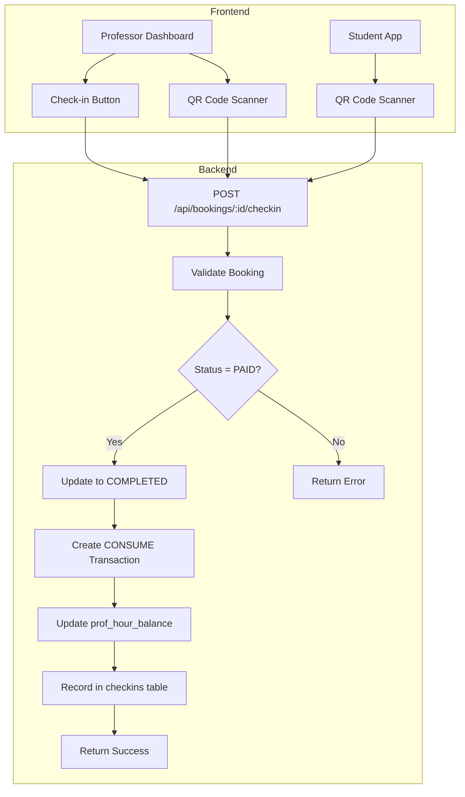

# Design Document - Check-in System

## Overview

O sistema de check-in permite que professores e alunos confirmem a realização de aulas, atualizando o status do booking para COMPLETED e creditando horas ao professor. O check-in pode ser feito via QR code ou botão manual.

## Architecture



## Components and Interfaces

### Backend API

#### POST /api/bookings/:id/checkin
Endpoint principal para realizar check-in de uma aula.

**Request:**
```typescript
{
  method: 'QRCODE' | 'MANUAL'
}
```

**Response (Success):**
```typescript
{
  success: true,
  message: string,
  booking: {
    id: string,
    status_canonical: 'COMPLETED',
    date: string,
    duration: number
  },
  credits: {
    hours_credited: number,
    new_balance: number
  }
}
```

**Response (Error):**
```typescript
{
  success: false,
  error: string,
  code: 'INVALID_STATUS' | 'ALREADY_COMPLETED' | 'UNAUTHORIZED' | 'NOT_FOUND'
}
```

### Frontend Components

#### CheckinButton
Componente de botão para check-in manual.

```typescript
interface CheckinButtonProps {
  bookingId: string
  bookingDate: Date
  status: string
  onSuccess: (result: CheckinResult) => void
  onError: (error: string) => void
}
```

#### QRCodeGenerator
Componente para gerar QR code do booking.

```typescript
interface QRCodeGeneratorProps {
  bookingId: string
  academyId: string
}
```

#### QRCodeScanner
Componente para escanear QR code (já existe, será reutilizado).

## Data Models

### Booking (atualização)
```typescript
interface Booking {
  id: string
  student_id: string | null
  teacher_id: string
  date: Date
  duration: number
  status: string
  status_canonical: 'AVAILABLE' | 'PAID' | 'COMPLETED' | 'CANCELED'
  // ... outros campos existentes
}
```

### HourTransaction (hour_tx)
```typescript
interface HourTransaction {
  id: string
  professor_id: string
  franqueadora_id: string
  unit_id: string | null
  type: 'PURCHASE' | 'CONSUME' | 'BONUS_LOCK' | 'BONUS_UNLOCK' | 'REFUND' | 'REVOKE'
  source: 'ALUNO' | 'PROFESSOR' | 'SYSTEM'
  hours: number
  booking_id: string | null
  meta_json: {
    booking_id?: string
    origin?: string
    student_id?: string
  }
  created_at: Date
}
```

### ProfHourBalance (prof_hour_balance)
```typescript
interface ProfHourBalance {
  id: string
  professor_id: string
  franqueadora_id: string
  unit_id: string | null
  available_hours: number
  locked_hours: number
  updated_at: Date
}
```

### Checkin (checkins)
```typescript
interface Checkin {
  id: string
  academy_id: string
  teacher_id: string | null
  student_id: string | null
  booking_id: string
  status: 'GRANTED' | 'DENIED'
  reason: string | null
  method: 'QRCODE' | 'MANUAL' | 'RECEPTION'
  created_at: Date
}
```

## Correctness Properties

*A property is a characteristic or behavior that should hold true across all valid executions of a system-essentially, a formal statement about what the system should do. Properties serve as the bridge between human-readable specifications and machine-verifiable correctness guarantees.*

### Property 1: Check-in updates booking status to COMPLETED
*For any* valid PAID booking and any check-in method (QRCODE or MANUAL), performing check-in should result in the booking's status_canonical being updated to COMPLETED.
**Validates: Requirements 1.1, 2.1**

### Property 2: Check-in creates CONSUME transaction
*For any* successful check-in, a CONSUME transaction should be created in hour_tx with the correct professor_id, hours equal to booking duration, and booking_id in meta_json.
**Validates: Requirements 1.2, 2.2, 4.2**

### Property 3: CONSUME transaction increments professor balance
*For any* CONSUME transaction created, the professor's available_hours in prof_hour_balance should increase by the transaction's hours value.
**Validates: Requirements 1.3**

### Property 4: Invalid status check-in rejection
*For any* booking with status_canonical not equal to PAID, attempting check-in should return an error and not modify any data.
**Validates: Requirements 1.4**

### Property 5: Check-in idempotency
*For any* booking that is already COMPLETED, attempting check-in should return "already completed" without creating duplicate transactions or modifying balance.
**Validates: Requirements 1.5**

### Property 6: Check-in authorization validation
*For any* check-in attempt, the system should validate that the user is either the booking's teacher_id or student_id, rejecting unauthorized users.
**Validates: Requirements 5.3, 6.1, 6.3**

### Property 7: Check-in audit logging
*For any* check-in attempt (success or failure), a record should be created in the checkins table with correct booking_id, method, status, and timestamp.
**Validates: Requirements 4.1**

### Property 8: QR code content validation
*For any* generated QR code, decoding it should yield a valid JSON containing booking_id and academy_id that match the source booking.
**Validates: Requirements 5.2**

### Property 9: Future booking check-in prevention
*For any* booking with date in the future (beyond tolerance window), check-in should be rejected with appropriate error.
**Validates: Requirements 2.4**

## Error Handling

| Error Code | Description | HTTP Status |
|------------|-------------|-------------|
| INVALID_STATUS | Booking status is not PAID | 400 |
| ALREADY_COMPLETED | Booking already has check-in | 409 |
| UNAUTHORIZED | User is not teacher or student of booking | 403 |
| NOT_FOUND | Booking not found | 404 |
| FUTURE_BOOKING | Booking date is in the future | 400 |
| BALANCE_ERROR | Error updating professor balance | 500 |

## Testing Strategy

### Unit Tests
- Validate check-in endpoint with various booking statuses
- Validate authorization logic for teacher and student
- Validate QR code generation and parsing
- Validate balance update calculations

### Property-Based Tests
- Use fast-check library for TypeScript
- Configure minimum 100 iterations per property
- Test all 9 correctness properties defined above

### Integration Tests
- End-to-end check-in flow via API
- Verify database state after check-in
- Verify notifications are sent
