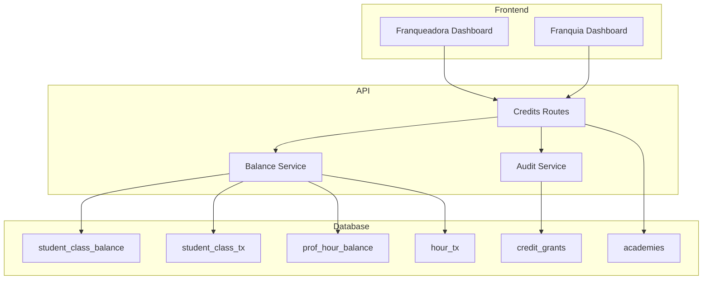

# Documento de Design - Liberação Manual de Créditos

## Visão Geral

A funcionalidade de liberação manual de créditos permite que administradores da Franqueadora e Franquia concedam créditos (aulas para alunos ou horas para professores) diretamente pelo painel administrativo. O sistema estende a infraestrutura existente de `balance.service.ts`, adicionando um novo tipo de transação `GRANT` com origem `ADMIN`.

### Principais Características
- Liberação de créditos para alunos (STUDENT_CLASS) e professores (PROFESSOR_HOUR)
- Controle de habilitação por franquia (franqueadora decide quais franquias podem usar)
- Escopo de permissões (franquia só acessa seus usuários)
- Auditoria completa de todas as liberações
- Validações de segurança (quantidade, confirmação para valores altos)

## Arquitetura



## Componentes e Interfaces

### API Endpoints

#### POST /api/admin/credits/grant
Libera créditos para um usuário.

**Request:**
```typescript
interface CreditGrantRequest {
  userEmail: string;           // Email do destinatário
  creditType: 'STUDENT_CLASS' | 'PROFESSOR_HOUR';
  quantity: number;            // Quantidade > 0
  reason: string;              // Motivo da liberação
  confirmHighQuantity?: boolean; // Obrigatório se qty > 100
}
```

**Response:**
```typescript
interface CreditGrantResponse {
  success: boolean;
  grantId: string;
  balance: StudentClassBalance | ProfHourBalance;
  transaction: StudentClassTransaction | HourTransaction;
}
```

#### GET /api/admin/credits/search-user
Busca usuário por email para verificar antes de liberar.

**Query Parameters:**
- `email`: string (obrigatório)

**Response:**
```typescript
interface SearchUserResponse {
  user: {
    id: string;
    email: string;
    name: string;
    role: string;
  } | null;
  studentBalance?: StudentClassBalance;
  professorBalance?: ProfHourBalance;
  franchises: Array<{ id: string; name: string }>;
}
```

#### GET /api/admin/credits/history
Retorna histórico de liberações com filtros.

**Query Parameters:**
- `startDate?: string` - Data inicial (ISO)
- `endDate?: string` - Data final (ISO)
- `recipientEmail?: string` - Filtrar por destinatário
- `creditType?: string` - Filtrar por tipo
- `grantedBy?: string` - Filtrar por quem liberou
- `franchiseId?: string` - Filtrar por franquia (apenas franqueadora)
- `page?: number` - Página (default: 1)
- `limit?: number` - Itens por página (default: 20)

**Response:**
```typescript
interface HistoryResponse {
  grants: CreditGrant[];
  total: number;
  page: number;
  totalPages: number;
}
```

### Interfaces TypeScript

```typescript
// Tipos de transação atualizados
type StudentClassTxType = 'PURCHASE' | 'CONSUME' | 'LOCK' | 'UNLOCK' | 'REFUND' | 'REVOKE' | 'GRANT';
type HourTxType = 'PURCHASE' | 'CONSUME' | 'BONUS_LOCK' | 'BONUS_UNLOCK' | 'REFUND' | 'REVOKE' | 'GRANT';
type TxSource = 'ALUNO' | 'PROFESSOR' | 'SYSTEM' | 'ADMIN';

// Registro de auditoria
interface CreditGrant {
  id: string;
  recipient_id: string;
  recipient_email: string;
  recipient_name: string;
  credit_type: 'STUDENT_CLASS' | 'PROFESSOR_HOUR';
  quantity: number;
  reason: string;
  granted_by_id: string;
  granted_by_email: string;
  franqueadora_id: string;
  franchise_id?: string;
  transaction_id: string;
  created_at: string;
}

// Configuração de franquia
interface AcademySettings {
  requireApproval: boolean;
  allowSameTimeBookings: boolean;
  manualCreditReleaseEnabled?: boolean; // NOVO
}
```

### Extensão do BalanceService

Novos métodos a serem adicionados em `balance.service.ts`:

```typescript
// Liberar aulas para aluno
async grantStudentClasses(
  studentId: string,
  franqueadoraId: string,
  qty: number,
  grantedById: string,
  reason: string
): Promise<{ balance: StudentClassBalance; transaction: StudentClassTransaction }>

// Liberar horas para professor
async grantProfessorHours(
  professorId: string,
  franqueadoraId: string,
  hours: number,
  grantedById: string,
  reason: string
): Promise<{ balance: ProfHourBalance; transaction: HourTransaction }>
```

## Modelos de Dados

### Nova Tabela: credit_grants

```sql
CREATE TABLE credit_grants (
  id UUID PRIMARY KEY DEFAULT gen_random_uuid(),
  recipient_id UUID NOT NULL REFERENCES users(id),
  recipient_email TEXT NOT NULL,
  recipient_name TEXT NOT NULL,
  credit_type TEXT NOT NULL CHECK (credit_type IN ('STUDENT_CLASS', 'PROFESSOR_HOUR')),
  quantity INTEGER NOT NULL CHECK (quantity > 0),
  reason TEXT NOT NULL,
  granted_by_id UUID NOT NULL REFERENCES users(id),
  granted_by_email TEXT NOT NULL,
  franqueadora_id UUID NOT NULL REFERENCES franqueadora(id),
  franchise_id UUID REFERENCES academies(id),
  transaction_id UUID NOT NULL,
  created_at TIMESTAMPTZ NOT NULL DEFAULT NOW()
);

-- Índices para consultas frequentes
CREATE INDEX idx_credit_grants_recipient ON credit_grants(recipient_id);
CREATE INDEX idx_credit_grants_granted_by ON credit_grants(granted_by_id);
CREATE INDEX idx_credit_grants_franqueadora ON credit_grants(franqueadora_id);
CREATE INDEX idx_credit_grants_franchise ON credit_grants(franchise_id);
CREATE INDEX idx_credit_grants_created_at ON credit_grants(created_at);
```

### Atualização das Tabelas de Transação

Adicionar tipo GRANT nas constraints:

```sql
-- student_class_tx
ALTER TABLE student_class_tx 
DROP CONSTRAINT IF EXISTS student_class_tx_type_check;

ALTER TABLE student_class_tx 
ADD CONSTRAINT student_class_tx_type_check 
CHECK (type IN ('PURCHASE', 'CONSUME', 'LOCK', 'UNLOCK', 'REFUND', 'REVOKE', 'GRANT'));

-- hour_tx
ALTER TABLE hour_tx 
DROP CONSTRAINT IF EXISTS hour_tx_type_check;

ALTER TABLE hour_tx 
ADD CONSTRAINT hour_tx_type_check 
CHECK (type IN ('PURCHASE', 'CONSUME', 'BONUS_LOCK', 'BONUS_UNLOCK', 'REFUND', 'REVOKE', 'GRANT'));

-- Adicionar ADMIN como source válido
ALTER TABLE student_class_tx 
DROP CONSTRAINT IF EXISTS student_class_tx_source_check;

ALTER TABLE student_class_tx 
ADD CONSTRAINT student_class_tx_source_check 
CHECK (source IN ('ALUNO', 'PROFESSOR', 'SYSTEM', 'ADMIN'));

ALTER TABLE hour_tx 
DROP CONSTRAINT IF EXISTS hour_tx_source_check;

ALTER TABLE hour_tx 
ADD CONSTRAINT hour_tx_source_check 
CHECK (source IN ('ALUNO', 'PROFESSOR', 'SYSTEM', 'ADMIN'));
```

### Atualização da Tabela academies

O campo `settings` já existe como JSON. Adicionar flag `manualCreditReleaseEnabled`:

```typescript
// Valor default: false (funcionalidade desabilitada por padrão)
settings: {
  requireApproval: true,
  allowSameTimeBookings: false,
  manualCreditReleaseEnabled: false
}
```

## Propriedades de Corretude

*Uma propriedade é uma característica ou comportamento que deve ser verdadeiro em todas as execuções válidas de um sistema - essencialmente, uma declaração formal sobre o que o sistema deve fazer. Propriedades servem como ponte entre especificações legíveis por humanos e garantias de corretude verificáveis por máquina.*

### Property 1: Saldo atualizado corretamente após liberação
*Para qualquer* liberação de créditos com quantidade Q para um usuário com saldo inicial S, o saldo final deve ser exatamente S + Q. Se o usuário não tinha saldo, o saldo final deve ser Q.
**Validates: Requirements 1.2, 6.3**

### Property 2: Email inexistente gera erro
*Para qualquer* email que não existe na tabela de usuários, a operação de liberação deve falhar com erro USER_NOT_FOUND e o saldo de nenhum usuário deve ser alterado.
**Validates: Requirements 1.4**

### Property 3: Auditoria sempre registrada
*Para qualquer* liberação bem-sucedida, deve existir um registro na tabela credit_grants com recipient_id, recipient_email, credit_type, quantity, reason, granted_by_id, franqueadora_id e transaction_id preenchidos.
**Validates: Requirements 1.3, 1.5**

### Property 4: Escopo de franquia respeitado na busca
*Para qualquer* busca feita por admin de franquia, todos os usuários retornados devem estar associados àquela franquia específica através de academy_students ou academy_teachers.
**Validates: Requirements 3.2**

### Property 5: Escopo de franquia respeitado na liberação
*Para qualquer* tentativa de liberação por admin de franquia para usuário não associado àquela franquia, a operação deve falhar com erro UNAUTHORIZED_FRANCHISE e nenhum saldo deve ser alterado.
**Validates: Requirements 3.4**

### Property 6: Tipo de crédito determina tabela correta
*Para qualquer* liberação com tipo STUDENT_CLASS, a transação deve existir em student_class_tx com type='GRANT'. Para tipo PROFESSOR_HOUR, a transação deve existir em hour_tx com type='GRANT'.
**Validates: Requirements 4.1, 4.2, 4.3**

### Property 7: Quantidade inválida rejeitada
*Para qualquer* quantidade menor ou igual a zero, a operação de liberação deve falhar com erro INVALID_QUANTITY antes de qualquer alteração no banco.
**Validates: Requirements 6.1**

### Property 8: Alta quantidade requer confirmação
*Para qualquer* quantidade maior que 100 sem flag confirmHighQuantity=true, a operação deve falhar com erro HIGH_QUANTITY_NOT_CONFIRMED.
**Validates: Requirements 6.2**

### Property 9: Atomicidade em falhas
*Para qualquer* operação que falhe após iniciar (ex: falha ao criar auditoria), o saldo do usuário deve permanecer exatamente igual ao valor antes da operação.
**Validates: Requirements 6.4, 6.5**

### Property 10: Funcionalidade desabilitada rejeita operação
*Para qualquer* franquia com settings.manualCreditReleaseEnabled=false, tentativas de liberação por admin dessa franquia devem falhar com erro FEATURE_DISABLED.
**Validates: Requirements 2.4**

## Tratamento de Erros

### Códigos de Erro Padronizados

| Código | HTTP Status | Descrição |
|--------|-------------|-----------|
| USER_NOT_FOUND | 404 | Email não encontrado no sistema |
| INVALID_QUANTITY | 400 | Quantidade deve ser maior que zero |
| UNAUTHORIZED_FRANCHISE | 403 | Usuário não pertence à franquia do admin |
| HIGH_QUANTITY_NOT_CONFIRMED | 400 | Quantidade > 100 requer confirmação |
| FEATURE_DISABLED | 403 | Funcionalidade desabilitada para esta franquia |
| BALANCE_UPDATE_FAILED | 500 | Falha ao atualizar saldo |
| TRANSACTION_FAILED | 500 | Falha ao criar transação |
| AUDIT_FAILED | 500 | Falha ao registrar auditoria |

### Atomicidade

Todas as operações de liberação são atômicas:
1. Validar entrada e permissões
2. Iniciar transação no banco
3. Atualizar/criar saldo
4. Criar transação GRANT
5. Criar registro de auditoria
6. Commit ou rollback completo

## Estratégia de Testes

### Testes Unitários
- Validações de entrada (quantidade, email, tipo)
- Lógica de escopo de franquia
- Criação de saldo quando não existe
- Cálculo correto de saldo final
- Verificação de funcionalidade habilitada

### Testes de Propriedade (Property-Based Testing)
- **Biblioteca**: fast-check
- **Mínimo**: 100 iterações por teste
- **Anotação**: `Feature: manual-credit-release, Property N: descrição`

Cada propriedade de corretude será implementada como um teste de propriedade separado, gerando dados aleatórios para validar que a propriedade se mantém em todos os casos.

### Testes de Integração
- Fluxo completo de liberação via API
- Permissões de admin franqueadora vs franquia
- Histórico com filtros
- Concorrência de liberações simultâneas

### Cobertura de Testes
- Testes unitários cobrem validações e lógica de negócio
- Testes de propriedade verificam invariantes do sistema
- Testes de integração validam fluxos end-to-end
