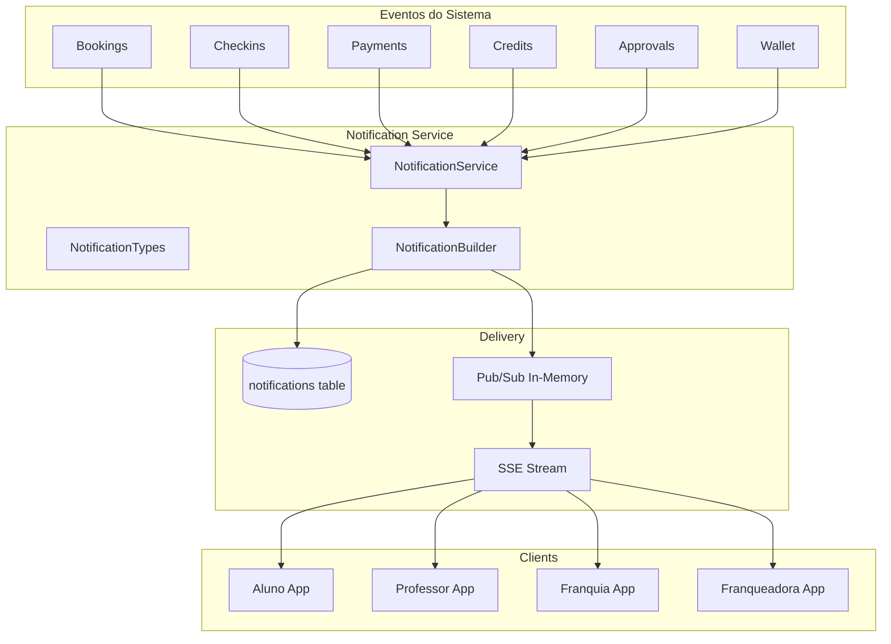

# Design Document: Sistema de Notificações Completo

## Overview

Expansão do sistema de notificações existente para cobrir todos os eventos relevantes do Meu Personal. A infraestrutura base (SSE, pub/sub, tabela notifications) já existe e será reutilizada. O foco é criar um serviço centralizado de notificações e integrar os pontos de disparo em todo o sistema.

## Architecture



## Components and Interfaces

### 1. NotificationService (apps/api/src/services/notification.service.ts)

Serviço centralizado que encapsula toda a lógica de criação de notificações:

```typescript
interface NotificationService {
  // Bookings - Professor
  notifyTeacherNewBooking(booking: Booking, student: Student, teacher: Teacher): Promise<void>
  notifyTeacherBookingCancelled(booking: Booking, student: Student, teacher: Teacher): Promise<void>
  notifyTeacherBookingRescheduled(booking: Booking, student: Student, teacher: Teacher, oldDate: Date): Promise<void>
  notifyTeacherBookingReminder(booking: Booking, student: Student, teacher: Teacher): Promise<void>
  notifyTeacherStudentLowCredits(student: Student, teacher: Teacher, booking: Booking): Promise<void>
  notifyTeacherNewStudent(student: Student, teacher: Teacher): Promise<void>
  notifyTeacherNewRating(rating: Rating, student: Student, teacher: Teacher): Promise<void>
  
  // Bookings - Aluno
  notifyStudentBookingConfirmed(booking: Booking, student: Student, teacher: Teacher): Promise<void>
  notifyStudentBookingCancelled(booking: Booking, student: Student, teacher: Teacher, reason?: string): Promise<void>
  notifyStudentBookingReminder(booking: Booking, student: Student, teacher: Teacher): Promise<void>
  notifyStudentBookingCompleted(booking: Booking, student: Student, teacher: Teacher): Promise<void>
  notifyStudentBookingCreated(booking: Booking, student: Student, teacher: Teacher): Promise<void>
  
  // Credits - Aluno
  notifyStudentCreditsDebited(student: Student, amount: number, balance: number, booking?: Booking): Promise<void>
  notifyStudentCreditsLow(student: Student, balance: number): Promise<void>
  notifyStudentCreditsPurchased(student: Student, amount: number, newBalance: number): Promise<void>
  notifyStudentCreditsRefunded(student: Student, amount: number, newBalance: number): Promise<void>
  notifyStudentCreditsExpiring(student: Student, amount: number, expirationDate: Date): Promise<void>
  notifyStudentCreditsExpired(student: Student, amount: number): Promise<void>
  notifyStudentCreditsZero(student: Student): Promise<void>
  
  // Check-in
  notifyTeacherStudentCheckin(checkin: Checkin, student: Student, teacher: Teacher): Promise<void>
  notifyTeacherStudentNoShow(booking: Booking, student: Student, teacher: Teacher): Promise<void>
  notifyFranchiseCheckin(checkin: Checkin, student: Student, academy: Academy): Promise<void>
  
  // Wallet - Professor
  notifyTeacherEarnings(teacher: Teacher, amount: number, booking: Booking): Promise<void>
  notifyTeacherWithdrawRequested(teacher: Teacher, amount: number): Promise<void>
  notifyTeacherWithdrawProcessed(teacher: Teacher, amount: number): Promise<void>
  notifyTeacherWithdrawAvailable(teacher: Teacher, balance: number): Promise<void>
  
  // Approvals
  notifyFranchiseNewTeacher(teacher: Teacher, academy: Academy): Promise<void>
  notifyFranchiseNewStudent(student: Student, academy: Academy): Promise<void>
  notifyTeacherApproved(teacher: Teacher, academy: Academy): Promise<void>
  notifyTeacherRejected(teacher: Teacher, academy: Academy, reason?: string): Promise<void>
  
  // Payments
  notifyUserPaymentConfirmed(user: User, payment: Payment): Promise<void>
  notifyUserPaymentFailed(user: User, payment: Payment, reason?: string): Promise<void>
  notifyUserPaymentRefunded(user: User, payment: Payment): Promise<void>
  
  // Franquia (Academia)
  notifyFranchiseNewBooking(booking: Booking, academy: Academy): Promise<void>
  notifyFranchiseBookingCancelled(booking: Booking, academy: Academy): Promise<void>
  notifyFranchisePaymentReceived(payment: Payment, academy: Academy): Promise<void>
  notifyFranchisePaymentFailed(payment: Payment, academy: Academy): Promise<void>
  notifyFranchiseWithdrawRequest(teacher: Teacher, amount: number, academy: Academy): Promise<void>
  notifyFranchiseScheduleConflict(conflicts: Conflict[], academy: Academy): Promise<void>
  notifyFranchiseInactiveStudent(student: Student, academy: Academy, daysSinceLastActivity: number): Promise<void>
  
  // Franqueadora
  notifyFranqueadoraNewFranchise(franchise: Franchise, franqueadora: Franqueadora): Promise<void>
  notifyFranqueadoraNewLead(lead: Lead, franqueadora: Franqueadora): Promise<void>
  notifyFranqueadoraPolicyUpdated(policy: Policy, affectedFranchises: Franchise[]): Promise<void>
  notifyFranqueadoraRevenueMilestone(franchise: Franchise, milestone: number): Promise<void>
  notifyFranqueadoraBookingDrop(franchise: Franchise, dropPercentage: number): Promise<void>
  notifyFranqueadoraTeacherApproved(teacher: Teacher, franchise: Franchise): Promise<void>
  notifyFranqueadoraNegativeReview(review: Review, franchise: Franchise): Promise<void>
  notifyFranqueadoraRoyaltyPayment(payment: Payment, franchise: Franchise): Promise<void>
}
```

### 2. NotificationTypes (apps/api/src/types/notification-types.ts)

Enum expandido com todos os tipos de notificação:

```typescript
export const notificationTypes = [
  // Bookings - Professor
  'teacher_new_booking',
  'teacher_booking_cancelled',
  'teacher_booking_rescheduled',
  'teacher_booking_reminder',
  'teacher_student_low_credits',
  'teacher_new_student',
  'teacher_new_rating',
  
  // Bookings - Aluno
  'student_booking_confirmed',
  'student_booking_cancelled',
  'student_booking_reminder',
  'student_booking_completed',
  'student_booking_created',
  'student_availability_changed',
  'student_series_expiring',
  
  // Credits - Aluno
  'student_credits_debited',
  'student_credits_low',
  'student_credits_purchased',
  'student_credits_refunded',
  'student_credits_expiring',
  'student_credits_expired',
  'student_credits_zero',
  
  // Check-in
  'teacher_student_checkin',
  'teacher_student_noshow',
  'franchise_checkin',
  
  // Wallet - Professor
  'teacher_earnings',
  'teacher_withdraw_requested',
  'teacher_withdraw_processed',
  'teacher_withdraw_available',
  
  // Approvals
  'franchise_new_teacher',
  'franchise_new_student',
  'teacher_approved',
  'teacher_rejected',
  
  // Payments
  'payment_confirmed',
  'payment_failed',
  'payment_refunded',
  
  // Franquia (Academia)
  'franchise_new_booking',
  'franchise_booking_cancelled',
  'franchise_new_student',
  'franchise_new_teacher',
  'franchise_payment_received',
  'franchise_payment_failed',
  'franchise_checkin',
  'franchise_withdraw_request',
  'franchise_schedule_conflict',
  'franchise_inactive_student',
  
  // Franqueadora
  'franqueadora_new_franchise',
  'franqueadora_new_lead',
  'franqueadora_policy_updated',
  'franqueadora_revenue_milestone',
  'franqueadora_booking_drop',
  'franqueadora_teacher_approved',
  'franqueadora_negative_review',
  'franqueadora_royalty_payment',
] as const

export type NotificationType = typeof notificationTypes[number]
```

### 3. NotificationBuilder (apps/api/src/services/notification-builder.ts)

Helper para construir notificações com mensagens padronizadas:

```typescript
interface NotificationBuilder {
  build(type: NotificationType, data: NotificationData): NotificationPayload
}

interface NotificationPayload {
  type: NotificationType
  title: string
  message: string
  data: Record<string, any>
  link?: string
}
```

## Data Models

### Tabela notifications (já existe)

```sql
-- Estrutura atual já suporta os requisitos
CREATE TABLE notifications (
  id UUID PRIMARY KEY DEFAULT gen_random_uuid(),
  academy_id UUID REFERENCES academies(id),
  user_id UUID REFERENCES users(id),
  type TEXT NOT NULL,
  title TEXT NOT NULL,
  message TEXT NOT NULL,
  data JSONB DEFAULT '{}',
  link TEXT,
  actor_id UUID,
  role_scope TEXT,
  read BOOLEAN DEFAULT false,
  created_at TIMESTAMPTZ DEFAULT now(),
  updated_at TIMESTAMPTZ DEFAULT now()
);

-- Índices para performance
CREATE INDEX IF NOT EXISTS idx_notifications_user_id ON notifications(user_id);
CREATE INDEX IF NOT EXISTS idx_notifications_academy_id ON notifications(academy_id);
CREATE INDEX IF NOT EXISTS idx_notifications_created_at ON notifications(created_at DESC);
CREATE INDEX IF NOT EXISTS idx_notifications_read ON notifications(read) WHERE read = false;
```


## Correctness Properties

*A property is a characteristic or behavior that should hold true across all valid executions of a system-essentially, a formal statement about what the system should do. Properties serve as the bridge between human-readable specifications and machine-verifiable correctness guarantees.*

Based on the prework analysis, the following properties consolidate related acceptance criteria:

### Property 1: Booking Creation Notifies Both Parties
*For any* valid booking creation, the Notification_System should create exactly one notification for the teacher AND one notification for the student, both containing the booking details.
**Validates: Requirements 1.1, 2.5**

### Property 2: Booking Cancellation Notifies Affected Party
*For any* booking cancellation, the Notification_System should create a notification for the party that did NOT initiate the cancellation (teacher notified if student cancels, student notified if teacher cancels).
**Validates: Requirements 1.2, 2.1**

### Property 3: Credit Transaction Creates Notification
*For any* credit transaction (debit, credit, refund, expiration), the Notification_System should create a notification for the student with the transaction amount and resulting balance.
**Validates: Requirements 3.1, 3.3, 3.4, 3.6**

### Property 4: Low Balance Threshold Triggers Alert
*For any* credit balance that transitions below the threshold of 2 classes, the Notification_System should create exactly one low-balance notification for the student.
**Validates: Requirements 3.2, 3.7**

### Property 5: Check-in Creates Notifications
*For any* successful check-in, the Notification_System should create a notification for the teacher of the scheduled class AND a notification for the franchise admin.
**Validates: Requirements 6.1, 6.2**

### Property 6: Payment Status Creates Notification
*For any* payment status change (confirmed, failed, refunded), the Notification_System should create a notification for the user with the payment details and status.
**Validates: Requirements 4.1, 4.2, 4.3**

### Property 7: Approval Status Creates Notification
*For any* approval decision (approved or rejected), the Notification_System should create a notification for the teacher with the decision and reason (if rejected).
**Validates: Requirements 5.3, 5.4**

### Property 8: New Registration Creates Admin Notification
*For any* new teacher or student registration requiring approval, the Notification_System should create a notification for the franchise administrators.
**Validates: Requirements 5.1, 5.2**

### Property 9: Notification Persistence
*For any* notification created, the notification should be persisted in the database before being published via SSE, ensuring offline users receive it upon reconnection.
**Validates: Requirements 8.2, 8.3**

### Property 10: Wallet Transaction Creates Notification
*For any* wallet transaction (earnings, withdraw request, withdraw processed), the Notification_System should create a notification for the teacher with the amount and transaction type.
**Validates: Requirements 9.1, 9.2, 9.3**

## Error Handling

### Notification Creation Failures
- If database insert fails, log error and retry once
- If SSE publish fails, notification is still persisted (eventual delivery on reconnect)
- Never throw exceptions that would break the main business flow

### Invalid Data
- Validate all required fields before creating notification
- Use Zod schemas for type safety
- Default to generic messages if specific data is missing

### Rate Limiting
- Implement deduplication for repeated events (e.g., multiple low-balance alerts)
- Use `data` field to track last notification time per type/user

## Testing Strategy

### Property-Based Testing Library
- **fast-check** for TypeScript property-based testing

### Unit Tests
- Test NotificationService methods individually
- Mock database and pub/sub for isolation
- Verify correct notification type and content

### Property-Based Tests
- Each correctness property will have a corresponding PBT
- Generate random but valid business events
- Verify notification creation follows the properties
- Minimum 100 iterations per property test

### Integration Tests
- Test full flow from event to SSE delivery
- Verify database persistence
- Test reconnection and replay functionality

### Test File Structure
```
apps/api/src/services/__tests__/
├── notification.service.test.ts      # Unit tests
├── notification.service.property.ts  # Property-based tests
└── notification.integration.test.ts  # Integration tests
```

### Test Annotations
Each property-based test must include:
```typescript
// **Feature: notification-system, Property 1: Booking Creation Notifies Both Parties**
// **Validates: Requirements 1.1, 2.5**
```
