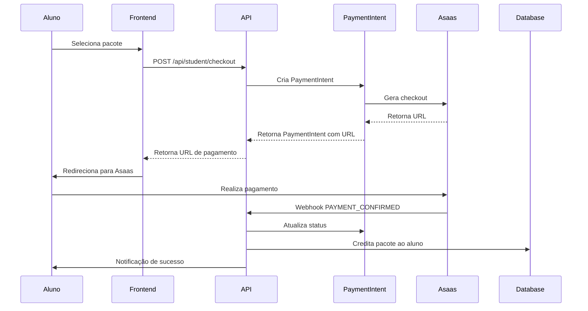
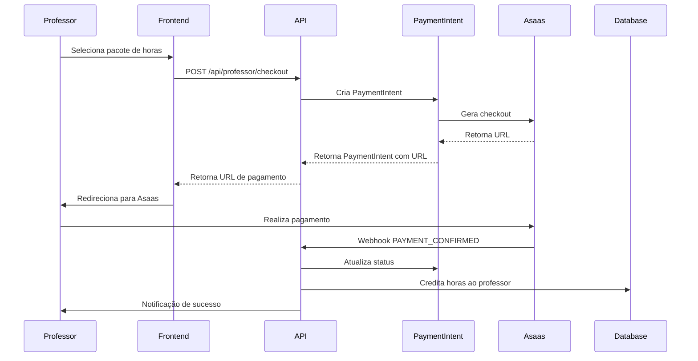

# Fases 1 e 2 - Modelo de Dados e API de Pagamentos - Plano Detalhado

## Fase 1 - Modelo de Dados (2-3 dias)

### Objetivo
Implementar o modelo de dados canônico definido no REALINHAMENTO.md, com foco em balances, transações e estrutura de franquias/unidades.

### Status Atual
- ✅ Migração `20251004_phase1_schema.sql` já existe
- ⚠️ Precisa ser aplicada e testada
- ⚠️ Dados de `academies` precisam migrar para `units`

### Ações Específicas

#### 1. Aplicar Migração do Schema Canônico

**Arquivo: `apps/api/migrations/20251004_phase1_schema.sql`**

**Antes de aplicar:**
```sql
-- Backup das tabelas críticas
CREATE TABLE academies_backup AS SELECT * FROM academies;
CREATE TABLE bookings_backup AS SELECT * FROM bookings;
CREATE TABLE users_backup AS SELECT * FROM users;
```

**Aplicação:**
```bash
cd apps/api
npm run prisma:db push  # Ou aplicar SQL diretamente
```

**Validação pós-migração:**
```sql
-- Verificar se tabelas foram criadas
SELECT table_name FROM information_schema.tables 
WHERE table_schema = 'public' 
AND table_name IN ('franchises', 'units', 'student_packages', 'hour_packages', 'payment_intents');

-- Verificar migração de academies -> units
SELECT COUNT(*) FROM units;
SELECT COUNT(*) FROM academies;
```

#### 2. Implementar Lógica de Balances

**Arquivo novo: `apps/api/src/services/balance.service.ts`**

```typescript
interface StudentBalanceParams {
  studentId: string;
  unitId?: string;
  qty: number;
  type: 'PURCHASE' | 'CONSUME' | 'LOCK' | 'UNLOCK' | 'REFUND' | 'REVOKE';
  bookingId?: string;
  unlockAt?: Date;
}

interface ProfessorBalanceParams {
  professorId: string;
  unitId?: string;
  hours: number;
  type: 'PURCHASE' | 'CONSUME' | 'BONUS_LOCK' | 'BONUS_UNLOCK' | 'REFUND' | 'REVOKE';
  bookingId?: string;
  unlockAt?: Date;
}

export class BalanceService {
  // Atualizar saldo do aluno
  async updateStudentBalance(params: StudentBalanceParams): Promise<void>
  
  // Atualizar saldo do professor
  async updateProfessorBalance(params: ProfessorBalanceParams): Promise<void>
  
  // Verificar saldo disponível
  async checkStudentBalance(studentId: string, unitId?: string): Promise<number>
  
  // Verificar horas disponíveis
  async checkProfessorBalance(professorId: string, unitId?: string): Promise<number>
}
```

#### 3. Popular Catálogos Iniciais

**Arquivo novo: `apps/api/src/seed/catalog.seed.ts`**

```typescript
// Pacotes de aluno
const studentPackages = [
  {
    title: 'Pacote Inicial - 5 Aulas',
    classes_qty: 5,
    price_cents: 25000, // R$ 250,00
    status: 'active'
  },
  {
    title: 'Pacote Intermediário - 10 Aulas',
    classes_qty: 10,
    price_cents: 45000, // R$ 450,00
    status: 'active'
  },
  {
    title: 'Pacote Avançado - 20 Aulas',
    classes_qty: 20,
    price_cents: 80000, // R$ 800,00
    status: 'active'
  }
];

// Pacotes de professor
const hourPackages = [
  {
    title: 'Pacote Inicial - 10 Horas',
    hours_qty: 10,
    price_cents: 30000, // R$ 300,00
    status: 'active'
  },
  {
    title: 'Pacote Intermediário - 25 Horas',
    hours_qty: 25,
    price_cents: 70000, // R$ 700,00
    status: 'active'
  },
  {
    title: 'Pacote Avançado - 50 Horas',
    hours_qty: 50,
    price_cents: 120000, // R$ 1.200,00
    status: 'active'
  }
];
```

#### 4. Adicionar Índices de Performance

**Arquivo novo: `apps/api/migrations/add_indexes.sql`**

```sql
-- Índices para student_class_tx
CREATE INDEX CONCURRENTLY IF NOT EXISTS idx_student_class_tx_student_created 
ON student_class_tx(student_id, created_at DESC);

CREATE INDEX CONCURRENTLY IF NOT EXISTS idx_student_class_tx_unlock_at 
ON student_class_tx(unlock_at) WHERE unlock_at IS NOT NULL;

-- Índices para hour_tx
CREATE INDEX CONCURRENTLY IF NOT EXISTS idx_hour_tx_professor_created 
ON hour_tx(professor_id, created_at DESC);

CREATE INDEX CONCURRENTLY IF NOT EXISTS idx_hour_tx_unlock_at 
ON hour_tx(unlock_at) WHERE unlock_at IS NOT NULL;

-- Índices para bookings
CREATE INDEX CONCURRENTLY IF NOT EXISTS idx_bookings_unit_start_at 
ON bookings(unit_id, start_at);

CREATE INDEX CONCURRENTLY IF NOT EXISTS idx_bookings_student_start_at 
ON bookings(student_id, start_at DESC);

CREATE INDEX CONCURRENTLY IF NOT EXISTS idx_bookings_professor_start_at 
ON bookings(teacher_id, start_at DESC);

-- Índices para payment_intents
CREATE INDEX CONCURRENTLY IF NOT EXISTS idx_payment_intents_status_created 
ON payment_intents(status, created_at);

CREATE INDEX CONCURRENTLY IF NOT EXISTS idx_payment_intents_provider_unique 
ON payment_intents(provider, provider_id);
```

## Fase 2 - API de Pacotes & PaymentIntent (2-3 dias)

### Objetivo
Implementar endpoints para compra de pacotes e gerenciamento de intenções de pagamento com integração Asaas.

### Ações Específicas

#### 1. Implementar Endpoints de Catálogo

**Arquivo novo: `apps/api/src/routes/packages.ts`**

```typescript
// GET /api/student/packages - Listar pacotes de aluno
router.get('/student', async (req, res) => {
  const { unitId } = req.query;
  // Retornar pacotes ativos por unidade
});

// GET /api/professor/packages - Listar pacotes de professor
router.get('/professor', async (req, res) => {
  const { unitId } = req.query;
  // Retornar pacotes de horas ativos por unidade
});
```

#### 2. Implementar Checkout de Pacotes

**Arquivo novo: `apps/api/src/routes/checkout.ts`**

```typescript
// POST /api/student/checkout - Checkout de pacote de aluno
router.post('/student', requireAuth, requireRole(['ALUNO']), async (req, res) => {
  const { packageId, unitId } = req.body;
  
  // 1. Validar pacote
  // 2. Criar PaymentIntent
  // 3. Gerar checkout Asaas
  // 4. Retornar URL de pagamento
});

// POST /api/professor/checkout - Checkout de pacote de professor
router.post('/professor', requireAuth, requireRole(['PROFESSOR']), async (req, res) => {
  const { packageId, unitId } = req.body;
  
  // 1. Validar pacote
  // 2. Criar PaymentIntent
  // 3. Gerar checkout Asaas
  // 4. Retornar URL de pagamento
});
```

#### 3. Implementar Tabela PaymentIntents

**Arquivo novo: `apps/api/src/services/payment-intent.service.ts`**

```typescript
interface CreatePaymentIntentParams {
  type: 'STUDENT_PACKAGE' | 'PROF_HOURS';
  actorUserId: string;
  unitId?: string;
  amountCents: number;
  metadata?: Record<string, any>;
}

export class PaymentIntentService {
  async createPaymentIntent(params: CreatePaymentIntentParams): Promise<PaymentIntent> {
    // 1. Criar registro em payment_intents
    // 2. Gerar checkout Asaas
    // 3. Atualizar com provider_id e checkout_url
    // 4. Retornar PaymentIntent criado
  }
  
  async processWebhook(providerId: string, status: string): Promise<void> {
    // 1. Buscar PaymentIntent por provider_id
    // 2. Verificar se já foi processado (idempotência)
    // 3. Atualizar status
    // 4. Se PAID, creditar pacote ao usuário
  }
}
```

#### 4. Implementar Webhooks Idempotentes

**Atualizar: `apps/api/src/routes/webhooks.ts`**

```typescript
// POST /api/webhooks/asaas
router.post('/asaas', async (req, res) => {
  const { event, payment } = req.body;
  
  // Validar webhook secret
  const webhookSecret = process.env.ASAAS_WEBHOOK_SECRET;
  if (!validateWebhookSignature(req, webhookSecret)) {
    return res.status(401).json({ error: 'Invalid webhook signature' });
  }
  
  // Processar baseado no tipo de evento
  if (event === 'PAYMENT_CONFIRMED') {
    await paymentIntentService.processWebhook(
      payment.id,
      'PAID'
    );
  }
  
  res.json({ received: true });
});
```

#### 5. Implementar Lógica de Crédito

**Arquivo novo: `apps/api/src/services/credit.service.ts`**

```typescript
export class CreditService {
  async creditStudentPackage(paymentIntent: PaymentIntent): Promise<void> {
    // 1. Buscar package detalhes
    // 2. Criar transação PURCHASE
    // 3. Atualizar student_class_balance
    // 4. Notificar usuário
  }
  
  async creditProfessorHours(paymentIntent: PaymentIntent): Promise<void> {
    // 1. Buscar package detalhes
    // 2. Criar transação PURCHASE
    // 3. Atualizar prof_hour_balance
    // 4. Notificar usuário
  }
}
```

## Fluxos de Implementação

### Fluxo 1: Compra de Pacote de Aluno


### Fluxo 2: Compra de Pacote de Professor


## Arquivos a Criar/Modificar

### Novos Arquivos
- `apps/api/src/services/balance.service.ts`
- `apps/api/src/services/payment-intent.service.ts`
- `apps/api/src/services/credit.service.ts`
- `apps/api/src/seed/catalog.seed.ts`
- `apps/api/src/routes/packages.ts`
- `apps/api/migrations/add_indexes.sql`

### Arquivos a Modificar
- `apps/api/src/routes/webhooks.ts` (adicionar idempotência)
- `apps/api/src/routes/checkout.ts` (já existe, precisa refatorar)
- `apps/api/src/services/asaas.service.ts` (ajustar para PaymentIntents)

## Riscos e Mitigações

### Risco 1: Falha na migração de dados
**Mitigação:** Fazer backup completo antes de aplicar migrações

### Risco 2: Webhooks duplicados
**Mitigação:** Implementar idempotência baseada em provider_id

### Risco 3: Inconsistência de saldos
**Mitigação:** Usar transações atômicas para atualizar balances

## Critérios de Sucesso

### Fase 1
- [ ] Schema canônico aplicado sem erros
- [ ] Dados migrados corretamente
- [ ] Índices criados e performando
- [ ] Catálogos populados

### Fase 2
- [ ] Endpoints de catálogo funcionando
- [ ] Checkout gerando PaymentIntents
- [ ] Webhooks processando pagamentos
- [ ] Créditos sendo aplicados corretamente

## Tempo Estimado
- **Fase 1**: 2-3 dias
- **Fase 2**: 2-3 dias
- **Total**: 4-6 dias

## Dependências
- Backup do banco de dados
- Conta Asaas configurada
- Webhook Asaas configurado para apontar para API
- Variáveis de ambiente configuradas