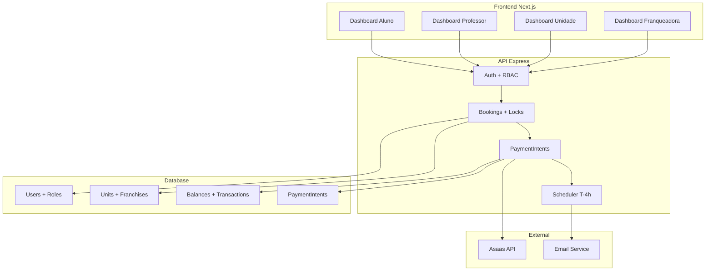
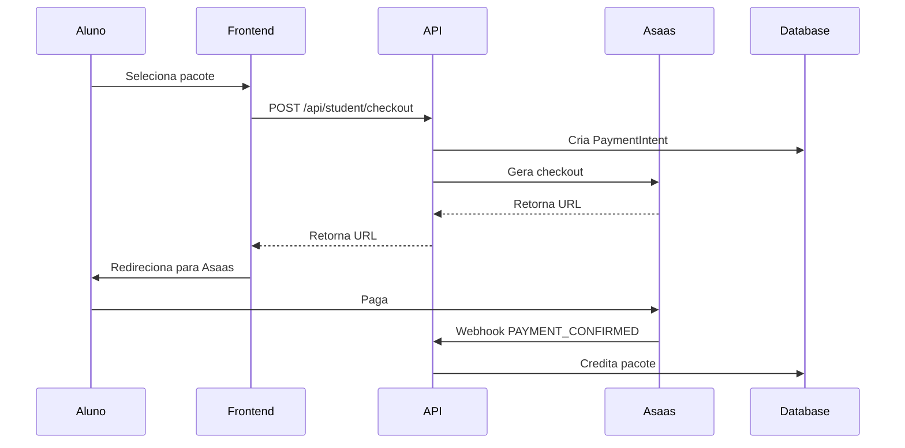
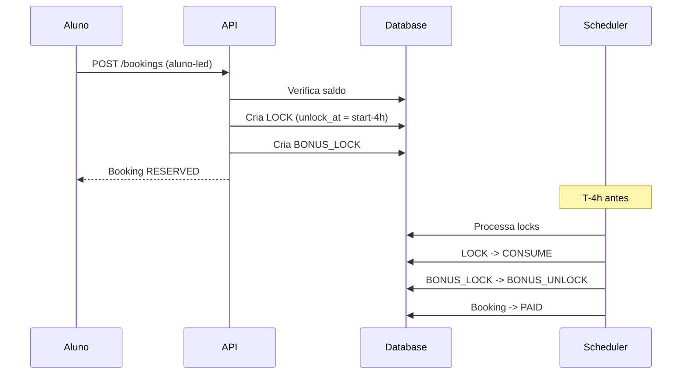

# Plano de Refatoração Consolidado - Meu Personal

## Resumo Executivo

Este documento consolida o plano completo de refatoração do projeto Meu Personal, alinhando o estado atual com o escopo canônico definido. O projeto será refatorado em 9 fases ao longo de 3 semanas, transformando a arquitetura atual para um modelo robusto com locks/unlocks, pagamentos integrados e scheduler automático.

### Visão Geral

- **Tecnologia**: Node.js + Express (API), Next.js + React (Front), PostgreSQL (Supabase)
- **Duração**: 3 semanas (15 dias úteis)
- **Foco**: Implementar modelo de dados canônico com locks, pagamentos Asaas e scheduler T-4h
- **Impacto**: Migração de `academies` → `units` + `franchises`, implementação de fluxos financeiros completos

## Arquitetura Futura

## Fases do Projeto

### Fase 0 - Hardening & Base (1-2 dias)
**Objetivo**: Consolidar segurança e autenticação

**Principais Entregáveis:**
- Remoção completa do Supabase Auth
- JWT puro com RBAC canônico
- Timezone America/Sao_Paulo configurado
- CORS e rate limiting verificados

**Arquivos Críticos:**
- `apps/api/src/routes/auth.ts`
- `apps/api/src/middleware/auth.ts`
- `apps/api/src/server.ts`

### Fase 1 - Modelo de Dados (2-3 dias)
**Objetivo**: Implementar schema canônico

**Principais Entregáveis:**
- Aplicação da migração `20251004_phase1_schema.sql`
- Migração de `academies` → `units`
- Serviços de balance implementados
- Catálogos populados

**Arquivos Críticos:**
- `apps/api/migrations/20251004_phase1_schema.sql`
- `apps/api/src/services/balance.service.ts`
- `apps/api/src/seed/catalog.seed.ts`

### Fase 2 - API de Pacotes & PaymentIntent (2-3 dias)
**Objetivo**: Implementar fluxos de pagamento

**Principais Entregáveis:**
- Endpoints de catálogo e checkout
- PaymentIntents com integração Asaas
- Webhooks idempotentes
- Lógica de crédito pós-pagamento

**Arquivos Críticos:**
- `apps/api/src/routes/packages.ts`
- `apps/api/src/services/payment-intent.service.ts`
- `apps/api/src/routes/webhooks.ts`

### Fase 3 - Agenda e Reservas (3-4 dias)
**Objetivo**: Refatorar sistema de agendamentos

**Principais Entregáveis:**
- Bookings com modelo canônico
- Lógica de LOCK/UNLOCK para alunos
- Lógica de CONSUME para professores
- Cancelamentos com regras (>4h / ≤4h)

**Arquivos Críticos:**
- `apps/api/src/routes/bookings.ts`
- `apps/api/src/services/booking-lock.service.ts`
- `apps/api/src/services/booking-cancel.service.ts`

### Fase 4 - Scheduler T-4h (1-2 dias)
**Objetivo**: Implementar processamento automático

**Principais Entregáveis:**
- Worker rodando a cada minuto
- Promoção automática de locks
- Auditoria de operações
- Graceful shutdown

**Arquivos Críticos:**
- `apps/api/src/scheduler/scheduler.ts`
- `apps/api/src/scheduler/student-lock-processor.ts`
- `apps/api/src/scheduler/professor-lock-processor.ts`

### Fase 5 - Reviews (1-2 dias)
**Objetivo**: Implementar sistema de avaliações

**Principais Entregáveis:**
- POST /reviews com visible_at = now+7d
- GET público com filtro de visibilidade

### Fase 6 - Check-in Stub (0,5 dia)
**Objetivo**: Implementar check-in mínimo

**Principais Entregáveis:**
- POST /checkin simples (apenas persiste tentativa)

### Fase 7 - RBAC & Auditoria (1-2 dias)
**Objetivo**: Endurecer segurança

**Principais Entregáveis:**
- requireRole em todas as rotas
- audit_logs para operações sensíveis

### Fase 8 - Front (2-4 dias)
**Objetivo**: Adaptar frontend

**Principais Entregáveis:**
- Stores adaptados para nova API
- Fluxos de compra de pacotes
- Exibição de saldos e transações
- Dashboards atualizados

### Fase 9 - Testes & Entregáveis (2-3 dias)
**Objetivo**: Finalizar projeto

**Principais Entregáveis:**
- Testes E2E mínimos
- Documentação OpenAPI/Postman
- Relatório de conciliação
- README atualizado

## Cronograma

| Semana | Fases | Foco Principal |
|--------|-------|----------------|
| Semana 1 | Fases 0-2 | Base, dados, pagamentos |
| Semana 2 | Fases 3-5 | Agenda, scheduler, reviews |
| Semana 3 | Fases 6-9 | Finalização, frontend, testes |

## Fluxos Críticos

### 1. Compra de Pacote de Aluno

### 2. Agendamento com Locks

## Riscos e Mitigações

| Risco | Probabilidade | Impacto | Mitigação |
|-------|---------------|---------|-----------|
| Falha na migração de dados | Média | Alto | Backup completo antes de migrar |
| Race conditions em locks | Média | Alto | Transações atômicas |
| Webhooks duplicados | Baixa | Médio | Idempotência por provider_id |
| Scheduler não processando | Baixa | Alto | Logs e monitoramento |
| Performance com locks | Média | Médio | Índices otimizados |

## Critérios de Sucesso

### Técnicos
- [ ] Schema canônico aplicado sem erros
- [ ] Todos os fluxos de pagamento funcionando
- [ ] Locks sendo processados automaticamente
- [ ] Frontend integrado com nova API
- [ ] Testes E2E passando

### Negócio
- [ ] Alunos podem comprar pacotes e agendar
- [ ] Professores podem comprar horas e reservar
- [ ] Unidades podem gerenciar capacidade
- [ ] Franqueadora tem visibilidade completa
- [ ] Sistema concilia financeiramente

## Próximos Passos

1. **Imediato**: Iniciar Fase 0 (Hardening & Base)
2. **Curto Prazo**: Aplicar migração do schema (Fase 1)
3. **Médio Prazo**: Implementar pagamentos (Fase 2)
4. **Longo Prazo**: Refatorar agendamentos (Fase 3+)

## Documentação de Referência

- `REALINHAMENTO.md` - Especificação completa
- `FASE_0_PLANO_DETALHADO.md` - Detalhes da Fase 0
- `FASES_1_2_PLANO_DETALHADO.md` - Detalhes das Fases 1-2
- `FASES_3_4_PLANO_DETALHADO.md` - Detalhes das Fases 3-4

## Contato e Suporte

Para dúvidas ou suporte durante a implementação:
- Documentação técnica nos arquivos de cada fase
- Diagramas e fluxos detalhados
- Critérios de aceite definidos por fase