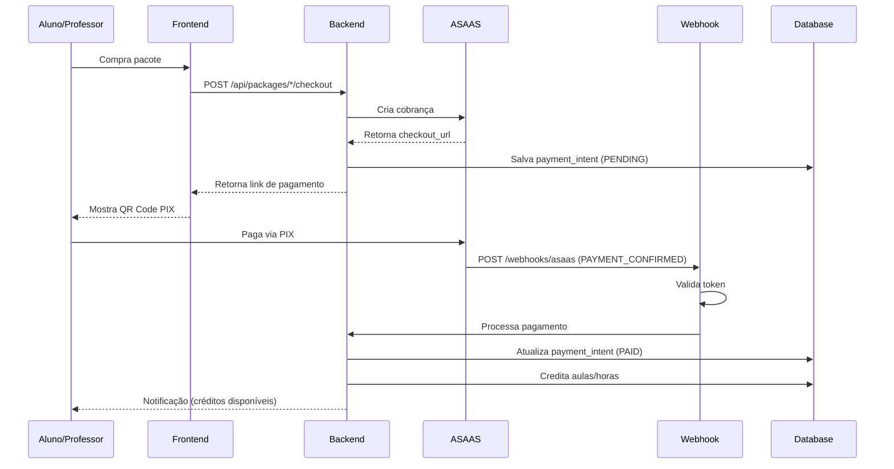

# 📋 Resumo das Mudanças - Sistema de Pagamentos

## ✅ O Que Foi Feito

### 1. Atualização do Ambiente ASAAS
```diff
- ASAAS_API_KEY=$aact_hmlg_... (Sandbox)
+ ASAAS_API_KEY=$aact_prod_... (Produção)

- ASAAS_ENV=sandbox
+ ASAAS_ENV=production

+ ASAAS_WEBHOOK_SECRET=wh_prod_meupersonal_2024_secure_token_a1b2c3d4e5f6
```

**⚠️ IMPORTANTE:** Agora o sistema está em **PRODUÇÃO** e cobra de verdade!

---

### 2. Melhorias no Código do Webhook

#### Antes:
```typescript
// Sem validação de token
// Logs básicos
// Código morto não utilizado
```

#### Depois:
```typescript
✅ Validação de token de segurança
✅ Logs detalhados com emojis para fácil identificação
✅ Tratamento de erros robusto
✅ Código limpo (removido funções antigas não utilizadas)
✅ Idempotência (não processa pagamento duas vezes)
```

---

### 3. Arquivos Modificados

| Arquivo | Mudanças |
|---------|----------|
| `apps/api/.env` | ✅ API Key de produção<br>✅ Token de webhook |
| `apps/api/src/routes/webhooks.ts` | ✅ Logs melhorados<br>✅ Validação de token<br>✅ Código limpo |
| `apps/api/src/services/payment-intent.service.ts` | ✅ Tratamento de erros<br>✅ Logs detalhados<br>✅ Status CANCELED |

---

### 4. Arquivos Criados

| Arquivo | Propósito |
|---------|-----------|
| `CONFIGURACAO_ASAAS_PRODUCAO.md` | 📖 Guia completo de configuração |
| `apps/api/test-webhook.sh` | 🧪 Script de teste do webhook |
| `RESUMO_MUDANCAS_PAGAMENTO.md` | 📋 Este arquivo |

---

## 🔄 Fluxo de Pagamento Atual



---

## 🎯 Próximos Passos

### Passo 1: Configurar Webhook no ASAAS ⏳
1. Acesse: https://www.asaas.com
2. Menu → Configurações → Integrações → Webhooks
3. Adicionar Webhook:
   - **URL:** `https://central-meupersonalweb.es3isr.easypanel.host/api/webhooks/asaas`
   - **Token:** `wh_prod_meupersonal_2024_secure_token_a1b2c3d4e5f6`
   - **Eventos:** PAYMENT_CONFIRMED, PAYMENT_RECEIVED, PAYMENT_OVERDUE, PAYMENT_REFUNDED

### Passo 2: Testar Localmente ⏳
```bash
# 1. Reinicie o backend
cd apps/api
npm run dev

# 2. Execute o script de teste
bash test-webhook.sh

# 3. Verifique os logs
# Deve aparecer: 🔔 [WEBHOOK] Asaas recebido...
```

### Passo 3: Testar em Produção ⏳
1. Crie uma cobrança de R$ 0,01 (teste)
2. Pague usando seu próprio CPF
3. Verifique se os créditos foram adicionados
4. Monitore os logs por 24h

### Passo 4: Monitoramento Contínuo ⏳
- Configure alertas para erros no webhook
- Monitore taxa de sucesso (deve ser > 99%)
- Verifique diariamente se pagamentos estão sendo creditados

---

## 🔐 Segurança Implementada

| Recurso | Status | Descrição |
|---------|--------|-----------|
| Token de Webhook | ✅ | Valida origem das requisições |
| Idempotência | ✅ | Não processa pagamento duas vezes |
| Logs de Auditoria | ✅ | Rastreabilidade completa |
| Tratamento de Erros | ✅ | Falhas não quebram o sistema |
| HTTPS | ✅ | Comunicação criptografada |

---

## 📊 Logs Esperados

### ✅ Sucesso:
```
🔔 [WEBHOOK] Asaas recebido: { event: 'PAYMENT_CONFIRMED', paymentId: 'pay_123' }
✅ [WEBHOOK] Processando pagamento: { providerId: 'pay_123', status: 'CONFIRMED' }
✅ PaymentIntent abc-123 atualizado para status: PAID
💳 Creditando aulas para aluno user-456...
✅ Aluno user-456 recebeu 10 aulas
✅ [WEBHOOK] Pagamento processado com sucesso
```

### ❌ Erro (Token Inválido):
```
🔔 [WEBHOOK] Asaas recebido: { event: 'PAYMENT_CONFIRMED', paymentId: 'pay_123' }
⚠️ Asaas webhook rejeitado por token inválido ou ausente
```

### ⚠️ Aviso (Pagamento Já Processado):
```
🔔 [WEBHOOK] Asaas recebido: { event: 'PAYMENT_CONFIRMED', paymentId: 'pay_123' }
ℹ️ PaymentIntent abc-123 já foi processado anteriormente
```

---

## 🆘 Troubleshooting

### Problema: "Invalid webhook token"
**Solução:** Verifique se o token no ASAAS é exatamente:
```
wh_prod_meupersonal_2024_secure_token_a1b2c3d4e5f6
```

### Problema: Webhook não chega
**Solução:** 
1. Teste a URL manualmente: `curl https://central-meupersonalweb.es3isr.easypanel.host/api/webhooks/asaas`
2. Verifique firewall/proxy
3. Confirme que o webhook está ativo no painel ASAAS

### Problema: Créditos não são adicionados
**Solução:**
1. Verifique os logs: `tail -f /var/log/app.log`
2. Confirme que `payment_intents` tem o registro
3. Verifique se `franqueadora_id` está correto

---

## 📞 Contatos

### Suporte ASAAS:
- Email: suporte@asaas.com
- Telefone: (16) 3509-5060
- Documentação: https://docs.asaas.com

### Documentação Útil:
- Webhooks: https://docs.asaas.com/docs/sobre-os-webhooks
- API: https://docs.asaas.com/reference
- Split de Pagamento: https://docs.asaas.com/docs/split-de-pagamento

---

## ✅ Checklist de Validação

Antes de considerar concluído:

- [ ] `.env` atualizado com chave de produção
- [ ] Token de webhook configurado
- [ ] Webhook criado no painel ASAAS
- [ ] Script de teste executado com sucesso
- [ ] Pagamento real de teste realizado (R$ 0,01)
- [ ] Créditos creditados corretamente
- [ ] Logs sendo monitorados
- [ ] Equipe treinada sobre novo fluxo
- [ ] Documentação lida e compreendida

---

**Status Atual:** ✅ Código Pronto | ⏳ Aguardando Configuração no ASAAS

**Última Atualização:** 2024-01-15
