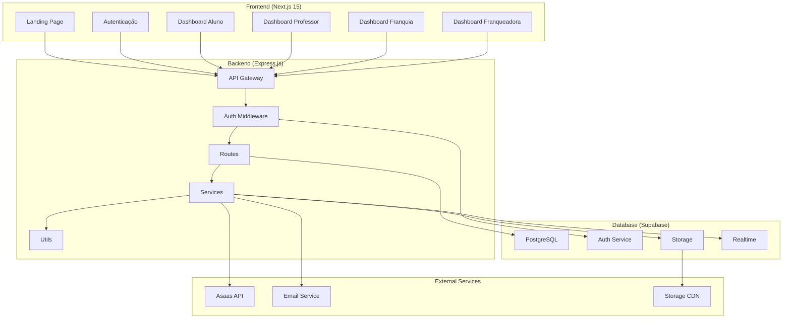
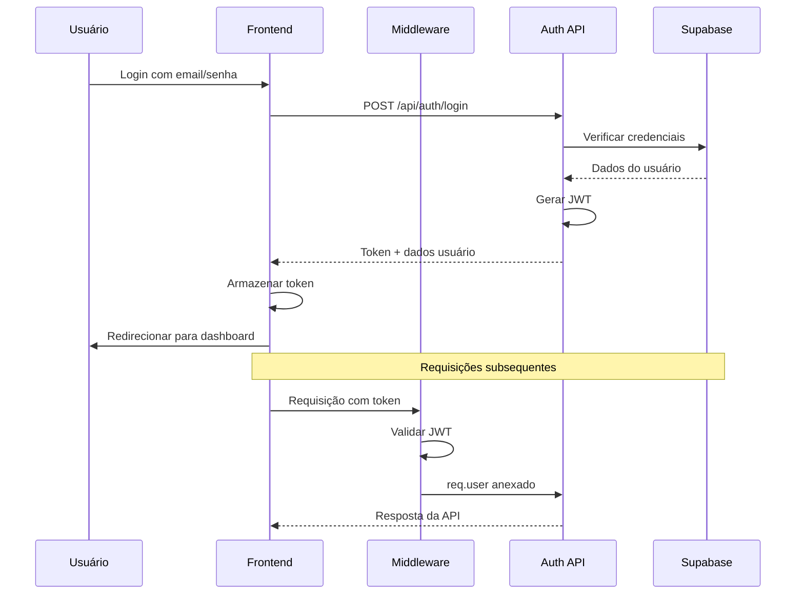
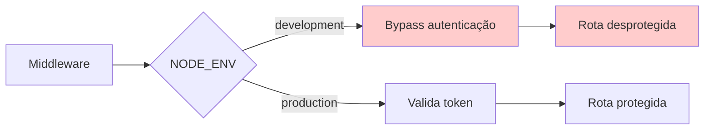
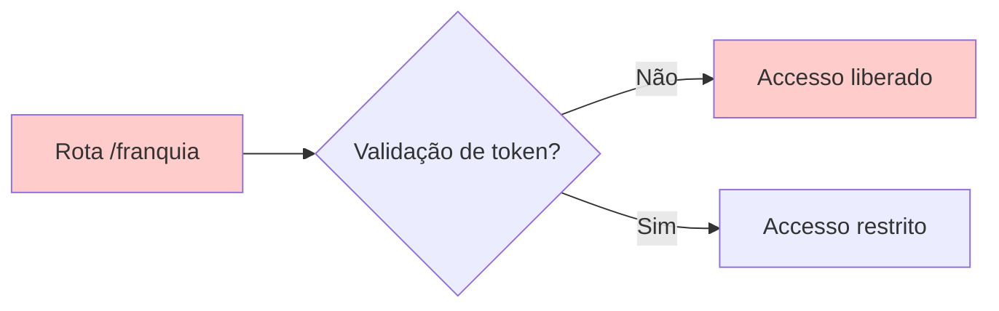
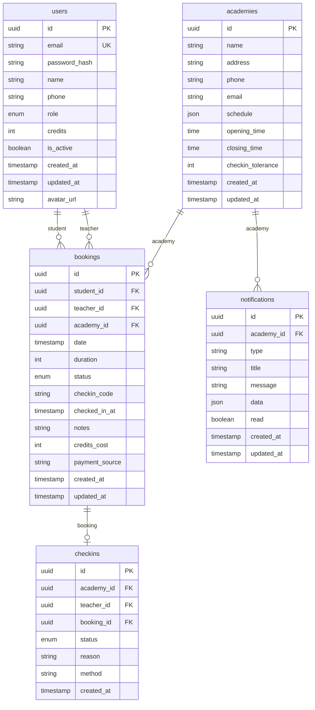
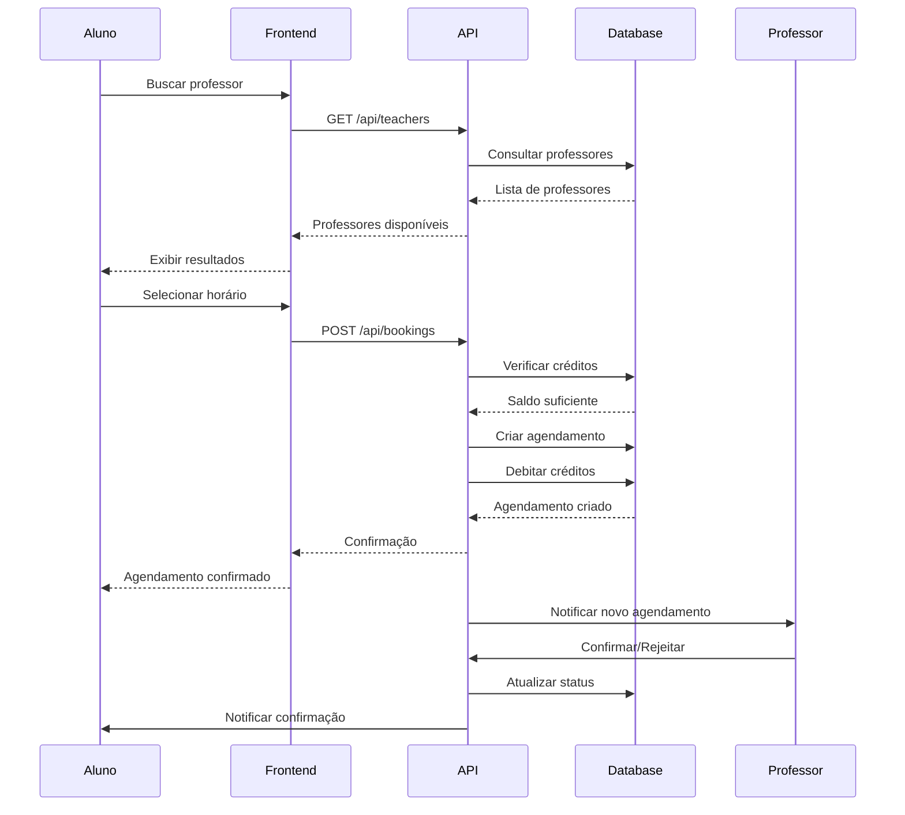
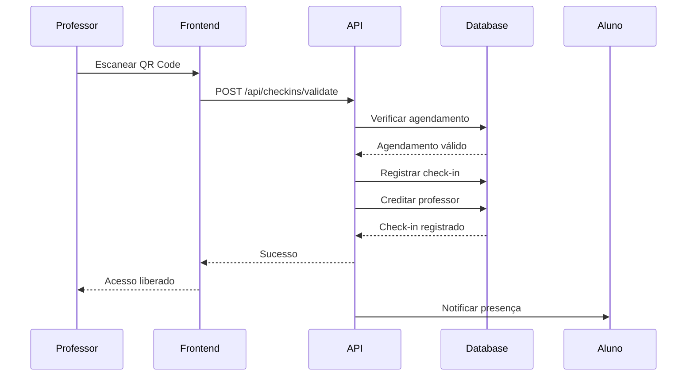

# Arquitetura do Sistema - Meu Personal

## 🏗️ Visão Geral da Arquitetura

## 🔐 Fluxo de Autenticação

## 🚨 Pontos Críticos de Segurança Identificados

### 1. Vulnerabilidade no Middleware

### 2. Falha de Autenticação na Rota /franquia

## 📊 Estrutura do Banco de Dados

## 🔧 Componentes da API

### Middleware de Autenticação
- **requireAuth**: Validação básica de JWT
- **requireFranqueadoraAdmin**: Validação de admin da franqueadora
- **Vulnerabilidade**: Bypass em ambiente de desenvolvimento

### Rotas Principais
- **/api/auth**: Login, registro, recuperação de senha
- **/api/users**: Gestão de usuários
- **/api/teachers**: Gestão de professores
- **/api/students**: Gestão de alunos
- **/api/bookings**: Sistema de agendamentos
- **/api/franchises**: Gestão de franquias
- **/api/financial**: Sistema financeiro

### Serviços Externos
- **Supabase**: Banco de dados e autenticação
- **Asaas**: Processamento de pagamentos
- **Storage CDN**: Upload de arquivos

## 🚨 Inconsistências Identificadas

### Schema Prisma vs Supabase
| Tabela | Schema Prisma | Supabase | Status |
|--------|---------------|-----------|---------|
| users | password (string) | password_hash (string) | ❌ Inconsistente |
| users | Sem avatar_url | avatar_url (string) | ❌ Faltando |
| academies | Não existe | ✅ Existe | ❌ Faltando |
| checkins | Não existe | ✅ Existe | ❌ Faltando |
| notifications | Não existe | ✅ Existe | ❌ Faltando |
| teacher_preferences | Parcial | ✅ Existe | ⚠️ Incompleto |

## 📋 Fluxos Principais do Sistema

### Fluxo de Agendamento

### Fluxo de Check-in

## 🛡️ Camadas de Segurança

### 1. Frontend
- Validação de formulários
- Sanitização de inputs
- Proteção XSS
- Armazenamento seguro de tokens

### 2. Backend
- Middleware de autenticação
- Validação de entrada (Zod)
- Rate limiting
- CORS configurado

### 3. Banco de Dados
- Row Level Security (RLS)
- Índices otimizados
- Backups automáticos
- Criptografia de dados sensíveis

### 4. Infraestrutura
- HTTPS/TLS
- Headers de segurança
- Firewall
- Monitoramento

## 📈 Estratégia de Escalabilidade

### Horizontal Scaling
- Frontend: Vercel Edge Functions
- Backend: Docker containers + Kubernetes
- Database: Supabase (auto-scaling)
- Storage: CDN global

### Performance Optimization
- Cache Redis para dados frequentes
- CDN para assets estáticos
- Lazy loading de componentes
- Otimização de queries

### Monitoramento e Observabilidade
- Logs centralizados
- Métricas de performance
- Alertas de erro
- Health checks automatizados

---

**Status da Arquitetura**: Funcional com vulnerabilidades críticas
**Prioridade**: Segurança > Funcionalidade > Performance
**Complexidade**: Média (bem estruturado mas precisa de ajustes)