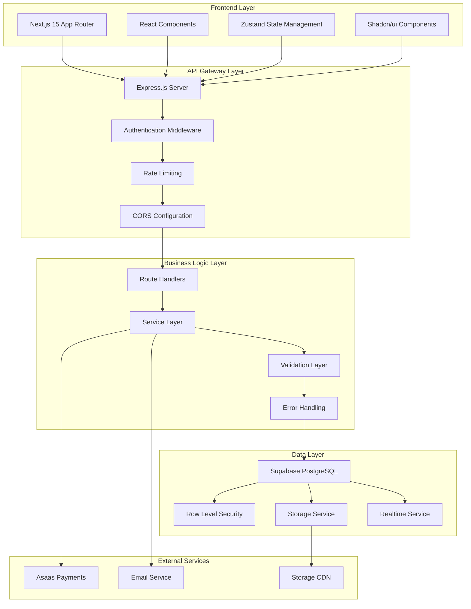

# Auditoria Técnica Completa - Meu Personal

## 1. Resumo Executivo

### Visão Geral do Projeto
O **Meu Personal** é uma plataforma completa de gestão de academias e personal trainers, desenvolvida como um sistema SaaS multi-tenant com arquitetura de microsserviços. O projeto está atualmente com **70% de implementação**, possuindo funcionalidades core de autenticação, agendamentos e gestão de usuários, mas apresentando vulnerabilidades críticas de segurança que bloqueiam o lançamento.

### Arquitetura Predominante
O sistema adota uma arquitetura **monolito modular** com separação clara entre frontend e backend:
- **Frontend**: Next.js 15 com App Router, React 19 e TypeScript
- **Backend**: Express.js com TypeScript, organizado em camadas
- **Banco de Dados**: PostgreSQL via Supabase com Row Level Security (RLS)
- **Infraestrutura**: Docker-compose para desenvolvimento, planejado para Vercel (frontend) e Supabase (backend)

### Pontos Críticos da Estrutura
- **Vulnerabilidades de segurança críticas** que expõem dados sensíveis
- **Inconsistências entre schema Prisma e Supabase**
- **Sistema de autenticação híbrido** (JWT custom + Supabase Auth)
- **Arquitetura bem estruturada** mas com implementação incompleta
- **Falta de testes automatizados** e documentação técnica atualizada

---

## 2. Arquitetura e Padrões de Design

### Arquitetura Geral do Sistema



### Padrões de Projeto Implementados

#### 1. **MVC (Model-View-Controller)**
- **Models**: Definidos via Prisma Schema com validações Zod
- **Views**: Componentes React com separação de preocupações
- **Controllers**: Route handlers no Express.js

#### 2. **Repository Pattern**
- Implementado através dos serviços Supabase
- Abstração do acesso a dados nas rotas da API
- Exemplo: [`apps/api/src/lib/supabase.ts`](apps/api/src/lib/supabase.ts)

#### 3. **Middleware Pattern**
- Autenticação: [`apps/api/src/middleware/auth.ts`](apps/api/src/middleware/auth.ts)
- Rate Limiting: [`apps/api/src/middleware/rateLimit.ts`](apps/api/src/middleware/rateLimit.ts)
- Validação: [`apps/api/src/middleware/validation.ts`](apps/api/src/middleware/validation.ts)

#### 4. **Factory Pattern**
- Utilizado na criação de respostas de API
- Implementado no error handler: [`apps/api/src/middleware/errorHandler.ts`](apps/api/src/middleware/errorHandler.ts)

#### 5. **Observer Pattern**
- Implementado via Supabase Realtime para notificações
- Store pattern com Zustand para gerenciamento de estado

### Comunicação Entre Módulos

#### Frontend-Backend Communication
- **Protocolo**: HTTP/HTTPS com REST API
- **Autenticação**: JWT Bearer tokens + cookies HttpOnly
- **Formatação**: JSON com validação Zod
- **Client**: Axios com interceptors customizados

#### Service Communication
- **Pagamentos**: Asaas API via webhooks
- **Email**: Resend service para notificações transacionais
- **Storage**: Supabase Storage para uploads de arquivos

---

## 3. Estrutura de Diretórios e Arquivos

### Estrutura Completa do Projeto

```
meu-personal/
├── apps/                          # Aplicações principais
│   ├── api/                       # Backend API (Express.js)
│   │   ├── prisma/               # Schema e migrações do BD
│   │   │   └── schema.prisma     # Schema completo do banco
│   │   ├── src/
│   │   │   ├── config/           # Configurações (Supabase)
│   │   │   ├── lib/              # Utilitários e helpers
│   │   │   ├── middleware/       # Middlewares Express
│   │   │   ├── routes/           # Endpoints da API
│   │   │   └── server.ts         # Entry point do servidor
│   │   └── uploads/              # Arquivos estáticos upload
│   └── web/                      # Frontend (Next.js)
│       ├── app/                  # App Router pages
│       │   ├── dashboard/        # Dashboards por tipo de usuário
│       │   ├── franqueadora/     # Pages da franqueadora
│       │   ├── franquia/         # Pages das franquias
│       │   ├── professor/        # Pages dos professores
│       │   └── student/          # Pages dos alunos
│       ├── components/           # Componentes React
│       │   ├── layout/           # Layout components
│       │   ├── ui/               # UI components (shadcn/ui)
│       │   └── modals/           # Modal components
│       ├── lib/                  # Utilitários e configurações
│       │   ├── stores/           # Zustand stores
│       │   └── hooks/            # Custom React hooks
│       └── public/               # Assets estáticos
├── docs/                         # Documentação do projeto
├── packages/                     # Packages compartilhados (vazio)
├── docker-compose.yml            # Configuração Docker
├── package.json                  # Root package.json (monorepo)
└── .env.example                  # Variáveis de ambiente exemplo
```

### Responsabilidade dos Diretórios Principais

#### **apps/api/src/routes/**
Contém todos os endpoints da API organizados por domínio:
- [`auth.ts`](apps/api/src/routes/auth.ts) - Autenticação e usuários
- [`teachers.ts`](apps/api/src/routes/teachers.ts) - Gestão de professores
- [`bookings.ts`](apps/api/src/routes/bookings.ts) - Sistema de agendamentos
- [`financial.ts`](apps/api/src/routes/financial.ts) - Relatórios financeiros
- [`franchises.ts`](apps/api/src/routes/franchises.ts) - Gestão de franquias

#### **apps/web/app/**
Estrutura de páginas baseada no Next.js App Router:
- **Dashboard específicos**: `/dashboard/aluno`, `/dashboard/professor`
- **Gestão de franquias**: `/franqueadora`, `/franquia`
- **Autenticação**: `/login`, `/cadastro`, `/esqueci-senha`

#### **apps/web/lib/stores/**
Gerenciamento de estado com Zustand:
- [`auth-store.ts`](apps/web/lib/stores/auth-store.ts) - Estado de autenticação
- [`franquia-store.ts`](apps/web/lib/stores/franquia-store.ts) - Estado da franquia
- [`notifications-store.ts`](apps/web/lib/stores/notifications-store.ts) - Notificações

### Pontos de Entrada da Aplicação

#### **Backend**
- **Principal**: [`apps/api/src/server.ts`](apps/api/src/server.ts)
- **Porta**: 3001 (configurável via PORT env)
- **Health Check**: `/health`

#### **Frontend**
- **Principal**: [`apps/web/app/layout.tsx`](apps/web/app/layout.tsx)
- **Porta**: 3000 (desenvolvimento)
- **Home**: [`apps/web/app/page.tsx`](apps/web/app/page.tsx)

---

## 4. Stack de Tecnologias e Dependências

### Linguagens e Frameworks

#### **Frontend**
- **Next.js 15.5.3**: Framework React com App Router
- **React 19.1.0**: Biblioteca UI base
- **TypeScript 5**: Tipagem estática
- **Tailwind CSS 3.4.17**: Framework CSS utilitário

#### **Backend**
- **Express.js 4.19.0**: Framework web Node.js
- **TypeScript 5.5.0**: Tipagem estática
- **Prisma 5.15.0**: ORM para banco de dados
- **Node.js 20+**: Runtime JavaScript

### Bibliotecas Principais

#### **Frontend Dependencies**
```json
{
  "@supabase/supabase-js": "^2.58.0",
  "@tanstack/react-query": "^5.89.0",
  "axios": "^1.12.2",
  "zustand": "^4.5.7",
  "react-hook-form": "^7.62.0",
  "date-fns": "^3.6.0",
  "html5-qrcode": "^2.3.8",
  "qrcode": "^1.5.4",
  "react-big-calendar": "^1.19.4"
}
```

#### **Backend Dependencies**
```json
{
  "@prisma/client": "^5.15.0",
  "@supabase/supabase-js": "^2.58.0",
  "express": "^4.19.0",
  "jsonwebtoken": "^9.0.2",
  "bcryptjs": "^2.4.3",
  "zod": "^3.23.0",
  "helmet": "^7.1.0",
  "cors": "^2.8.5",
  "multer": "^2.0.2",
  "nodemailer": "^7.0.6",
  "resend": "^6.1.2"
}
```

### Banco de Dados

#### **PostgreSQL via Supabase**
- **Provider**: PostgreSQL 15+
- **ORM**: Prisma com schema completo
- **Segurança**: Row Level Security (RLS)
- **Realtime**: Supabase Realtime para notificações
- **Storage**: Supabase Storage para uploads

#### **Schema Principal**
- **users**: Usuários do sistema com roles
- **teacher_profiles**: Perfis específicos de professores
- **bookings**: Sistema de agendamentos
- **academies**: Franquias/academias
- **transactions**: Transações financeiras
- **notifications**: Sistema de notificações

### Serviços Externos

#### **Pagamentos**
- **Asaas API**: Processamento de pagamentos
- **Webhooks**: Notificações de status de pagamento

#### **Comunicação**
- **Resend**: Envio de emails transacionais
- **Supabase Realtime**: Notificações em tempo real

---

## 5. Análise Detalhada das Funcionalidades

### Funcionalidades Principais Mapeadas

#### 1. **Sistema de Autenticação**
**Status**: 90% implementado
- **Login/Registro**: Completo com validação
- **Recuperação de Senha**: Implementado via Supabase Auth
- **Roles**: STUDENT, TEACHER, ADMIN, FRANCHISOR, FRANCHISE_ADMIN
- **JWT Tokens**: Com expiração configurável
- **Middleware**: Proteção de rotas por role

**Fluxo de Trabalho**:
1. Usuário faz login via `/api/auth/login`
2. Backend valida credenciais no Supabase
3. Gera JWT com dados do usuário
4. Frontend armazena token e dados do usuário
5. Middleware valida token em requisições subsequentes

#### 2. **Gestão de Professores**
**Status**: 80% implementado
- **Perfil Completo**: Bio, especialidades, valor/hora
- **Disponibilidade**: Configuração de horários
- **Avaliações**: Sistema de reviews 1-5 estrelas
- **Estatísticas**: Aulas, ganhos, avaliações
- **Vínculo com Academias**: Professores podem trabalhar em múltiplas academias

**Endpoints Principais**:
- `GET /api/teachers` - Listar professores
- `GET /api/teachers/:id` - Detalhes do professor
- `PUT /api/teachers/:id` - Atualizar perfil
- `GET /api/teachers/:id/stats` - Estatísticas

#### 3. **Sistema de Agendamentos**
**Status**: 75% implementado
- **Criação de Agendamentos**: Alunos agendam com professores
- **Confirmação**: Professores confirmam/rejeitam agendamentos
- **Cancelamento**: Com política de reembolso
- **Check-in**: Sistema QR Code para validação
- **Histórico**: Consulta de agendamentos passados

**Fluxo Completo**:
1. Aluno busca professor disponível
2. Seleciona horário na agenda
3. Sistema debita créditos do aluno
4. Professor recebe notificação
5. Professor confirma/rejeita agendamento
6. No dia da aula: check-in via QR Code
7. Sistema credita professor após aula

#### 4. **Sistema de Créditos**
**Status**: 60% implementado
- **Compra de Créditos**: Pacotes via Asaas
- **Débito Automático**: Ao criar agendamento
- **Crédito Professor**: Após check-in da aula
- **Histórico**: Transações completas
- **Validação**: Saldo insuficiente bloqueia agendamento

#### 5. **Gestão de Franquias**
**Status**: 70% implementado
- **Cadastro de Franquias**: Dados completos da academia
- **Vínculo Professores**: Professores por academia
- **Vínculo Alunos**: Alunos por academia
- **Planos Personalizados**: Pacotes por academia
- **Relatórios Financeiros**: Faturamento por franquia

#### 6. **Dashboard Multi-Role**
**Status**: 80% implementado
- **Aluno**: Busca professores, meus agendamentos, créditos
- **Professor**: Agenda, alunos, carteira, configurações
- **Franquia**: Gestão de professores, alunos, financeiro
- **Franqueadora**: Visão geral de todas as franquias

### Componentes e Serviços por Funcionalidade

#### **Autenticação**
- **Frontend**: [`apps/web/lib/stores/auth-store.ts`](apps/web/lib/stores/auth-store.ts)
- **Backend**: [`apps/api/src/routes/auth.ts`](apps/api/src/routes/auth.ts)
- **Middleware**: [`apps/api/src/middleware/auth.ts`](apps/api/src/middleware/auth.ts)

#### **Agendamentos**
- **Frontend**: [`apps/web/components/booking/slot-selector.tsx`](apps/web/components/booking/slot-selector.tsx)
- **Backend**: [`apps/api/src/routes/bookings.ts`](apps/api/src/routes/bookings.ts)
- **API Client**: [`apps/web/lib/api.ts`](apps/web/lib/api.ts)

#### **Notificações**
- **Frontend**: [`apps/web/components/notifications/NotificationsProvider.tsx`](apps/web/components/notifications/NotificationsProvider.tsx)
- **Backend**: [`apps/api/src/routes/notifications.ts`](apps/api/src/routes/notifications.ts)
- **Realtime**: Supabase Realtime subscriptions

---

## 6. Configuração, Ambiente e Deploy

### Variáveis de Ambiente Necessárias

#### **Backend (.env)**
```env
PORT=3001
FRONTEND_URL=http://localhost:3000
SUPABASE_URL=https://fstbhakmmznfdeluyexc.supabase.co
SUPABASE_SERVICE_ROLE_KEY=service_role_key_aqui
JWT_SECRET=secret_minimo_32_caracteres
JWT_EXPIRES_IN=15m
DEFAULT_CREDITS_PER_CLASS=1

# Pagamentos (opcional)
ASAAS_BASE_URL=https://sandbox.asaas.com/api/v3
ASAAS_API_KEY=asaas_api_key_aqui

# Email
RESEND_API_KEY=resend_api_key_aqui
RESEND_FROM_EMAIL=noreply@meupersonal.com
```

#### **Frontend (.env.local)**
```env
NEXT_PUBLIC_API_URL=http://localhost:3001
NEXT_PUBLIC_SUPABASE_URL=https://fstbhakmmznfdeluyexc.supabase.co
NEXT_PUBLIC_SUPABASE_ANON_KEY=anon_key_aqui
```

### Processo de Build e Execução

#### **Desenvolvimento**
```bash
# Instalar dependências
npm install

# Iniciar backend (Terminal 1)
cd apps/api
npm run dev

# Iniciar frontend (Terminal 2)
cd apps/web
npm run dev

# Ou iniciar ambos simultaneamente
npm run dev
```

#### **Produção**
```bash
# Build de todas as aplicações
npm run build

# Iniciar versão de produção
npm run start
```

### Configuração de CI/CD

**Status**: Não implementado
- **Recomendação**: GitHub Actions para deploy automatizado
- **Frontend**: Deploy para Vercel
- **Backend**: Deploy para Railway/Render
- **Banco**: Supabase (já configurado)

### Processo de Deploy Atual

**Manual via linha de comando**:
1. Build do frontend: `npm run build --workspace=web`
2. Build do backend: `npm run build --workspace=api`
3. Deploy manual para plataforma de hospedagem

---

## 7. Qualidade de Código e Testes

### Avaliação Geral da Qualidade do Código

#### **Pontos Fortes**
- **TypeScript**: Uso consistente em todo o projeto
- **Estrutura Modular**: Boa separação de responsabilidades
- **Padrões de Código**: Convenções consistentes
- **Componentização**: Reutilização de componentes React
- **Validação**: Uso de Zod para validação de dados

#### **Pontos a Melhorar**
- **Tratamento de Erros**: Inconsistente em alguns endpoints
- **Logging**: Mínimo, dificulta debug em produção
- **Documentação**: Faltando JSDoc e comentários
- **Type Safety**: Alguns tipos `any` podem ser melhorados

### Estratégia de Testes Implementada

**Status**: Praticamente inexistente
- **Testes Unitários**: Não implementados
- **Testes de Integração**: Não implementados
- **Testes E2E**: Não implementados
- **Testes de API**: Não implementados

### Frameworks de Testes Disponíveis

**Recomendações para implementação**:
- **Frontend**: Jest + React Testing Library
- **Backend**: Jest + Supabase test helpers
- **E2E**: Playwright ou Cypress
- **API**: Supertest para testes de endpoints

### Cobertura de Testes

**Atual**: 0%
**Meta mínima recomendada**: 70%
**Áreas críticas para testar**:
- Autenticação e autorização
- Sistema de agendamentos
- Processamento de pagamentos
- Validação de dados

---

## 8. Pontos de Atenção, Riscos e Recomendações

### Vulnerabilidades Críticas de Segurança

#### 1. **Bypass de Autenticação em Desenvolvimento**
**Risco**: Crítico
**Localização**: [`apps/api/src/middleware/auth.ts`](apps/api/src/middleware/auth.ts)
**Impacto**: Acesso não autorizado ao sistema
**Recomendação**: Remover bypass de desenvolvimento

#### 2. **Senhas Hardcoded**
**Risco**: Crítico
**Impacto**: Acesso administrativo exposto
**Recomendação**: Remover senhas hardcoded e usar variáveis de ambiente

#### 3. **JWT Secrets Inseguros**
**Risco**: Alto
**Impacto**: Tokens podem ser forjados
**Recomendação**: Usar secrets com mínimo 32 caracteres

#### 4. **CORS Permissivo**
**Risco**: Médio-Alto
**Impacto**: Possibilidade de ataques CSRF
**Recomendação**: Configurar allowlist restritiva

### Inconsistências de Schema

#### **Prisma vs Supabase**
| Tabela | Campo Prisma | Campo Supabase | Status |
|--------|---------------|----------------|---------|
| users | password | password_hash | ❌ Inconsistente |
| users | Sem avatar_url | avatar_url | ❌ Faltando |
| academies | Não existe | ✅ Existe | ❌ Faltando |

### Gargalos de Performance

#### 1. **Queries N+1**
**Localização**: Múltiplos endpoints
**Impacto**: Lentidão em listagens grandes
**Recomendação**: Implementar eager loading com Prisma

#### 2. **Falta de Cache**
**Impacto**: Múltiplas consultas repetitivas
**Recomendação**: Implementar Redis para cache

#### 3. **Upload de Arquivos**
**Impacto**: Processamento síncrono
**Recomendação**: Implementar upload assíncrono

### Dívida Técnica

#### 1. **Código Duplicado**
**Localização**: Validações em múltiplos arquivos
**Recomendação**: Criar schemas compartilhados

#### 2. **Tipos `any`**
**Localização**: Handlers de API
**Recomendação**: Criar interfaces específicas

#### 3. **Middleware de Erro**
**Status**: Parcialmente implementado
**Recomendação**: Completar implementação

### Recomendações de Melhorias

#### Imediatas (Críticas)
1. **Corrigir vulnerabilidades de segurança**
2. **Sincronizar schemas Prisma/Supabase**
3. **Implementar logging básico**
4. **Remover senhas hardcoded**

#### Curto Prazo (1-2 semanas)
1. **Implementar testes unitários críticos**
2. **Configurar CI/CD básico**
3. **Melhorar tratamento de erros**
4. **Documentar APIs**

#### Médio Prazo (1 mês)
1. **Implementar testes E2E**
2. **Otimizar performance de queries**
3. **Implementar monitoring**
4. **Documentação completa**

#### Longo Prazo (3 meses)
1. **Refatorar para microsserviços**
2. **Implementar cache distribuído**
3. **Sistema de analytics**
4. **Automação completa de deploy**

---

## Conclusão

O projeto **Meu Personal** apresenta uma **arquitetura sólida e bem estruturada** com tecnologias modernas e boas práticas de desenvolvimento. No entanto, **vulnerabilidades críticas de segurança** bloqueiam o lançamento, e a **falta de testes** compromete a confiabilidade do sistema.

Com as correções de segurança adequadas e implementação dos testes essenciais, o projeto tem potencial para se tornar uma plataforma robusta e escalável para gestão de academias e personal trainers.

**Status Atual**: 70% implementado com bloqueadores críticos
**Esforço para Lançamento**: 2-3 semanas (com foco em segurança)
**Potencial de Escalabilidade**: Alto (arquitetura bem planejada)