# Fases 3 e 4 - Agenda e Scheduler - Plano Detalhado

## Fase 3 - Agenda e Reservas (3-4 dias)

### Objetivo
Refatorar endpoints de bookings para implementar o modelo canônico com locks/unlocks, regras de cancelamento e validação de capacidade.

### Status Atual
- ✅ Endpoint `/api/bookings` já existe mas usa modelo antigo
- ⚠️ Precisa refatorar para usar `units` em vez de `academies`
- ⚠️ Lógica de locks/unlocks não implementada
- ⚠️ Regras de cancelamento (>4h / ≤4h) não implementadas

### Ações Específicas

#### 1. Refatorar Endpoints de Bookings

**Arquivo: `apps/api/src/routes/bookings.ts`**

**Mudanças principais:**
- Substituir `academy_id` por `unit_id`
- Implementar lógica de source (ALUNO vs PROFESSOR)
- Adicionar validação de capacidade por slot
- Implementar regras de cancelamento

```typescript
// Schema atualizado
const bookingSchema = z.object({
  source: z.enum(['ALUNO', 'PROFESSOR']),
  student_id: z.string().uuid().optional(),
  professor_id: z.string().uuid(),
  unit_id: z.string().uuid(),
  start_at: z.string().datetime(),
  end_at: z.string().datetime(),
  student_notes: z.string().optional(),
  professor_notes: z.string().optional()
});
```

#### 2. Implementar Lógica de LOCK/UNLOCK

**Arquivo novo: `apps/api/src/services/booking-lock.service.ts`**

```typescript
export class BookingLockService {
  // Criar agendamento aluno-led
  async createStudentBooking(bookingData: StudentBookingData): Promise<Booking> {
    await supabase.transaction(async (tx) => {
      // 1. Validar saldo do aluno
      const balance = await this.checkStudentBalance(bookingData.studentId, bookingData.unitId);
      if (balance < 1) {
        throw new Error('Saldo insuficiente');
      }
      
      // 2. Validar capacidade do slot
      const slotCapacity = await this.checkSlotCapacity(bookingData.unitId, bookingData.startAt);
      if (slotCapacity <= 0) {
        throw new Error('Slot lotado');
      }
      
      // 3. Criar booking com status RESERVED
      const booking = await tx.from('bookings').insert({
        ...bookingData,
        status: 'RESERVED',
        cancellable_until: new Date(bookingData.startAt.getTime() - 4 * 60 * 60 * 1000)
      }).select().single();
      
      // 4. Criar LOCK para aluno (unlock_at = start_at - 4h)
      await tx.from('student_class_tx').insert({
        student_id: bookingData.studentId,
        unit_id: bookingData.unitId,
        type: 'LOCK',
        qty: 1,
        booking_id: booking.id,
        unlock_at: new Date(bookingData.startAt.getTime() - 4 * 60 * 60 * 1000),
        source: 'ALUNO'
      });
      
      // 5. Criar BONUS_LOCK para professor
      await tx.from('hour_tx').insert({
        professor_id: bookingData.professorId,
        unit_id: bookingData.unitId,
        type: 'BONUS_LOCK',
        hours: 1,
        booking_id: booking.id,
        unlock_at: new Date(bookingData.startAt.getTime() - 4 * 60 * 60 * 1000),
        source: 'SYSTEM'
      });
      
      return booking;
    });
  }
  
  // Criar agendamento professor-led
  async createProfessorBooking(bookingData: ProfessorBookingData): Promise<Booking> {
    await supabase.transaction(async (tx) => {
      // 1. Validar horas disponíveis do professor
      const balance = await this.checkProfessorBalance(bookingData.professorId, bookingData.unitId);
      if (balance < 1) {
        throw new Error('Horas insuficientes');
      }
      
      // 2. Criar booking com status RESERVED
      const booking = await tx.from('bookings').insert({
        ...bookingData,
        status: 'RESERVED',
        cancellable_until: new Date(bookingData.startAt.getTime() - 4 * 60 * 60 * 1000)
      }).select().single();
      
      // 3. CONSUME 1 hora do professor
      await tx.from('hour_tx').insert({
        professor_id: bookingData.professorId,
        unit_id: bookingData.unitId,
        type: 'CONSUME',
        hours: 1,
        booking_id: booking.id,
        source: 'PROFESSOR'
      });
      
      // 4. Atualizar saldo
      await tx.raw(`
        UPDATE prof_hour_balance 
        SET available_hours = available_hours - 1,
            updated_at = NOW()
        WHERE professor_id = $1 AND unit_id = $2
      `, [bookingData.professorId, bookingData.unitId]);
      
      return booking;
    });
  }
}
```

#### 3. Implementar Cancelamentos

**Arquivo novo: `apps/api/src/services/booking-cancel.service.ts`**

```typescript
export class BookingCancelService {
  async cancelBooking(bookingId: string, actorId: string): Promise<void> {
    await supabase.transaction(async (tx) => {
      // 1. Buscar booking
      const booking = await tx.from('bookings')
        .select('*')
        .eq('id', bookingId)
        .single();
      
      if (!booking) {
        throw new Error('Booking não encontrado');
      }
      
      const now = new Date();
      const isMoreThan4hBefore = booking.cancellable_until && now < booking.cancellable_until;
      
      if (booking.source === 'ALUNO') {
        // Cancelamento aluno-led
        if (isMoreThan4hBefore) {
          // >4h: REVOKE locks (aluno recupera crédito, professor não ganha bônus)
          await this.revokeStudentLock(tx, booking);
          await this.revokeProfessorBonusLock(tx, booking);
        } else {
          // ≤4h: mantém consumo/bônus (não faz nada, locks serão processados pelo scheduler)
        }
      } else {
        // Cancelamento professor-led
        if (isMoreThan4hBefore) {
          // >4h: REFUND 1h para professor
          await this.refundProfessorHour(tx, booking);
        }
        // ≤4h: mantém consumo (não faz nada)
      }
      
      // 2. Atualizar status do booking
      await tx.from('bookings')
        .update({ 
          status: 'CANCELED',
          updated_at: now
        })
        .eq('id', bookingId);
      
      // 3. Registrar auditoria
      await tx.from('audit_logs').insert({
        actor_user_id: actorId,
        action: 'CANCEL_BOOKING',
        entity: 'booking',
        entity_id: bookingId,
        diff_json: { 
          old_status: booking.status,
          new_status: 'CANCELED',
          is_more_than_4h_before: isMoreThan4hBefore
        },
        created_at: now
      });
    });
  }
  
  private async revokeStudentLock(tx: any, booking: any): Promise<void> {
    // Criar transação REVOKE para anular o LOCK
    await tx.from('student_class_tx').insert({
      student_id: booking.student_id,
      unit_id: booking.unit_id,
      type: 'REVOKE',
      qty: 1,
      booking_id: booking.id,
      source: 'SYSTEM',
      created_at: new Date()
    });
    
    // Atualizar saldo (devolver crédito)
    await tx.raw(`
      UPDATE student_class_balance 
      SET total_consumed = total_consumed - 1,
          locked_qty = locked_qty - 1,
          updated_at = NOW()
      WHERE student_id = $1 AND unit_id = $2
    `, [booking.student_id, booking.unit_id]);
  }
  
  private async revokeProfessorBonusLock(tx: any, booking: any): Promise<void> {
    // Criar transação REVOKE para anular o BONUS_LOCK
    await tx.from('hour_tx').insert({
      professor_id: booking.professor_id,
      unit_id: booking.unit_id,
      type: 'REVOKE',
      hours: 1,
      booking_id: booking.id,
      source: 'SYSTEM',
      created_at: new Date()
    });
    
    // Atualizar saldo (remover lock)
    await tx.raw(`
      UPDATE prof_hour_balance 
      SET locked_hours = locked_hours - 1,
          updated_at = NOW()
      WHERE professor_id = $1 AND unit_id = $2
    `, [booking.professor_id, booking.unit_id]);
  }
  
  private async refundProfessorHour(tx: any, booking: any): Promise<void> {
    // Criar transação REFUND
    await tx.from('hour_tx').insert({
      professor_id: booking.professor_id,
      unit_id: booking.unit_id,
      type: 'REFUND',
      hours: 1,
      booking_id: booking.id,
      source: 'SYSTEM',
      created_at: new Date()
    });
    
    // Atualizar saldo (devolver hora)
    await tx.raw(`
      UPDATE prof_hour_balance 
      SET available_hours = available_hours + 1,
          updated_at = NOW()
      WHERE professor_id = $1 AND unit_id = $2
    `, [booking.professor_id, booking.unit_id]);
  }
}
```

#### 4. Validar Capacidade por Slot

**Arquivo novo: `apps/api/src/services/slot-capacity.service.ts`**

```typescript
export class SlotCapacityService {
  async checkSlotCapacity(unitId: string, startAt: Date): Promise<number> {
    // Buscar capacidade da unidade
    const { data: unit } = await supabase
      .from('units')
      .select('capacity_per_slot')
      .eq('id', unitId)
      .single();
    
    if (!unit) {
      throw new Error('Unidade não encontrada');
    }
    
    // Contar bookings confirmados no mesmo horário
    const endAt = new Date(startAt.getTime() + 60 * 60 * 1000); // +1 hora
    
    const { count } = await supabase
      .from('bookings')
      .select('*', { count: 'exact', head: true })
      .eq('unit_id', unitId)
      .gte('start_at', startAt.toISOString())
      .lt('start_at', endAt.toISOString())
      .in('status', ['RESERVED', 'PAID', 'DONE']);
    
    const capacity = unit.capacity_per_slot || 1;
    const used = count || 0;
    
    return Math.max(0, capacity - used);
  }
}
```

## Fase 4 - Scheduler T-4h (1-2 dias)

### Objetivo
Implementar worker que processa locks automaticamente, promovendo LOCK → UNLOCK/CONSUME quando o horário se aproxima.

### Ações Específicas

#### 1. Implementar Worker Base

**Arquivo novo: `apps/api/src/scheduler/scheduler.ts`**

```typescript
export class Scheduler {
  private isRunning = false;
  private interval: NodeJS.Timeout | null = null;
  
  async start(): Promise<void> {
    if (this.isRunning) {
      console.log('Scheduler já está rodando');
      return;
    }
    
    console.log('Iniciando scheduler...');
    this.isRunning = true;
    
    // Rodar a cada 1 minuto
    this.interval = setInterval(async () => {
      try {
        await this.processJobs();
      } catch (error) {
        console.error('Erro no scheduler:', error);
      }
    }, 60 * 1000); // 1 minuto
    
    // Processar imediatamente ao iniciar
    await this.processJobs();
  }
  
  async stop(): Promise<void> {
    if (this.interval) {
      clearInterval(this.interval);
      this.interval = null;
    }
    this.isRunning = false;
    console.log('Scheduler parado');
  }
  
  private async processJobs(): Promise<void> {
    console.log(`Processando jobs: ${new Date().toISOString()}`);
    
    // Processar locks de alunos
    await this.processStudentLocks();
    
    // Processar locks de professores
    await this.processProfessorLocks();
    
    // Limpar locks expirados
    await this.cleanupExpiredLocks();
  }
}
```

#### 2. Processar Locks de Alunos

**Arquivo novo: `apps/api/src/scheduler/student-lock-processor.ts`**

```typescript
export class StudentLockProcessor {
  async processLocks(): Promise<void> {
    const now = new Date();
    
    // Buscar locks que precisam ser processados
    const { data: locks } = await supabase
      .from('student_class_tx')
      .select(`
        *,
        booking:bookings(id, status, start_at)
      `)
      .eq('type', 'LOCK')
      .lte('unlock_at', now.toISOString())
      .is('booking.status', 'RESERVED');
    
    if (!locks || locks.length === 0) {
      console.log('Nenhum lock de aluno para processar');
      return;
    }
    
    console.log(`Processando ${locks.length} locks de alunos`);
    
    for (const lock of locks) {
      await supabase.transaction(async (tx) => {
        // Verificar se o booking ainda existe e está RESERVED
        const { data: booking } = await tx.from('bookings')
          .select('*')
          .eq('id', lock.booking_id)
          .eq('status', 'RESERVED')
          .single();
        
        if (!booking) {
          // Booking não encontrado ou não está RESERVED, cancelar lock
          await this.cancelLock(tx, lock);
          return;
        }
        
        // Promover LOCK para CONSUME
        await tx.from('student_class_tx').insert({
          student_id: lock.student_id,
          unit_id: lock.unit_id,
          type: 'CONSUME',
          qty: lock.qty,
          booking_id: lock.booking_id,
          source: 'SYSTEM',
          created_at: now
        });
        
        // Atualizar saldo
        await tx.raw(`
          UPDATE student_class_balance 
          SET total_consumed = total_consumed + $1,
              locked_qty = locked_qty - $1,
              updated_at = NOW()
          WHERE student_id = $2 AND unit_id = $3
        `, [lock.qty, lock.student_id, lock.unit_id]);
        
        // Atualizar booking para PAID
        await tx.from('bookings')
          .update({ 
            status: 'PAID',
            updated_at: now
          })
          .eq('id', lock.booking_id);
        
        // Registrar auditoria
        await tx.from('audit_logs').insert({
          actor_user_id: null,
          action: 'PROMOTE_STUDENT_LOCK',
          entity: 'student_class_tx',
          entity_id: lock.id,
          diff_json: {
            lock_id: lock.id,
            booking_id: lock.booking_id,
            promoted_at: now.toISOString()
          },
          created_at: now
        });
        
        console.log(`Lock de aluno promovido: ${lock.id} -> CONSUME`);
      });
    }
  }
  
  private async cancelLock(tx: any, lock: any): Promise<void> {
    // Criar transação REVOKE
    await tx.from('student_class_tx').insert({
      student_id: lock.student_id,
      unit_id: lock.unit_id,
      type: 'REVOKE',
      qty: lock.qty,
      booking_id: lock.booking_id,
      source: 'SYSTEM',
      created_at: new Date()
    });
    
    // Atualizar saldo (remover lock sem consumir)
    await tx.raw(`
      UPDATE student_class_balance 
      SET locked_qty = locked_qty - $1,
          updated_at = NOW()
      WHERE student_id = $2 AND unit_id = $3
    `, [lock.qty, lock.student_id, lock.unit_id]);
    
    console.log(`Lock de aluno cancelado: ${lock.id}`);
  }
}
```

#### 3. Processar Locks de Professores

**Arquivo novo: `apps/api/src/scheduler/professor-lock-processor.ts`**

```typescript
export class ProfessorLockProcessor {
  async processLocks(): Promise<void> {
    const now = new Date();
    
    // Buscar BONUS_LOCKs que precisam ser processados
    const { data: locks } = await supabase
      .from('hour_tx')
      .select(`
        *,
        booking:bookings(id, status, start_at)
      `)
      .eq('type', 'BONUS_LOCK')
      .lte('unlock_at', now.toISOString())
      .is('booking.status', 'RESERVED');
    
    if (!locks || locks.length === 0) {
      console.log('Nenhum BONUS_LOCK de professor para processar');
      return;
    }
    
    console.log(`Processando ${locks.length} BONUS_LOCKs de professores`);
    
    for (const lock of locks) {
      await supabase.transaction(async (tx) => {
        // Verificar se o booking ainda existe e está RESERVED
        const { data: booking } = await tx.from('bookings')
          .select('*')
          .eq('id', lock.booking_id)
          .eq('status', 'RESERVED')
          .single();
        
        if (!booking) {
          // Booking não encontrado ou não está RESERVED, cancelar lock
          await this.cancelLock(tx, lock);
          return;
        }
        
        // Promover BONUS_LOCK para BONUS_UNLOCK
        await tx.from('hour_tx').insert({
          professor_id: lock.professor_id,
          unit_id: lock.unit_id,
          type: 'BONUS_UNLOCK',
          hours: lock.hours,
          booking_id: lock.booking_id,
          source: 'SYSTEM',
          created_at: now
        });
        
        // Atualizar saldo (adicionar hora bônus)
        await tx.raw(`
          UPDATE prof_hour_balance 
          SET available_hours = available_hours + $1,
              locked_hours = locked_hours - $1,
              updated_at = NOW()
          WHERE professor_id = $2 AND unit_id = $3
        `, [lock.hours, lock.professor_id, lock.unit_id]);
        
        // Registrar auditoria
        await tx.from('audit_logs').insert({
          actor_user_id: null,
          action: 'PROMOTE_PROFESSOR_BONUS_LOCK',
          entity: 'hour_tx',
          entity_id: lock.id,
          diff_json: {
            lock_id: lock.id,
            booking_id: lock.booking_id,
            promoted_at: now.toISOString()
          },
          created_at: now
        });
        
        console.log(`BONUS_LOCK de professor promovido: ${lock.id} -> BONUS_UNLOCK`);
      });
    }
  }
  
  private async cancelLock(tx: any, lock: any): Promise<void> {
    // Criar transação REVOKE
    await tx.from('hour_tx').insert({
      professor_id: lock.professor_id,
      unit_id: lock.unit_id,
      type: 'REVOKE',
      hours: lock.hours,
      booking_id: lock.booking_id,
      source: 'SYSTEM',
      created_at: new Date()
    });
    
    // Atualizar saldo (remover lock sem adicionar bônus)
    await tx.raw(`
      UPDATE prof_hour_balance 
      SET locked_hours = locked_hours - $1,
          updated_at = NOW()
      WHERE professor_id = $2 AND unit_id = $3
    `, [lock.hours, lock.professor_id, lock.unit_id]);
    
    console.log(`BONUS_LOCK de professor cancelado: ${lock.id}`);
  }
}
```

#### 4. Integrar Scheduler ao Servidor

**Atualizar: `apps/api/src/server.ts`**

```typescript
import { Scheduler } from './scheduler/scheduler';

// Inicializar scheduler
const scheduler = new Scheduler();

// Iniciar scheduler junto com o servidor
app.listen(PORT, async () => {
  console.log(`🚀 Servidor rodando na porta ${PORT}`);
  console.log(`📚 API Documentation: http://localhost:${PORT}/api`);
  console.log(`🌍 Environment: ${process.env.NODE_ENV || 'development'}`);
  console.log(`🔒 Modo de segurança: ATIVO`);
  
  // Iniciar scheduler
  await scheduler.start();
  console.log(`⏰ Scheduler iniciado`);
});

// Graceful shutdown
process.on('SIGTERM', async () => {
  console.log('Recebido SIGTERM, desligando...');
  await scheduler.stop();
  process.exit(0);
});

process.on('SIGINT', async () => {
  console.log('Recebido SIGINT, desligando...');
  await scheduler.stop();
  process.exit(0);
});
```

## Fluxos de Implementação

### Fluxo 1: Agendamento Aluno-Led

```mermaid
sequenceDiagram
    participant A as Aluno
    participant API as API
    participant DB as Database
    participant S as Scheduler
    
    A->>API: POST /bookings (source=ALUNO)
    API->>DB: Verificar saldo
    DB-->>API: Saldo OK
    API->>DB: Verificar capacidade
    DB-->>API: Capacidade OK
    API->>DB: Criar booking (RESERVED)
    API->>DB: Criar LOCK (unlock_at = start-4h)
    API->>DB: Criar BONUS_LOCK
    API-->>A: Booking criado
    
    Note over S: Após 4h antes da aula
    S->>DB: Buscar LOCKs para processar
    S->>DB: Promover LOCK -> CONSUME
    S->>DB: Promover BONUS_LOCK -> BONUS_UNLOCK
    S->>DB: Atualizar booking -> PAID
```


### Fluxo 2: Cancelamento >4h


## Arquivos a Criar/Modificar

### Novos Arquivos
- `apps/api/src/services/booking-lock.service.ts`
- `apps/api/src/services/booking-cancel.service.ts`
- `apps/api/src/services/slot-capacity.service.ts`
- `apps/api/src/scheduler/scheduler.ts`
- `apps/api/src/scheduler/student-lock-processor.ts`
- `apps/api/src/scheduler/professor-lock-processor.ts`

### Arquivos a Modificar
- `apps/api/src/routes/bookings.ts` (refatorar completo)
- `apps/api/src/server.ts` (integrar scheduler)

## Riscos e Mitigações

### Risco 1: Race conditions em locks
**Mitigação:** Usar transações atômicas para todas as operações

### Risco 2: Scheduler não processando locks
**Mitigação:** Implementar logs detalhados e monitoramento

### Risco 3: Performance com muitos locks
**Mitigação:** Índices otimizados para coluna unlock_at

## Critérios de Sucesso

### Fase 3
- [ ] Bookings usando modelo canônico
- [ ] LOCK/UNLOCK funcionando para alunos
- [ ] BONUS_LOCK/BONUS_UNLOCK funcionando para professores
- [ ] Cancelamentos com regras >4h / ≤4h
- [ ] Validação de capacidade por slot

### Fase 4
- [ ] Scheduler rodando a cada minuto
- [ ] Locks sendo promovidos automaticamente
- [ ] Auditoria registrando operações
- [ ] Graceful shutdown funcionando

## Tempo Estimado
- **Fase 3**: 3-4 dias
- **Fase 4**: 1-2 dias
- **Total**: 4-6 dias

## Dependências
- Schema canônico aplicado (Fase 1)
- Serviços de balance implementados (Fase 1)
- Variáveis de ambiente configuradas
- Backup do banco de dados