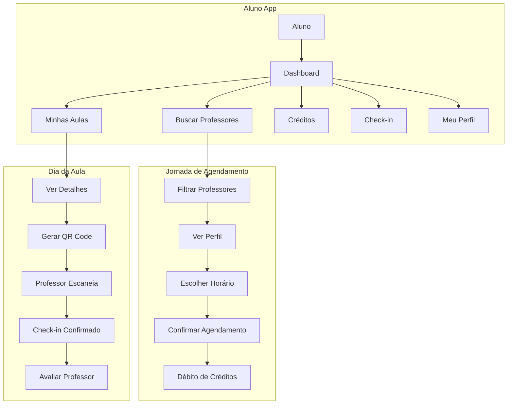
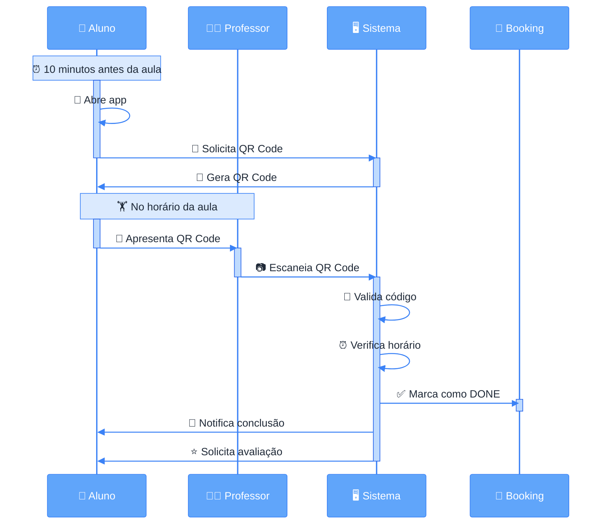
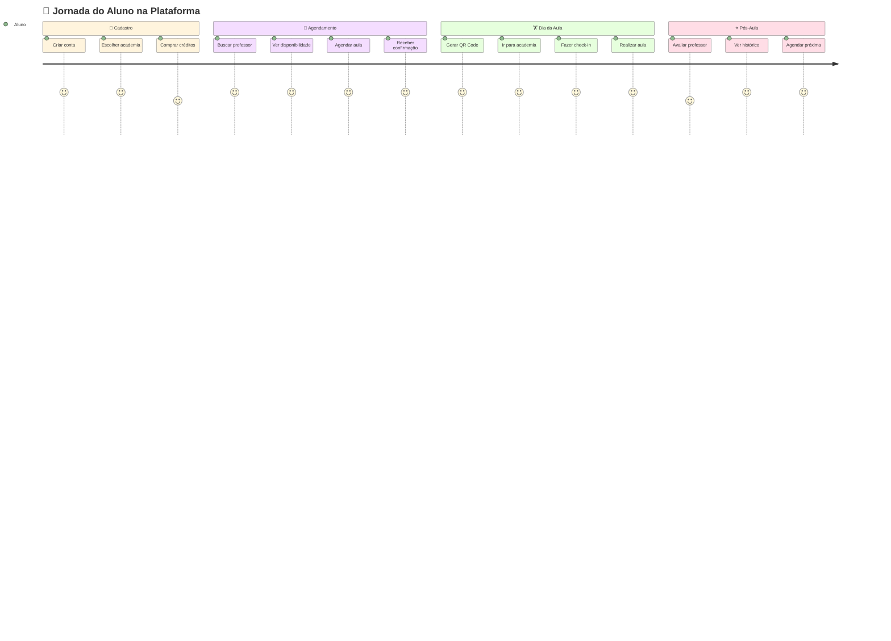
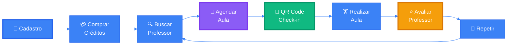

# Documentação Técnica - Aluno

## Visão Geral

A interface do aluno é focada em proporcionar uma experiência simples, intuitiva e mobile-first para agendar aulas, acompanhar progresso, gerenciar créditos e avaliar professores. É o ponto de entrada principal para usuários finais da plataforma.

## Arquitetura e Fluxo do Usuário



## Funcionalidades Principais

### 1. Dashboard do Aluno
**Rota:** `/aluno/dashboard`

#### 1.1 Visão Geral
```json
{
  "credits": 10,
  "next_class": {
    "id": "uuid",
    "teacher_name": "Maria Santos",
    "academy_name": "Academia Centro",
    "date": "2024-01-15T10:00:00Z",
    "duration": 60
  },
  "stats": {
    "total_classes": 45,
    "completed_classes": 42,
    "cancelled_classes": 3,
    "favorite_teachers": ["Maria Santos", "Carlos Lima"]
  },
  "recent_activity": [
    {
      "type": "BOOKING_COMPLETED",
      "message": "Aula com Maria Santos concluída",
      "date": "2024-01-14T10:00:00Z"
    }
  ]
}
```

#### 1.2 Próximas Aulas
**Endpoint:** `GET /api/bookings?student_id=:id&status=RESERVED,PAID`

Lista de aulas agendadas:
```json
{
  "bookings": [
    {
      "id": "uuid",
      "teacherId": "uuid",
      "teacherName": "Maria Santos",
      "franchiseId": "uuid",
      "franchiseName": "Academia Centro",
      "franchiseAddress": "Rua Exemplo, 123 - São Paulo, SP",
      "date": "2024-01-15T10:00:00Z",
      "duration": 60,
      "status": "PAID",
      "creditsCost": 1,
      "cancellableUntil": "2024-01-15T06:00:00Z"
    }
  ]
}
```

#### 1.3 Saldo de Créditos
**Campo:** `users.credits`

Exibição em destaque do saldo atual:
- Créditos disponíveis
- Créditos bloqueados (em agendamentos pendentes)
- Histórico de transações
- Botão para comprar mais créditos

### 2. Buscar e Agendar Professores

#### 2.1 Buscar Professores
**Endpoint:** `GET /api/teachers?academy_id=:id&city=:city&state=:state`

**Filtros Disponíveis:**
- Academia/Unidade
- Cidade
- Estado
- Especialidades
- Avaliação mínima
- Disponibilidade

**Resposta:**
```json
{
  "teachers": [
    {
      "id": "uuid",
      "name": "Maria Santos",
      "email": "maria@email.com",
      "avatar_url": "https://...",
      "specialties": ["Musculação", "Funcional", "HIIT"],
      "hourly_rate": 80.00,
      "rating_avg": 4.8,
      "rating_count": 45,
      "is_available": true,
      "academy": {
        "id": "uuid",
        "name": "Academia Centro",
        "city": "São Paulo",
        "state": "SP",
        "address": "Rua Exemplo, 123"
      }
    }
  ]
}
```

#### 2.2 Ver Perfil do Professor
**Endpoint:** `GET /api/teachers/:id`

Perfil completo com:
- Dados pessoais e foto
- Biografia profissional
- Especialidades
- CREF
- Avaliação média e quantidade
- Academias onde atende
- Valor da hora/aula
- Disponibilidade

**Avaliações do Professor:**
**Endpoint:** `GET /api/teachers/:id/ratings?limit=10&offset=0`

```json
{
  "ratings": [
    {
      "id": "uuid",
      "rating": 5,
      "comment": "Excelente profissional! Muito atencioso e dedicado.",
      "created_at": "2024-01-14T15:00:00Z",
      "student": {
        "name": "João Silva",
        "avatar_url": "https://..."
      }
    }
  ]
}
```

#### 2.3 Ver Disponibilidade
**Endpoint:** `GET /api/bookings?teacher_id=:id&unit_id=:academy_id&from=:date&to=:date&status=AVAILABLE`

Calendário com horários disponíveis:
```json
{
  "bookings": [
    {
      "id": "uuid",
      "date": "2024-01-15T10:00:00Z",
      "duration": 60,
      "status": "AVAILABLE"
    },
    {
      "id": "uuid",
      "date": "2024-01-15T11:00:00Z",
      "duration": 60,
      "status": "AVAILABLE"
    }
  ]
}
```

#### 2.4 Agendar Aula
**Endpoint:** `POST /api/bookings`

```json
{
  "source": "ALUNO",
  "studentId": "uuid",
  "professorId": "uuid",
  "unitId": "uuid",
  "startAt": "2024-01-15T10:00:00Z",
  "endAt": "2024-01-15T11:00:00Z",
  "studentNotes": "Primeira aula, foco em avaliação física"
}
```

**Fluxo de Agendamento:**
```mermaid
%%{init: {'theme':'base', 'themeVariables': { 'primaryColor':'#3b82f6','actorBkg':'#60a5fa','actorBorder':'#3b82f6','actorTextColor':'#fff','actorLineColor':'#3b82f6','signalColor':'#3b82f6','signalTextColor':'#1f2937','labelBoxBkgColor':'#dbeafe','labelBoxBorderColor':'#3b82f6','labelTextColor':'#1f2937','noteBorderColor':'#3b82f6','noteBkgColor':'#dbeafe','noteTextColor':'#1f2937','activationBorderColor':'#2563eb','activationBkgColor':'#bfdbfe','sequenceNumberColor':'#fff'}}}%%
sequenceDiagram
    participant A as 👤 Aluno
    participant S as 🖥️ Sistema
    participant C as 💳 Créditos
    participant P as 👨‍🏫 Professor
    participant N as 📧 Notificações
    
    A->>S: 📝 Solicita agendamento
    activate S
    S->>C: 🔍 Verifica saldo de créditos
    activate C
    
    alt 💰 Créditos Suficientes
        C-->>S: ✅ Saldo OK
        deactivate C
        S->>S: 🔍 Valida disponibilidade
        S->>C: 🔒 Bloqueia créditos
        activate C
        deactivate C
        S->>S: 📅 Cria agendamento (RESERVED)
        
        alt ⚡ Aprovação Automática
            S->>C: 💸 Debita créditos
            activate C
            deactivate C
            S->>S: ✅ Confirma (PAID)
            S->>N: 📤 Notifica aluno e professor
            activate N
            deactivate N
        else 🔐 Requer Aprovação
            S->>P: 🔔 Notifica novo pedido
            deactivate S
            activate P
            P->>S: ✅ Aprova agendamento
            deactivate P
            activate S
            S->>C: 💸 Debita créditos
            activate C
            deactivate C
            S->>S: ✅ Confirma (PAID)
            S->>N: 📤 Notifica aluno
            activate N
            deactivate N
        end
    else ❌ Créditos Insuficientes
        C-->>S: ⚠️ Saldo insuficiente
        deactivate C
        S->>A: ❌ Erro: Créditos insuficientes
        S->>A: 🛒 Redireciona para compra
        deactivate S
    end
```

**Validações:**
- Verifica saldo de créditos
- Valida disponibilidade do horário
- Confirma que professor está ativo
- Verifica horário de funcionamento da academia
- Valida antecedência mínima (padrão: 4 horas)

### 3. Minhas Aulas

#### 3.1 Aulas Futuras
**Endpoint:** `GET /api/bookings?student_id=:id&status=RESERVED,PAID&from=:now`

Lista de aulas agendadas para o futuro

#### 3.2 Histórico de Aulas
**Endpoint:** `GET /api/bookings?student_id=:id&status=DONE,CANCELED&to=:now`

```json
{
  "bookings": [
    {
      "id": "uuid",
      "teacherName": "Maria Santos",
      "franchiseName": "Academia Centro",
      "date": "2024-01-14T10:00:00Z",
      "duration": 60,
      "status": "DONE",
      "creditsCost": 1,
      "rating": {
        "rating": 5,
        "comment": "Excelente aula!"
      }
    }
  ]
}
```

#### 3.3 Detalhes da Aula
**Endpoint:** `GET /api/bookings/:id`

Informações completas:
- Professor (nome, foto, contato)
- Academia (nome, endereço, telefone)
- Data e horário
- Duração
- Status
- Custo em créditos
- Notas do aluno
- QR Code (se aula futura)
- Avaliação (se aula concluída)

#### 3.4 Cancelar Agendamento
**Endpoint:** `DELETE /api/bookings/:id`

**Regras de Cancelamento:**
- Até 4 horas antes: Reembolso total de créditos
- Menos de 4 horas: Sem reembolso (configurável)
- Após início da aula: Não permite cancelamento

```json
{
  "message": "Agendamento cancelado com sucesso",
  "status": "CANCELED",
  "credits_refunded": 1
}
```

### 4. Check-in

#### 4.1 Meu QR Code
**Endpoint:** `GET /api/students/checkin-code`

Gera QR Code único para o aluno:
```json
{
  "qr_code_data": "encrypted_student_data",
  "qr_code_image": "data:image/png;base64,..."
}
```

**Características:**
- QR Code único por aluno
- Criptografado com dados do aluno
- Válido apenas no horário da aula (com tolerância)
- Renovado a cada acesso

#### 4.2 Fluxo de Check-in


#### 4.3 Histórico de Check-ins
**Endpoint:** `GET /api/students/:id/checkins`

```json
{
  "checkins": [
    {
      "id": "uuid",
      "booking_id": "uuid",
      "teacher_name": "Maria Santos",
      "academy_name": "Academia Centro",
      "scheduled_time": "2024-01-14T10:00:00Z",
      "checkin_time": "2024-01-14T10:05:00Z",
      "status": "SUCCESS"
    }
  ]
}
```

### 5. Avaliações

#### 5.1 Avaliar Professor
**Endpoint:** `POST /api/bookings/:id/rating`

Após aula concluída, aluno pode avaliar:

```json
{
  "rating": 5,
  "comment": "Excelente profissional! Muito atencioso e dedicado. Treino bem estruturado e focado nos meus objetivos."
}
```

**Validações:**
- Apenas aulas concluídas (DONE)
- Rating de 1 a 5 estrelas
- Comentário opcional (máx 1000 caracteres)
- Pode editar avaliação existente

**Regras:**
- Avaliação é anônima para outros alunos
- Professor vê nome do aluno
- Impacta média do professor imediatamente
- Não pode ser deletada, apenas editada

#### 5.2 Ver Avaliação Deixada
**Endpoint:** `GET /api/bookings/:id/rating`

```json
{
  "rating": {
    "id": "uuid",
    "rating": 5,
    "comment": "Excelente aula!",
    "created_at": "2024-01-14T11:00:00Z",
    "updated_at": "2024-01-14T11:00:00Z"
  }
}
```

### 6. Créditos e Pagamentos

#### 6.1 Saldo Atual
**Campo:** `users.credits`

Exibição do saldo:
- Créditos disponíveis
- Créditos bloqueados (agendamentos pendentes)
- Créditos usados no mês
- Previsão de quando acabam os créditos

#### 6.2 Comprar Créditos
**Endpoint:** `POST /api/students/buy-credits`

```json
{
  "package_id": "uuid",
  "payment_method": "credit_card",
  "payment_data": {
    "card_token": "tok_...",
    "installments": 1
  }
}
```

**Pacotes Disponíveis:**
**Endpoint:** `GET /api/packages?for_role=STUDENT`

```json
{
  "packages": [
    {
      "id": "uuid",
      "name": "Pacote 5 Aulas",
      "credits": 5,
      "price": 250.00,
      "price_per_credit": 50.00,
      "is_active": true
    },
    {
      "id": "uuid",
      "name": "Pacote 10 Aulas",
      "credits": 10,
      "price": 450.00,
      "price_per_credit": 45.00,
      "discount": "10%",
      "is_active": true
    },
    {
      "id": "uuid",
      "name": "Pacote 20 Aulas",
      "credits": 20,
      "price": 800.00,
      "price_per_credit": 40.00,
      "discount": "20%",
      "is_active": true
    }
  ]
}
```

#### 6.3 Histórico de Transações
**Endpoint:** `GET /api/transactions?user_id=:id`

```json
{
  "transactions": [
    {
      "id": "uuid",
      "type": "CREDIT_PURCHASE",
      "amount": 10,
      "description": "Compra de 10 créditos - Pacote Mensal",
      "price": 450.00,
      "payment_method": "credit_card",
      "status": "COMPLETED",
      "created_at": "2024-01-01T10:00:00Z"
    },
    {
      "id": "uuid",
      "type": "BOOKING_PAYMENT",
      "amount": -1,
      "description": "Aula com Maria Santos",
      "booking_id": "uuid",
      "created_at": "2024-01-15T10:00:00Z"
    },
    {
      "id": "uuid",
      "type": "BOOKING_REFUND",
      "amount": 1,
      "description": "Cancelamento de aula",
      "booking_id": "uuid",
      "created_at": "2024-01-16T08:00:00Z"
    }
  ]
}
```

**Tipos de Transação:**
- `CREDIT_PURCHASE`: Compra de créditos
- `BOOKING_PAYMENT`: Débito por agendamento
- `BOOKING_REFUND`: Reembolso de cancelamento
- `ADMIN_ADJUSTMENT`: Ajuste manual (admin)

#### 6.4 Planos de Assinatura
**Endpoint:** `GET /api/plans?academy_id=:id`

Planos mensais oferecidos pela academia:

```json
{
  "plans": [
    {
      "id": "uuid",
      "name": "Plano Básico",
      "description": "Ideal para quem treina 2-3x por semana",
      "price": 199.90,
      "credits_included": 12,
      "duration_days": 30,
      "features": [
        "12 aulas por mês",
        "Acesso a todos os professores",
        "Cancelamento até 4h antes"
      ],
      "is_active": true
    },
    {
      "id": "uuid",
      "name": "Plano Premium",
      "description": "Para quem treina todos os dias",
      "price": 349.90,
      "credits_included": 24,
      "duration_days": 30,
      "features": [
        "24 aulas por mês",
        "Acesso a todos os professores",
        "Cancelamento até 2h antes",
        "Prioridade no agendamento"
      ],
      "is_active": true
    }
  ]
}
```

### 7. Meu Perfil

#### 7.1 Visualizar Perfil
**Endpoint:** `GET /api/students/:id`

```json
{
  "id": "uuid",
  "name": "João Silva",
  "email": "joao@email.com",
  "phone": "(11) 98888-8888",
  "avatar_url": "https://...",
  "credits": 10,
  "is_active": true,
  "created_at": "2024-01-01T00:00:00Z",
  "academy_students": [{
    "academy_id": "uuid",
    "status": "active",
    "join_date": "2024-01-01T00:00:00Z",
    "academies": {
      "name": "Academia Centro",
      "city": "São Paulo",
      "state": "SP"
    }
  }]
}
```

#### 7.2 Editar Perfil
**Endpoint:** `PUT /api/students/:id`

```json
{
  "name": "João Silva",
  "email": "joao@email.com",
  "phone": "(11) 98888-8888",
  "avatar_url": "https://..."
}
```

**Campos Editáveis:**
- Nome
- Email
- Telefone
- Foto de perfil
- Preferências de notificação

#### 7.3 Estatísticas Pessoais
**Endpoint:** `GET /api/students/:id/stats`

```json
{
  "total_bookings": 45,
  "completed_bookings": 42,
  "pending_bookings": 2,
  "cancelled_bookings": 3,
  "total_credits_spent": 42,
  "total_spent": 2100.00,
  "favorite_teachers": [
    {
      "id": "uuid",
      "name": "Maria Santos",
      "classes_count": 15
    }
  ],
  "last_booking_date": "2024-01-14T10:00:00Z",
  "join_date": "2024-01-01T00:00:00Z",
  "current_subscription": {
    "plan_name": "Plano Básico",
    "credits_remaining": 10,
    "end_date": "2024-02-01"
  }
}
```

## Fluxo Completo do Aluno



### Fluxo Visual Simplificado



## Modelo de Dados

### User (Aluno)
```sql
CREATE TABLE users (
  id UUID PRIMARY KEY,
  email VARCHAR(255) UNIQUE NOT NULL,
  name VARCHAR(255) NOT NULL,
  phone VARCHAR(20),
  role VARCHAR(20) DEFAULT 'STUDENT',
  credits INTEGER DEFAULT 0,
  avatar_url TEXT,
  is_active BOOLEAN DEFAULT true,
  created_at TIMESTAMP DEFAULT NOW(),
  updated_at TIMESTAMP DEFAULT NOW()
);

CREATE INDEX idx_users_role ON users(role);
CREATE INDEX idx_users_email ON users(email);
CREATE INDEX idx_users_credits ON users(credits);
```

### AcademyStudent (Vínculo com Academia)
```sql
CREATE TABLE academy_students (
  id UUID PRIMARY KEY,
  academy_id UUID REFERENCES academies(id),
  student_id UUID REFERENCES users(id),
  plan_id UUID REFERENCES academy_plans(id),
  status VARCHAR(20) DEFAULT 'active',
  join_date TIMESTAMP DEFAULT NOW(),
  last_activity TIMESTAMP DEFAULT NOW(),
  created_at TIMESTAMP DEFAULT NOW(),
  updated_at TIMESTAMP DEFAULT NOW(),
  
  UNIQUE(academy_id, student_id)
);

CREATE INDEX idx_academy_students_academy ON academy_students(academy_id);
CREATE INDEX idx_academy_students_student ON academy_students(student_id);
CREATE INDEX idx_academy_students_status ON academy_students(status);
```

### Booking (Agendamentos)
```sql
CREATE TABLE bookings (
  id UUID PRIMARY KEY,
  student_id UUID REFERENCES users(id),
  teacher_id UUID REFERENCES users(id),
  unit_id UUID REFERENCES units(id),
  franchise_id UUID REFERENCES academies(id),
  date TIMESTAMP NOT NULL,
  duration INTEGER DEFAULT 60,
  status VARCHAR(20) DEFAULT 'PENDING',
  status_canonical VARCHAR(20),
  credits_cost INTEGER DEFAULT 1,
  source VARCHAR(20),
  notes TEXT,
  cancellable_until TIMESTAMP,
  created_at TIMESTAMP DEFAULT NOW(),
  updated_at TIMESTAMP DEFAULT NOW()
);

CREATE INDEX idx_bookings_student ON bookings(student_id);
CREATE INDEX idx_bookings_teacher ON bookings(teacher_id);
CREATE INDEX idx_bookings_date ON bookings(date);
CREATE INDEX idx_bookings_status ON bookings(status_canonical);
```

### Transaction (Transações de Créditos)
```sql
CREATE TABLE transactions (
  id UUID PRIMARY KEY,
  user_id UUID REFERENCES users(id),
  type VARCHAR(50) NOT NULL,
  amount INTEGER NOT NULL,
  description TEXT,
  reference_id VARCHAR(255),
  booking_id UUID REFERENCES bookings(id),
  payment_method VARCHAR(50),
  price DECIMAL(10,2),
  status VARCHAR(20) DEFAULT 'COMPLETED',
  created_at TIMESTAMP DEFAULT NOW()
);

CREATE INDEX idx_transactions_user ON transactions(user_id);
CREATE INDEX idx_transactions_type ON transactions(type);
CREATE INDEX idx_transactions_created ON transactions(created_at DESC);
```

### TeacherRating (Avaliações)
```sql
CREATE TABLE teacher_ratings (
  id UUID PRIMARY KEY,
  teacher_id UUID REFERENCES users(id),
  student_id UUID REFERENCES users(id),
  booking_id UUID UNIQUE REFERENCES bookings(id),
  rating INTEGER CHECK (rating >= 1 AND rating <= 5),
  comment TEXT,
  created_at TIMESTAMP DEFAULT NOW(),
  updated_at TIMESTAMP DEFAULT NOW()
);

CREATE INDEX idx_teacher_ratings_teacher ON teacher_ratings(teacher_id);
CREATE INDEX idx_teacher_ratings_student ON teacher_ratings(student_id);
CREATE INDEX idx_teacher_ratings_booking ON teacher_ratings(booking_id);
```

## Endpoints da API

### Perfil e Dados Básicos
```
GET  /api/students/:id
PUT  /api/students/:id
POST /api/students
GET  /api/students/:id/stats
```

### Buscar Professores
```
GET  /api/teachers
GET  /api/teachers/:id
GET  /api/teachers/:id/ratings
```

### Agendamentos
```
GET    /api/bookings?student_id=:id
POST   /api/bookings
GET    /api/bookings/:id
DELETE /api/bookings/:id
```

### Check-in
```
GET  /api/students/checkin-code
GET  /api/students/:id/checkins
```

### Avaliações
```
POST /api/bookings/:id/rating
GET  /api/bookings/:id/rating
```

### Créditos e Pagamentos
```
GET  /api/packages?for_role=STUDENT
POST /api/students/buy-credits
GET  /api/transactions?user_id=:id
```

### Planos
```
GET  /api/plans?academy_id=:id
POST /api/students/:id/subscribe
```

## Permissões e Controle de Acesso

### Acesso Próprio (Student)
Aluno pode acessar apenas seus próprios dados:
- Perfil
- Agendamentos
- Transações
- Avaliações
- Check-ins

### Validação de Acesso
```typescript
const validateStudentAccess = (req, res, next) => {
  const { id } = req.params
  const user = req.user
  
  if (user.role === 'STUDENT' && user.userId !== id) {
    return res.status(403).json({ error: 'Acesso negado' })
  }
  
  next()
}
```

## Otimizações Mobile

### 1. Dados Offline
Cache local de:
- Próximas aulas
- Professores favoritos
- QR Code
- Histórico recente

### 2. Imagens Otimizadas
- Avatar em múltiplos tamanhos
- Lazy loading de imagens
- Compressão automática

### 3. Notificações Push
- Lembrete 1 hora antes da aula
- Confirmação de agendamento
- Créditos baixos
- Avaliação pendente

### 4. Performance
- Paginação em listas
- Infinite scroll
- Debounce em buscas
- Cache de API

## Regras de Negócio

### 1. Créditos
- 1 crédito = 1 aula de 60 minutos
- Créditos não expiram
- Reembolso em caso de cancelamento (dentro do prazo)
- Não permite saldo negativo

### 2. Agendamento
- Antecedência mínima: 4 horas
- Antecedência máxima: 30 dias
- Máximo de 3 agendamentos simultâneos pendentes
- Não permite agendamento em horários conflitantes

### 3. Cancelamento
- Até 4h antes: Reembolso total
- Menos de 4h: Sem reembolso
- Após início: Não permite cancelamento
- Máximo de 3 cancelamentos por mês

### 4. Check-in
- Tolerância: 15 minutos após horário
- Antes do horário: Permitido
- Após tolerância: Requer aprovação do professor
- Sem check-in: Aula perdida (sem reembolso)

### 5. Avaliações
- Apenas aulas concluídas
- Obrigatório rating (1-5)
- Comentário opcional
- Pode editar, não pode deletar

## Boas Práticas

1. **Sempre validar** saldo de créditos antes de agendar
2. **Notificar** sobre mudanças em agendamentos
3. **Facilitar** processo de compra de créditos
4. **Incentivar** avaliações após aulas
5. **Manter** histórico completo de transações
6. **Implementar** rate limiting em endpoints públicos
7. **Cachear** dados frequentemente acessados
8. **Otimizar** para mobile-first