# Documentação Técnica - Banco de Dados

## Visão Geral

O banco de dados é modelado utilizando PostgreSQL com Prisma ORM. A arquitetura é relacional e projetada para suportar uma plataforma multi-tenant que conecta alunos, professores, franquias e franqueadora. Utiliza identificadores únicos (UUIDs e CUIDs) para garantir integridade e escalabilidade.

## Arquitetura Geral

```mermaid
%%{init: {'theme':'base', 'themeVariables': { 'primaryColor':'#8b5cf6','primaryTextColor':'#fff','primaryBorderColor':'#7c3aed'}}}%%
erDiagram
    FRANQUEADORA ||--o{ FRANQUEADORA_ADMIN : "🔗 tem"
    FRANQUEADORA ||--o{ ACADEMY : "🏪 gerencia"
    FRANQUEADORA ||--o{ FRANCHISE_PACKAGE : "📦 oferece"
    FRANQUEADORA ||--o{ FRANCHISE_LEAD : "🎯 recebe"
    
    ACADEMY ||--o{ ACADEMY_TEACHER : "👨‍🏫 tem"
    ACADEMY ||--o{ ACADEMY_STUDENT : "👥 tem"
    ACADEMY ||--o{ ACADEMY_PLAN : "💳 oferece"
    ACADEMY ||--o{ BOOKING : "📅 hospeda"
    ACADEMY ||--o{ CHECKIN : "✅ registra"
    ACADEMY ||--o{ NOTIFICATION : "🔔 gera"
    
    USER ||--o| TEACHER_PROFILE : "📋 tem"
    USER ||--o{ BOOKING : "📝 participa"
    USER ||--o{ TRANSACTION : "💰 realiza"
    USER ||--o{ TEACHER_RATING : "⭐ avalia-recebe"
    USER ||--o{ ACADEMY_TEACHER : "🔗 vincula"
    USER ||--o{ ACADEMY_STUDENT : "🔗 vincula"
    
    TEACHER_PROFILE ||--o{ TEACHER_STUDENT : "👥 gerencia"
    
    BOOKING ||--o| TEACHER_RATING : "⭐ recebe"
    BOOKING ||--o{ CHECKIN : "✅ resulta"
    
    FRANQUEADORA {
        uuid id PK "🔑"
        string name "🏢"
        string email "📧"
        string cnpj "📄"
        boolean is_active "✅"
    }
    
    USER {
        uuid id PK "🔑"
        string email UK "📧"
        string name "👤"
        string phone "📱"
        string cpf "📄"
        string cref "🎓"
        string cref_card_url "🖼️"
        enum role "👔"
        enum approval_status "✅"
        enum gender "⚧"
        int credits "💳"
        boolean is_active "✅"
        timestamp created_at "📅"
    }
    
    ACADEMY {
        uuid id PK "🔑"
        string name "🏪"
        string city "🌆"
        string state "📍"
        time opening_time "🕐"
        time closing_time "🕐"
        int checkin_tolerance "⏰"
        decimal monthly_revenue "💰"
    }
    
    BOOKING {
        uuid id PK "🔑"
        uuid student_id FK "👤"
        uuid teacher_id FK "👨‍🏫"
        timestamp date "📅"
        int duration "⏱️"
        string status_canonical "📊"
        int credits_cost "💳"
        string source "📍"
    }
    
    TEACHER_PROFILE {
        uuid id PK "🔑"
        uuid user_id FK "👤"
        text bio "📝"
        array specialties "🎯"
        decimal hourly_rate "💰"
        json availability "📅"
        decimal rating_avg "⭐"
        int rating_count "🔢"
    }
```



## Enums

### Role
Define os papéis dos usuários no sistema:
```sql
CREATE TYPE role AS ENUM (
  'STUDENT',      -- Aluno
  'TEACHER',      -- Professor
  'ADMIN',        -- Administrador geral
  'FRANCHISOR',   -- Franqueadora
  'FRANCHISE_ADMIN' -- Administrador de franquia
);
```

### ApprovalStatus
Controla o fluxo de aprovação de cadastros (principalmente professores):
```sql
CREATE TYPE approval_status AS ENUM (
  'PENDING',   -- Aguardando aprovação
  'APPROVED',  -- Aprovado
  'REJECTED'   -- Rejeitado
);
```

### Gender
Opções de gênero para o perfil do usuário:
```sql
CREATE TYPE gender AS ENUM (
  'MALE',
  'FEMALE',
  'NON_BINARY',
  'OTHER',
  'PREFER_NOT_TO_SAY'
);
```

### BookingStatus
Representa os diferentes estados de um agendamento:
```sql
CREATE TYPE booking_status AS ENUM (
  'PENDING',    -- Aguardando confirmação
  'CONFIRMED',  -- Confirmado
  'COMPLETED',  -- Concluído
  'CANCELLED'   -- Cancelado
);
```

### TransactionType
Categoriza os tipos de transações financeiras:
```sql
CREATE TYPE transaction_type AS ENUM (
  'CREDIT_PURCHASE',  -- Compra de créditos
  'BOOKING_PAYMENT',  -- Pagamento de agendamento
  'BOOKING_REFUND'    -- Reembolso de cancelamento
);
```

## Tabelas Principais

### users
Tabela central que armazena todos os usuários da plataforma.

```sql
CREATE TABLE users (
  id UUID PRIMARY KEY DEFAULT uuid_generate_v4(),
  email VARCHAR(255) UNIQUE NOT NULL,
  password_hash VARCHAR(255),
  name VARCHAR(255) NOT NULL,
  phone VARCHAR(20),
  cpf VARCHAR(14),
  cref VARCHAR(50),
  cref_card_url TEXT,
  gender gender,
  role role DEFAULT 'STUDENT',
  credits INTEGER DEFAULT 0,
  is_active BOOLEAN DEFAULT true,
  avatar_url TEXT,
  approval_status approval_status DEFAULT 'PENDING',
  approved_at TIMESTAMP,
  approved_by UUID REFERENCES users(id),
  created_at TIMESTAMP DEFAULT NOW(),
  updated_at TIMESTAMP DEFAULT NOW()
);

CREATE INDEX idx_users_email ON users(email);
CREATE INDEX idx_users_role ON users(role);
CREATE INDEX idx_users_approval_status ON users(approval_status);
CREATE INDEX idx_users_cref ON users(cref);
```

**Campos Importantes:**
- `role`: Define o tipo de usuário (STUDENT, TEACHER, etc.)
- `credits`: Saldo de créditos (para alunos)
- `approval_status`: Status de aprovação (para professores)
- `cref`: Registro profissional (obrigatório para professores)
- `cref_card_url`: URL do cartão CREF para validação

**Relacionamentos:**
- Um usuário pode ser aprovador de outros usuários
- Um usuário pode ter um perfil de professor
- Um usuário pode ter múltiplos agendamentos
- Um usuário pode ter múltiplas transações

### teacher_profiles
Informações adicionais específicas para professores.

```sql
CREATE TABLE teacher_profiles (
  id UUID PRIMARY KEY DEFAULT uuid_generate_v4(),
  user_id UUID UNIQUE REFERENCES users(id) ON DELETE CASCADE,
  bio TEXT,
  specialization TEXT[] DEFAULT '{}',
  hourly_rate DECIMAL(10,2) DEFAULT 0,
  availability JSONB DEFAULT '{}',
  is_available BOOLEAN DEFAULT true,
  rating_avg DECIMAL(3,2),
  rating_count INTEGER DEFAULT 0,
  total_sessions INTEGER DEFAULT 0,
  created_at TIMESTAMP DEFAULT NOW(),
  updated_at TIMESTAMP DEFAULT NOW()
);

CREATE INDEX idx_teacher_profiles_user ON teacher_profiles(user_id);
CREATE INDEX idx_teacher_profiles_available ON teacher_profiles(is_available);
CREATE INDEX idx_teacher_profiles_rating ON teacher_profiles(rating_avg DESC);
```

**Campos Importantes:**
- `specialization`: Array de especialidades (Musculação, Funcional, etc.)
- `hourly_rate`: Valor cobrado por hora de aula
- `availability`: JSON com disponibilidade por dia/academia
- `rating_avg`: Média de avaliações (cache)
- `rating_count`: Total de avaliações (cache)

**Estrutura do campo availability:**
```json
{
  "monday": {
    "academies": {
      "academy_uuid_1": {
        "slots": [
          { "start": "08:00", "end": "12:00" },
          { "start": "14:00", "end": "18:00" }
        ]
      }
    }
  },
  "tuesday": {
    "academies": {
      "academy_uuid_1": {
        "slots": [
          { "start": "08:00", "end": "12:00" }
        ]
      }
    }
  }
}
```

### teacher_students
Alunos particulares gerenciados diretamente pelo professor.

```sql
CREATE TABLE teacher_students (
  id UUID PRIMARY KEY DEFAULT uuid_generate_v4(),
  teacher_id UUID REFERENCES teacher_profiles(id) ON DELETE CASCADE,
  name VARCHAR(255) NOT NULL,
  email VARCHAR(255) NOT NULL,
  phone VARCHAR(20),
  hourly_rate DECIMAL(10,2),
  notes TEXT,
  created_at TIMESTAMP DEFAULT NOW(),
  updated_at TIMESTAMP DEFAULT NOW()
);

CREATE INDEX idx_teacher_students_teacher ON teacher_students(teacher_id);
CREATE INDEX idx_teacher_students_email ON teacher_students(email);
```

**Características:**
- Alunos fora do sistema de academias
- Cada aluno pode ter `hourly_rate` personalizado
- Professor agenda diretamente para eles
- Pagamento gerenciado fora da plataforma

### academies
Representa as franquias (unidades físicas/academias).

```sql
CREATE TABLE academies (
  id UUID PRIMARY KEY DEFAULT uuid_generate_v4(),
  franqueadora_id UUID REFERENCES franqueadora(id),
  name VARCHAR(255) NOT NULL,
  email VARCHAR(255) NOT NULL,
  phone VARCHAR(20),
  address TEXT,
  city VARCHAR(100),
  state VARCHAR(2),
  zip_code VARCHAR(10),
  is_active BOOLEAN DEFAULT true,
  opening_time TIME DEFAULT '06:00:00',
  closing_time TIME DEFAULT '22:00:00',
  checkin_tolerance INTEGER DEFAULT 15,
  schedule JSONB DEFAULT '[]',
  monthly_revenue DECIMAL(10,2) DEFAULT 0,
  created_at TIMESTAMP DEFAULT NOW(),
  updated_at TIMESTAMP DEFAULT NOW()
);

CREATE INDEX idx_academies_franqueadora ON academies(franqueadora_id);
CREATE INDEX idx_academies_city_state ON academies(city, state);
CREATE INDEX idx_academies_active ON academies(is_active);
```

**Campos Importantes:**
- `opening_time` / `closing_time`: Horário de funcionamento padrão
- `checkin_tolerance`: Tolerância para check-in em minutos
- `schedule`: Horários especiais por dia da semana (JSONB)
- `monthly_revenue`: Receita mensal (cache)

**Estrutura do campo schedule:**
```json
{
  "monday": { "open": "06:00", "close": "22:00" },
  "tuesday": { "open": "06:00", "close": "22:00" },
  "saturday": { "open": "08:00", "close": "18:00" },
  "sunday": { "closed": true }
}
```

### academy_teachers
Tabela de junção entre professores e academias.

```sql
CREATE TABLE academy_teachers (
  id UUID PRIMARY KEY DEFAULT uuid_generate_v4(),
  academy_id UUID REFERENCES academies(id) ON DELETE CASCADE,
  teacher_id UUID REFERENCES users(id) ON DELETE CASCADE,
  status VARCHAR(20) DEFAULT 'active',
  commission_rate DECIMAL(3,2) DEFAULT 0.70,
  created_at TIMESTAMP DEFAULT NOW(),
  updated_at TIMESTAMP DEFAULT NOW(),
  
  UNIQUE(academy_id, teacher_id)
);

CREATE INDEX idx_academy_teachers_academy ON academy_teachers(academy_id);
CREATE INDEX idx_academy_teachers_teacher ON academy_teachers(teacher_id);
CREATE INDEX idx_academy_teachers_status ON academy_teachers(status);
```

**Campos Importantes:**
- `status`: active, inactive, suspended
- `commission_rate`: Taxa de comissão do professor (0.70 = 70%)

**Status Possíveis:**
- `active`: Professor ativo na academia
- `inactive`: Professor desvinculado
- `suspended`: Professor temporariamente suspenso

### academy_students
Tabela de junção entre alunos e academias.

```sql
CREATE TABLE academy_students (
  id UUID PRIMARY KEY DEFAULT uuid_generate_v4(),
  academy_id UUID REFERENCES academies(id) ON DELETE CASCADE,
  student_id UUID REFERENCES users(id) ON DELETE CASCADE,
  plan_id UUID REFERENCES academy_plans(id),
  status VARCHAR(20) DEFAULT 'active',
  join_date TIMESTAMP DEFAULT NOW(),
  last_activity TIMESTAMP DEFAULT NOW(),
  created_at TIMESTAMP DEFAULT NOW(),
  updated_at TIMESTAMP DEFAULT NOW(),
  
  UNIQUE(academy_id, student_id)
);

CREATE INDEX idx_academy_students_academy ON academy_students(academy_id);
CREATE INDEX idx_academy_students_student ON academy_students(student_id);
CREATE INDEX idx_academy_students_status ON academy_students(status);
CREATE INDEX idx_academy_students_last_activity ON academy_students(last_activity DESC);
```

**Campos Importantes:**
- `plan_id`: Plano atual do aluno na academia
- `last_activity`: Última atividade (agendamento/check-in)

### academy_plans
Planos de assinatura oferecidos pelas academias.

```sql
CREATE TABLE academy_plans (
  id UUID PRIMARY KEY DEFAULT uuid_generate_v4(),
  academy_id UUID REFERENCES academies(id) ON DELETE CASCADE,
  name VARCHAR(100) NOT NULL,
  description TEXT,
  price DECIMAL(10,2) NOT NULL,
  credits_included INTEGER NOT NULL,
  duration_days INTEGER NOT NULL,
  features JSONB,
  is_active BOOLEAN DEFAULT true,
  created_at TIMESTAMP DEFAULT NOW(),
  updated_at TIMESTAMP DEFAULT NOW()
);

CREATE INDEX idx_academy_plans_academy ON academy_plans(academy_id);
CREATE INDEX idx_academy_plans_active ON academy_plans(is_active);
```

**Exemplo de features:**
```json
{
  "max_bookings_per_day": 2,
  "priority_booking": true,
  "cancellation_hours": 2,
  "access_all_teachers": true
}
```

### bookings
Tabela central de agendamentos.

```sql
CREATE TABLE bookings (
  id UUID PRIMARY KEY DEFAULT uuid_generate_v4(),
  student_id UUID REFERENCES users(id),
  teacher_id UUID REFERENCES users(id) NOT NULL,
  unit_id UUID REFERENCES units(id),
  franchise_id UUID REFERENCES academies(id),
  date TIMESTAMP NOT NULL,
  duration INTEGER DEFAULT 60,
  status VARCHAR(20) DEFAULT 'PENDING',
  status_canonical VARCHAR(20),
  credits_cost INTEGER DEFAULT 1,
  source VARCHAR(20),
  notes TEXT,
  cancellable_until TIMESTAMP,
  created_at TIMESTAMP DEFAULT NOW(),
  updated_at TIMESTAMP DEFAULT NOW()
);

CREATE INDEX idx_bookings_student ON bookings(student_id);
CREATE INDEX idx_bookings_teacher ON bookings(teacher_id);
CREATE INDEX idx_bookings_date ON bookings(date);
CREATE INDEX idx_bookings_status ON bookings(status_canonical);
CREATE INDEX idx_bookings_unit ON bookings(unit_id);
CREATE INDEX idx_bookings_franchise ON bookings(franchise_id);
```

**Campos Importantes:**
- `student_id`: NULL para disponibilidade/bloqueios
- `status_canonical`: Status normalizado (AVAILABLE, RESERVED, PAID, DONE, CANCELED, BLOCKED)
- `source`: ALUNO ou PROFESSOR (quem iniciou o agendamento)
- `cancellable_until`: Prazo limite para cancelamento com reembolso

**Status Canônicos:**
- `AVAILABLE`: Horário disponível para agendamento
- `RESERVED`: Reservado mas não pago
- `PAID`: Confirmado e pago
- `DONE`: Aula concluída (após check-in)
- `CANCELED`: Cancelado
- `BLOCKED`: Bloqueado pelo professor

### teacher_ratings
Avaliações que alunos deixam para professores.

```sql
CREATE TABLE teacher_ratings (
  id UUID PRIMARY KEY DEFAULT uuid_generate_v4(),
  teacher_id UUID REFERENCES users(id) ON DELETE CASCADE,
  student_id UUID REFERENCES users(id) ON DELETE CASCADE,
  booking_id UUID UNIQUE REFERENCES bookings(id) ON DELETE CASCADE,
  rating INTEGER CHECK (rating >= 1 AND rating <= 5) NOT NULL,
  comment TEXT,
  created_at TIMESTAMP DEFAULT NOW(),
  updated_at TIMESTAMP DEFAULT NOW()
);

CREATE INDEX idx_teacher_ratings_teacher ON teacher_ratings(teacher_id);
CREATE INDEX idx_teacher_ratings_student ON teacher_ratings(student_id);
CREATE INDEX idx_teacher_ratings_booking ON teacher_ratings(booking_id);
CREATE INDEX idx_teacher_ratings_created ON teacher_ratings(created_at DESC);
```

**Regras:**
- Apenas aulas concluídas podem ser avaliadas
- Rating obrigatório (1-5 estrelas)
- Comentário opcional
- Pode ser editado (upsert por booking_id)
- Atualiza cache em teacher_profiles automaticamente

### transactions
Registra todas as transações financeiras.

```sql
CREATE TABLE transactions (
  id UUID PRIMARY KEY DEFAULT uuid_generate_v4(),
  user_id UUID REFERENCES users(id) ON DELETE CASCADE,
  type transaction_type NOT NULL,
  amount INTEGER NOT NULL,
  description TEXT,
  reference_id VARCHAR(255),
  booking_id UUID REFERENCES bookings(id),
  payment_method VARCHAR(50),
  price DECIMAL(10,2),
  status VARCHAR(20) DEFAULT 'COMPLETED',
  created_at TIMESTAMP DEFAULT NOW()
);

CREATE INDEX idx_transactions_user ON transactions(user_id);
CREATE INDEX idx_transactions_type ON transactions(type);
CREATE INDEX idx_transactions_created ON transactions(created_at DESC);
CREATE INDEX idx_transactions_booking ON transactions(booking_id);
```

**Tipos de Transação:**
- `CREDIT_PURCHASE`: Compra de créditos
- `BOOKING_PAYMENT`: Débito por agendamento
- `BOOKING_REFUND`: Reembolso de cancelamento

**Campos Importantes:**
- `amount`: Quantidade de créditos (positivo ou negativo)
- `price`: Valor em dinheiro (para compras)
- `reference_id`: ID externo (gateway de pagamento)

### credit_packages
Pacotes de créditos disponíveis para compra.

```sql
CREATE TABLE credit_packages (
  id UUID PRIMARY KEY DEFAULT uuid_generate_v4(),
  name VARCHAR(100) NOT NULL,
  credits INTEGER NOT NULL,
  price DECIMAL(10,2) NOT NULL,
  for_role role NOT NULL,
  is_active BOOLEAN DEFAULT true,
  created_at TIMESTAMP DEFAULT NOW(),
  updated_at TIMESTAMP DEFAULT NOW()
);

CREATE INDEX idx_credit_packages_role ON credit_packages(for_role);
CREATE INDEX idx_credit_packages_active ON credit_packages(is_active);
```

**Exemplo de Pacotes:**
```sql
INSERT INTO credit_packages (name, credits, price, for_role) VALUES
  ('Pacote 5 Aulas', 5, 250.00, 'STUDENT'),
  ('Pacote 10 Aulas', 10, 450.00, 'STUDENT'),
  ('Pacote 20 Aulas', 20, 800.00, 'STUDENT'),
  ('Pacote 50 Horas', 50, 2000.00, 'TEACHER');
```

### checkins
Registra os check-ins realizados.

```sql
CREATE TABLE checkins (
  id UUID PRIMARY KEY DEFAULT uuid_generate_v4(),
  academy_id UUID REFERENCES academies(id) ON DELETE CASCADE,
  booking_id UUID REFERENCES bookings(id) ON DELETE CASCADE,
  teacher_id UUID REFERENCES users(id) ON DELETE CASCADE,
  status VARCHAR(20) NOT NULL,
  method VARCHAR(20) DEFAULT 'QRCODE',
  reason TEXT,
  created_at TIMESTAMP DEFAULT NOW()
);

CREATE INDEX idx_checkins_academy ON checkins(academy_id);
CREATE INDEX idx_checkins_booking ON checkins(booking_id);
CREATE INDEX idx_checkins_teacher ON checkins(teacher_id);
CREATE INDEX idx_checkins_created ON checkins(created_at DESC);
```

**Métodos de Check-in:**
- `QRCODE`: Escaneamento de QR code
- `MANUAL`: Check-in manual pelo admin
- `AUTOMATIC`: Check-in automático

**Status:**
- `SUCCESS`: Check-in realizado com sucesso
- `LATE`: Check-in fora do horário (com tolerância)
- `DENIED`: Check-in negado
- `MISSED`: Aluno não compareceu

### notifications
Notificações para administradores de franquia.

```sql
CREATE TABLE notifications (
  id UUID PRIMARY KEY DEFAULT uuid_generate_v4(),
  academy_id UUID REFERENCES academies(id) ON DELETE CASCADE,
  type VARCHAR(50) NOT NULL,
  title VARCHAR(255) NOT NULL,
  message TEXT NOT NULL,
  data JSONB,
  is_read BOOLEAN DEFAULT false,
  created_at TIMESTAMP DEFAULT NOW(),
  updated_at TIMESTAMP DEFAULT NOW()
);

CREATE INDEX idx_notifications_academy ON notifications(academy_id);
CREATE INDEX idx_notifications_read ON notifications(is_read);
CREATE INDEX idx_notifications_created ON notifications(created_at DESC);
```

**Tipos de Notificação:**
- `NEW_BOOKING`: Novo agendamento
- `BOOKING_CANCELLED`: Cancelamento
- `NEW_STUDENT`: Novo aluno
- `LOW_CREDITS`: Aluno com créditos baixos
- `TEACHER_UNAVAILABLE`: Professor indisponível
- `CHECKIN_MISSED`: Check-in não realizado

### franqueadora
Entidade da franqueadora (administração central).

```sql
CREATE TABLE franqueadora (
  id UUID PRIMARY KEY DEFAULT uuid_generate_v4(),
  name VARCHAR(255) NOT NULL,
  email VARCHAR(255) NOT NULL,
  phone VARCHAR(20),
  cnpj VARCHAR(18),
  is_active BOOLEAN DEFAULT true,
  created_at TIMESTAMP DEFAULT NOW(),
  updated_at TIMESTAMP DEFAULT NOW()
);

CREATE INDEX idx_franqueadora_active ON franqueadora(is_active);
```

### franqueadora_admins
Administradores da franqueadora.

```sql
CREATE TABLE franqueadora_admins (
  id UUID PRIMARY KEY DEFAULT uuid_generate_v4(),
  franqueadora_id UUID REFERENCES franqueadora(id) ON DELETE CASCADE,
  user_id UUID REFERENCES users(id) ON DELETE CASCADE,
  role VARCHAR(50) NOT NULL,
  created_at TIMESTAMP DEFAULT NOW(),
  updated_at TIMESTAMP DEFAULT NOW(),
  
  UNIQUE(franqueadora_id, user_id)
);

CREATE INDEX idx_franqueadora_admins_franqueadora ON franqueadora_admins(franqueadora_id);
CREATE INDEX idx_franqueadora_admins_user ON franqueadora_admins(user_id);
```

### franchise_packages
Pacotes de investimento para novas franquias.

```sql
CREATE TABLE franchise_packages (
  id UUID PRIMARY KEY DEFAULT uuid_generate_v4(),
  franqueadora_id UUID REFERENCES franqueadora(id) ON DELETE CASCADE,
  name VARCHAR(100) NOT NULL,
  description TEXT,
  investment_amount DECIMAL(10,2) NOT NULL,
  credits_included INTEGER,
  features JSONB,
  is_active BOOLEAN DEFAULT true,
  created_at TIMESTAMP DEFAULT NOW(),
  updated_at TIMESTAMP DEFAULT NOW()
);

CREATE INDEX idx_franchise_packages_franqueadora ON franchise_packages(franqueadora_id);
CREATE INDEX idx_franchise_packages_active ON franchise_packages(is_active);
```

**Exemplo de features:**
```json
{
  "max_teachers": 10,
  "max_students": 100,
  "support_level": "basic",
  "marketing_kit": true,
  "training_included": true
}
```

### franchise_leads
Leads de potenciais franqueados.

```sql
CREATE TABLE franchise_leads (
  id UUID PRIMARY KEY DEFAULT uuid_generate_v4(),
  franqueadora_id UUID REFERENCES franqueadora(id) ON DELETE CASCADE,
  name VARCHAR(255) NOT NULL,
  email VARCHAR(255) NOT NULL,
  phone VARCHAR(20),
  city VARCHAR(100),
  state VARCHAR(2),
  status VARCHAR(20) DEFAULT 'NEW',
  investment_capacity VARCHAR(50),
  notes TEXT,
  created_at TIMESTAMP DEFAULT NOW(),
  updated_at TIMESTAMP DEFAULT NOW()
);

CREATE INDEX idx_franchise_leads_franqueadora ON franchise_leads(franqueadora_id);
CREATE INDEX idx_franchise_leads_status ON franchise_leads(status);
CREATE INDEX idx_franchise_leads_created ON franchise_leads(created_at DESC);
```

**Status de Lead:**
- `NEW`: Novo lead
- `CONTACTED`: Contato realizado
- `QUALIFIED`: Lead qualificado
- `PROPOSAL_SENT`: Proposta enviada
- `NEGOTIATING`: Em negociação
- `CONVERTED`: Convertido em franquia
- `LOST`: Lead perdido

### settings
Configurações globais da aplicação.

```sql
CREATE TABLE settings (
  id UUID PRIMARY KEY DEFAULT uuid_generate_v4(),
  key VARCHAR(100) UNIQUE NOT NULL,
  value JSONB NOT NULL,
  created_at TIMESTAMP DEFAULT NOW(),
  updated_at TIMESTAMP DEFAULT NOW()
);

CREATE INDEX idx_settings_key ON settings(key);
```

**Exemplos de Configurações:**
```sql
INSERT INTO settings (key, value) VALUES
  ('booking_rules', '{
    "min_advance_hours": 4,
    "max_advance_days": 30,
    "cancellation_deadline_hours": 4,
    "checkin_tolerance_minutes": 15
  }'),
  ('commission_rates', '{
    "default_teacher": 0.70,
    "premium_teacher": 0.80,
    "platform_fee": 0.10
  }');
```

## Diagramas de Relacionamento Detalhados

### Fluxo de Agendamento

```mermaid
%%{init: {'theme':'base', 'themeVariables': { 'primaryColor':'#8b5cf6','primaryTextColor':'#fff','primaryBorderColor':'#7c3aed','lineColor':'#8b5cf6','secondaryColor':'#ec4899','tertiaryColor':'#06b6d4'}}}%%
graph LR
    A["👤 Aluno"]
    B["👨‍🏫 Professor"]
    C["📅 Disponibilidade"]
    D["🏪 Academia"]
    E["📝 Booking"]
    F["💳 Créditos"]
    G["💰 Transaction"]
    
    A -->|🔍 busca| B
    B -->|📆 tem| C
    C -->|🏢 em| D
    A -->|➕ cria| E
    E -->|💸 debita| F
    E -->|🔔 notifica| B
    E -->|📊 registra| G
    
    style A fill:#3b82f6,stroke:#2563eb,stroke-width:3px,color:#fff
    style B fill:#f59e0b,stroke:#d97706,stroke-width:3px,color:#fff
    style E fill:#8b5cf6,stroke:#7c3aed,stroke-width:3px,color:#fff
    style F fill:#10b981,stroke:#059669,stroke-width:2px,color:#fff
    style G fill:#ec4899,stroke:#db2777,stroke-width:2px,color:#fff
```



### Fluxo de Check-in

```mermaid
%%{init: {'theme':'base', 'themeVariables': { 'primaryColor':'#10b981','primaryTextColor':'#fff','primaryBorderColor':'#059669','lineColor':'#10b981','secondaryColor':'#06b6d4','tertiaryColor':'#f59e0b'}}}%%
graph LR
    A["👤 Aluno"]
    B["📱 QR Code"]
    C["👨‍🏫 Professor"]
    D["🖥️ Sistema"]
    E["📅 Booking"]
    F["✅ DONE"]
    G["✔️ Checkin"]
    H["⭐ Avaliação"]
    
    A -->|📱 gera| B
    C -->|📷 escaneia| B
    B -->|🔐 valida| D
    D -->|🔄 atualiza| E
    E -->|✅ marca| F
    D -->|➕ cria| G
    D -->|📝 solicita| H
    
    style A fill:#3b82f6,stroke:#2563eb,stroke-width:3px,color:#fff
    style B fill:#8b5cf6,stroke:#7c3aed,stroke-width:3px,color:#fff
    style C fill:#f59e0b,stroke:#d97706,stroke-width:3px,color:#fff
    style D fill:#10b981,stroke:#059669,stroke-width:3px,color:#fff
    style F fill:#10b981,stroke:#059669,stroke-width:2px,color:#fff
    style H fill:#f59e0b,stroke:#d97706,stroke-width:2px,color:#fff
```



### Hierarquia de Usuários

```mermaid
%%{init: {'theme':'base', 'themeVariables': { 'primaryColor':'#6366f1','primaryTextColor':'#fff','primaryBorderColor':'#4f46e5','lineColor':'#6366f1','secondaryColor':'#8b5cf6','tertiaryColor':'#ec4899'}}}%%
graph TB
    A["🏢 Franqueadora"]
    B["👤 Franqueadora Admin"]
    C["🏪 Academias"]
    D["👤 Franchise Admin"]
    E["👨‍🏫 Professores"]
    F["👥 Alunos"]
    G["📅 Agendamentos"]
    H["✅ Check-ins"]
    I["⭐ Avaliações"]
    
    A --> B
    A --> C
    C --> D
    C --> E
    C --> F
    E --> G
    F --> G
    G --> H
    G --> I
    
    style A fill:#6366f1,stroke:#4f46e5,stroke-width:4px,color:#fff
    style C fill:#10b981,stroke:#059669,stroke-width:3px,color:#fff
    style G fill:#8b5cf6,stroke:#7c3aed,stroke-width:3px,color:#fff
    style H fill:#06b6d4,stroke:#0891b2,stroke-width:2px,color:#fff
    style I fill:#f59e0b,stroke:#d97706,stroke-width:2px,color:#fff
```



## Índices e Performance

### Índices Compostos Recomendados

```sql
-- Busca de agendamentos por professor e data
CREATE INDEX idx_bookings_teacher_date 
ON bookings(teacher_id, date DESC);

-- Busca de agendamentos por aluno e status
CREATE INDEX idx_bookings_student_status 
ON bookings(student_id, status_canonical);

-- Busca de professores por academia e status
CREATE INDEX idx_academy_teachers_academy_status 
ON academy_teachers(academy_id, status);

-- Busca de transações por usuário e tipo
CREATE INDEX idx_transactions_user_type 
ON transactions(user_id, type, created_at DESC);

-- Busca de avaliações por professor e data
CREATE INDEX idx_teacher_ratings_teacher_created 
ON teacher_ratings(teacher_id, created_at DESC);
```

### Índices Parciais

```sql
-- Apenas agendamentos ativos
CREATE INDEX idx_bookings_active 
ON bookings(date) 
WHERE status_canonical IN ('RESERVED', 'PAID');

-- Apenas professores aprovados
CREATE INDEX idx_users_approved_teachers 
ON users(id) 
WHERE role = 'TEACHER' AND approval_status = 'APPROVED';

-- Apenas academias ativas
CREATE INDEX idx_academies_active_city 
ON academies(city, state) 
WHERE is_active = true;
```

## Views Úteis

### view_teacher_stats
Estatísticas agregadas por professor.

```sql
CREATE VIEW view_teacher_stats AS
SELECT 
  u.id AS teacher_id,
  u.name AS teacher_name,
  tp.hourly_rate,
  tp.rating_avg,
  tp.rating_count,
  COUNT(DISTINCT b.id) AS total_bookings,
  COUNT(DISTINCT CASE WHEN b.status_canonical = 'DONE' THEN b.id END) AS completed_bookings,
  COUNT(DISTINCT CASE WHEN b.status_canonical = 'CANCELED' THEN b.id END) AS cancelled_bookings,
  COUNT(DISTINCT b.student_id) AS unique_students,
  SUM(CASE WHEN b.status_canonical = 'DONE' THEN b.credits_cost ELSE 0 END) AS total_credits_earned
FROM users u
LEFT JOIN teacher_profiles tp ON u.id = tp.user_id
LEFT JOIN bookings b ON u.id = b.teacher_id
WHERE u.role = 'TEACHER'
GROUP BY u.id, u.name, tp.hourly_rate, tp.rating_avg, tp.rating_count;
```

### view_student_stats
Estatísticas agregadas por aluno.

```sql
CREATE VIEW view_student_stats AS
SELECT 
  u.id AS student_id,
  u.name AS student_name,
  u.credits AS current_credits,
  COUNT(DISTINCT b.id) AS total_bookings,
  COUNT(DISTINCT CASE WHEN b.status_canonical = 'DONE' THEN b.id END) AS completed_bookings,
  COUNT(DISTINCT CASE WHEN b.status_canonical = 'CANCELED' THEN b.id END) AS cancelled_bookings,
  COUNT(DISTINCT b.teacher_id) AS unique_teachers,
  SUM(CASE WHEN b.status_canonical IN ('DONE', 'CANCELED') THEN b.credits_cost ELSE 0 END) AS total_credits_spent,
  MAX(b.date) AS last_booking_date
FROM users u
LEFT JOIN bookings b ON u.id = b.student_id
WHERE u.role = 'STUDENT'
GROUP BY u.id, u.name, u.credits;
```

### view_academy_stats
Estatísticas agregadas por academia.

```sql
CREATE VIEW view_academy_stats AS
SELECT 
  a.id AS academy_id,
  a.name AS academy_name,
  a.city,
  a.state,
  COUNT(DISTINCT at.teacher_id) AS total_teachers,
  COUNT(DISTINCT CASE WHEN at.status = 'active' THEN at.teacher_id END) AS active_teachers,
  COUNT(DISTINCT ast.student_id) AS total_students,
  COUNT(DISTINCT CASE WHEN ast.status = 'active' THEN ast.student_id END) AS active_students,
  COUNT(DISTINCT b.id) AS total_bookings,
  COUNT(DISTINCT CASE WHEN b.status_canonical = 'DONE' THEN b.id END) AS completed_bookings,
  a.monthly_revenue
FROM academies a
LEFT JOIN academy_teachers at ON a.id = at.academy_id
LEFT JOIN academy_students ast ON a.id = ast.academy_id
LEFT JOIN bookings b ON a.id = b.franchise_id
GROUP BY a.id, a.name, a.city, a.state, a.monthly_revenue;
```

## Triggers

### update_teacher_rating_cache
Atualiza cache de avaliações em teacher_profiles.

```sql
CREATE OR REPLACE FUNCTION update_teacher_rating_cache()
RETURNS TRIGGER AS $$
BEGIN
  UPDATE teacher_profiles
  SET 
    rating_avg = (
      SELECT AVG(rating)::DECIMAL(3,2)
      FROM teacher_ratings
      WHERE teacher_id = NEW.teacher_id
    ),
    rating_count = (
      SELECT COUNT(*)
      FROM teacher_ratings
      WHERE teacher_id = NEW.teacher_id
    ),
    updated_at = NOW()
  WHERE user_id = NEW.teacher_id;
  
  RETURN NEW;
END;
$$ LANGUAGE plpgsql;

CREATE TRIGGER trigger_update_teacher_rating_cache
AFTER INSERT OR UPDATE ON teacher_ratings
FOR EACH ROW
EXECUTE FUNCTION update_teacher_rating_cache();
```

### update_booking_status_canonical
Normaliza status de agendamentos.

```sql
CREATE OR REPLACE FUNCTION update_booking_status_canonical()
RETURNS TRIGGER AS $$
BEGIN
  -- Normalizar status para status_canonical
  NEW.status_canonical = CASE
    WHEN NEW.student_id IS NULL AND NEW.status = 'BLOCKED' THEN 'BLOCKED'
    WHEN NEW.student_id IS NULL THEN 'AVAILABLE'
    WHEN NEW.status IN ('PENDING', 'CONFIRMED') THEN 'RESERVED'
    WHEN NEW.status = 'COMPLETED' THEN 'DONE'
    WHEN NEW.status = 'CANCELLED' THEN 'CANCELED'
    ELSE NEW.status
  END;
  
  RETURN NEW;
END;
$$ LANGUAGE plpgsql;

CREATE TRIGGER trigger_update_booking_status_canonical
BEFORE INSERT OR UPDATE ON bookings
FOR EACH ROW
EXECUTE FUNCTION update_booking_status_canonical();
```

### update_user_credits
Atualiza créditos do usuário após transação.

```sql
CREATE OR REPLACE FUNCTION update_user_credits()
RETURNS TRIGGER AS $$
BEGIN
  UPDATE users
  SET 
    credits = credits + NEW.amount,
    updated_at = NOW()
  WHERE id = NEW.user_id;
  
  RETURN NEW;
END;
$$ LANGUAGE plpgsql;

CREATE TRIGGER trigger_update_user_credits
AFTER INSERT ON transactions
FOR EACH ROW
WHEN (NEW.type IN ('CREDIT_PURCHASE', 'BOOKING_REFUND'))
EXECUTE FUNCTION update_user_credits();
```

### update_last_activity
Atualiza última atividade do aluno na academia.

```sql
CREATE OR REPLACE FUNCTION update_student_last_activity()
RETURNS TRIGGER AS $$
BEGIN
  UPDATE academy_students
  SET last_activity = NOW()
  WHERE student_id = NEW.student_id
    AND academy_id = NEW.franchise_id;
  
  RETURN NEW;
END;
$$ LANGUAGE plpgsql;

CREATE TRIGGER trigger_update_student_last_activity
AFTER INSERT OR UPDATE ON bookings
FOR EACH ROW
WHEN (NEW.student_id IS NOT NULL)
EXECUTE FUNCTION update_student_last_activity();
```

## Stored Procedures

### get_academy_stats
Retorna estatísticas completas de uma academia.

```sql
CREATE OR REPLACE FUNCTION get_academy_stats(
  academy_id UUID,
  include_revenue BOOLEAN DEFAULT true
)
RETURNS TABLE (
  total_students INTEGER,
  active_students INTEGER,
  total_teachers INTEGER,
  active_teachers INTEGER,
  total_bookings INTEGER,
  completed_bookings INTEGER,
  cancelled_bookings INTEGER,
  completion_rate DECIMAL(5,2),
  credits_balance INTEGER,
  plans_active INTEGER
) AS $$
BEGIN
  RETURN QUERY
  SELECT 
    COUNT(DISTINCT ast.student_id)::INTEGER AS total_students,
    COUNT(DISTINCT CASE WHEN ast.status = 'active' THEN ast.student_id END)::INTEGER AS active_students,
    COUNT(DISTINCT at.teacher_id)::INTEGER AS total_teachers,
    COUNT(DISTINCT CASE WHEN at.status = 'active' THEN at.teacher_id END)::INTEGER AS active_teachers,
    COUNT(DISTINCT b.id)::INTEGER AS total_bookings,
    COUNT(DISTINCT CASE WHEN b.status_canonical = 'DONE' THEN b.id END)::INTEGER AS completed_bookings,
    COUNT(DISTINCT CASE WHEN b.status_canonical = 'CANCELED' THEN b.id END)::INTEGER AS cancelled_bookings,
    CASE 
      WHEN COUNT(DISTINCT b.id) > 0 
      THEN (COUNT(DISTINCT CASE WHEN b.status_canonical = 'DONE' THEN b.id END)::DECIMAL / COUNT(DISTINCT b.id) * 100)::DECIMAL(5,2)
      ELSE 0
    END AS completion_rate,
    COALESCE(SUM(u.credits), 0)::INTEGER AS credits_balance,
    COUNT(DISTINCT ap.id)::INTEGER AS plans_active
  FROM academies a
  LEFT JOIN academy_students ast ON a.id = ast.academy_id
  LEFT JOIN academy_teachers at ON a.id = at.academy_id
  LEFT JOIN bookings b ON a.id = b.franchise_id
  LEFT JOIN users u ON ast.student_id = u.id
  LEFT JOIN academy_plans ap ON a.id = ap.academy_id AND ap.is_active = true
  WHERE a.id = academy_id
  GROUP BY a.id;
END;
$$ LANGUAGE plpgsql;
```

### get_teacher_availability
Retorna disponibilidade de um professor em uma data específica.

```sql
CREATE OR REPLACE FUNCTION get_teacher_availability(
  teacher_id UUID,
  academy_id UUID,
  check_date DATE
)
RETURNS TABLE (
  time_slot TIMESTAMP,
  is_available BOOLEAN,
  booking_id UUID
) AS $$
BEGIN
  RETURN QUERY
  WITH time_slots AS (
    SELECT generate_series(
      (check_date || ' 06:00:00')::TIMESTAMP,
      (check_date || ' 22:00:00')::TIMESTAMP,
      '1 hour'::INTERVAL
    ) AS slot
  )
  SELECT 
    ts.slot AS time_slot,
    CASE 
      WHEN b.id IS NULL THEN true
      WHEN b.status_canonical = 'AVAILABLE' THEN true
      ELSE false
    END AS is_available,
    b.id AS booking_id
  FROM time_slots ts
  LEFT JOIN bookings b ON 
    b.teacher_id = teacher_id
    AND b.franchise_id = academy_id
    AND b.date = ts.slot
  ORDER BY ts.slot;
END;
$$ LANGUAGE plpgsql;
```

## Constraints e Validações

### Check Constraints

```sql
-- Validar rating entre 1 e 5
ALTER TABLE teacher_ratings
ADD CONSTRAINT check_rating_range
CHECK (rating >= 1 AND rating <= 5);

-- Validar créditos não negativos
ALTER TABLE users
ADD CONSTRAINT check_credits_non_negative
CHECK (credits >= 0);

-- Validar duração de agendamento
ALTER TABLE bookings
ADD CONSTRAINT check_duration_positive
CHECK (duration > 0);

-- Validar taxa de comissão
ALTER TABLE academy_teachers
ADD CONSTRAINT check_commission_rate
CHECK (commission_rate >= 0 AND commission_rate <= 1);

-- Validar horário de funcionamento
ALTER TABLE academies
ADD CONSTRAINT check_opening_hours
CHECK (opening_time < closing_time);
```

### Foreign Key Constraints com Cascade

```sql
-- Deletar agendamentos ao deletar usuário
ALTER TABLE bookings
ADD CONSTRAINT fk_bookings_student
FOREIGN KEY (student_id) REFERENCES users(id)
ON DELETE CASCADE;

-- Deletar perfil ao deletar usuário
ALTER TABLE teacher_profiles
ADD CONSTRAINT fk_teacher_profiles_user
FOREIGN KEY (user_id) REFERENCES users(id)
ON DELETE CASCADE;

-- Deletar vínculos ao deletar academia
ALTER TABLE academy_teachers
ADD CONSTRAINT fk_academy_teachers_academy
FOREIGN KEY (academy_id) REFERENCES academies(id)
ON DELETE CASCADE;
```

## Backup e Manutenção

### Estratégia de Backup

```sql
-- Backup completo diário
pg_dump -Fc database_name > backup_$(date +%Y%m%d).dump

-- Backup incremental (WAL archiving)
archive_mode = on
archive_command = 'cp %p /path/to/archive/%f'
```

### Vacuum e Analyze

```sql
-- Vacuum automático configurado
autovacuum = on
autovacuum_vacuum_scale_factor = 0.1
autovacuum_analyze_scale_factor = 0.05

-- Vacuum manual periódico
VACUUM ANALYZE bookings;
VACUUM ANALYZE users;
VACUUM ANALYZE transactions;
```

### Particionamento (Futuro)

Para tabelas que crescem muito (bookings, transactions):

```sql
-- Particionar bookings por mês
CREATE TABLE bookings_2024_01 PARTITION OF bookings
FOR VALUES FROM ('2024-01-01') TO ('2024-02-01');

CREATE TABLE bookings_2024_02 PARTITION OF bookings
FOR VALUES FROM ('2024-02-01') TO ('2024-03-01');
```

## Segurança

### Row Level Security (RLS)

```sql
-- Habilitar RLS em tabelas sensíveis
ALTER TABLE users ENABLE ROW LEVEL SECURITY;
ALTER TABLE bookings ENABLE ROW LEVEL SECURITY;
ALTER TABLE transactions ENABLE ROW LEVEL SECURITY;

-- Política para alunos verem apenas seus dados
CREATE POLICY student_own_data ON users
FOR SELECT
USING (id = current_user_id() AND role = 'STUDENT');

-- Política para professores verem apenas seus dados
CREATE POLICY teacher_own_data ON bookings
FOR SELECT
USING (teacher_id = current_user_id());
```

### Auditoria

```sql
-- Tabela de auditoria
CREATE TABLE audit_log (
  id UUID PRIMARY KEY DEFAULT uuid_generate_v4(),
  table_name VARCHAR(100) NOT NULL,
  operation VARCHAR(10) NOT NULL,
  user_id UUID,
  old_data JSONB,
  new_data JSONB,
  created_at TIMESTAMP DEFAULT NOW()
);

-- Trigger de auditoria
CREATE OR REPLACE FUNCTION audit_trigger()
RETURNS TRIGGER AS $$
BEGIN
  INSERT INTO audit_log (table_name, operation, user_id, old_data, new_data)
  VALUES (
    TG_TABLE_NAME,
    TG_OP,
    current_user_id(),
    CASE WHEN TG_OP = 'DELETE' THEN row_to_json(OLD) ELSE NULL END,
    CASE WHEN TG_OP IN ('INSERT', 'UPDATE') THEN row_to_json(NEW) ELSE NULL END
  );
  RETURN NEW;
END;
$$ LANGUAGE plpgsql;
```

## Boas Práticas

1. **Sempre usar transações** para operações que afetam múltiplas tabelas
2. **Implementar soft delete** ao invés de deletar registros importantes
3. **Manter índices** atualizados e otimizados
4. **Usar prepared statements** para prevenir SQL injection
5. **Validar dados** no nível da aplicação E do banco
6. **Monitorar queries lentas** e otimizar
7. **Fazer backup regular** e testar restauração
8. **Documentar mudanças** no schema
9. **Usar migrations** para controle de versão do schema
10. **Implementar auditoria** para operações sensíveis