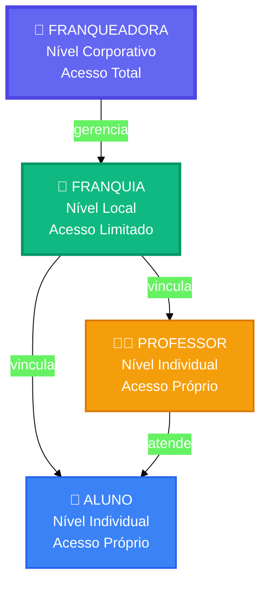
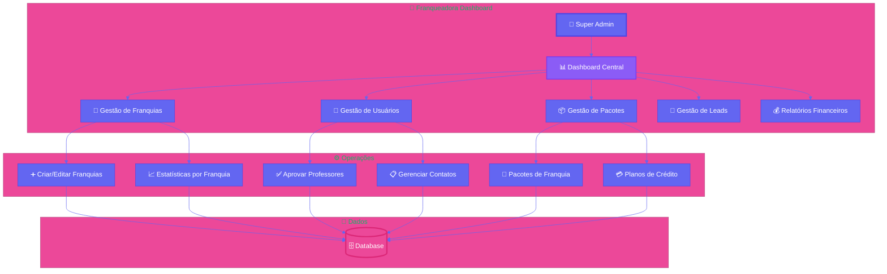
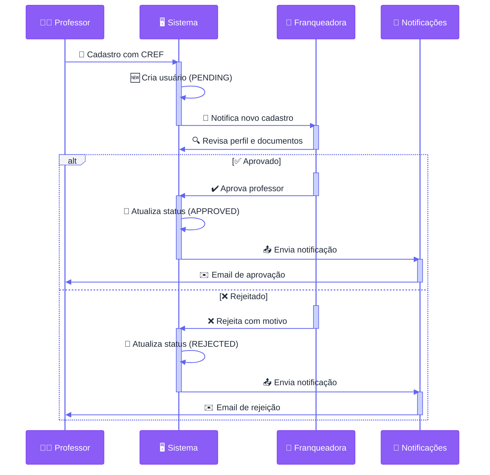
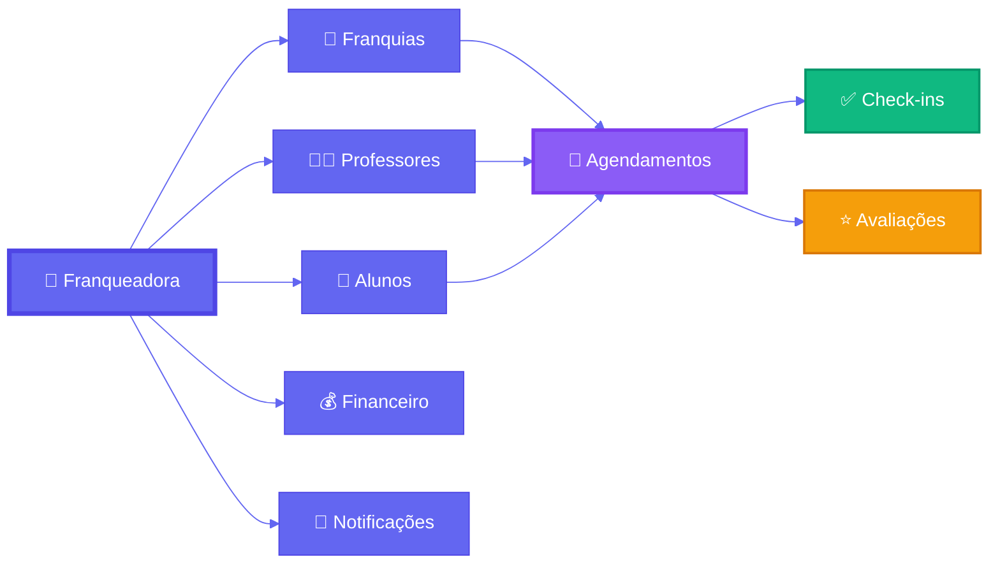

# Documentação Técnica - Franqueadora

## Visão Geral

A interface da franqueadora é o painel de controle central da plataforma, projetada para permitir que a administração corporativa gerencie toda a rede de franquias, usuários, pacotes, políticas e operações financeiras. É o nível mais alto de acesso no sistema, com visibilidade completa sobre todas as operações.

### Hierarquia de Acesso



## Arquitetura e Fluxo de Dados



## Funcionalidades Principais

### 1. Dashboard Central

**Rota:** `/franqueadora/dashboard`

- **Visão Consolidada:** Dashboard com métricas agregadas de toda a rede
  - Total de franquias ativas/inativas
  - Total de usuários por perfil (alunos, professores, admins)
  - Agendamentos realizados (total, concluídos, cancelados)
  - Receita total e por franquia
  - Taxa de crescimento mensal
- **Gráficos e Análises:**

  - Evolução temporal de cadastros
  - Performance por franquia
  - Taxa de conversão de leads
  - Distribuição geográfica das franquias

- **Alertas e Notificações:**
  - Novos cadastros de professores pendentes de aprovação
  - Franquias com baixa performance
  - Leads não atendidos

### 2. Gestão de Franquias (Academias)

#### 2.1 Listar Franquias

**Endpoint:** `GET /api/franqueadora/franchises`

- Tabela paginada com todas as franquias
- Filtros disponíveis:
  - Status (ativa/inativa)
  - Cidade/Estado
  - Data de criação
  - Receita mensal
- Ordenação por múltiplos critérios
- Busca por nome, CNPJ, email

#### 2.2 Criar Nova Franquia

**Endpoint:** `POST /api/franqueadora/franchises`

Campos obrigatórios:

```json
{
  "name": "Academia Exemplo",
  "email": "contato@academia.com",
  "phone": "(11) 99999-9999",
  "cnpj": "00.000.000/0000-00",
  "address": "Rua Exemplo, 123",
  "city": "São Paulo",
  "state": "SP",
  "zip_code": "01234-567",
  "opening_time": "06:00:00",
  "closing_time": "22:00:00",
  "checkin_tolerance": 30
}
```

#### 2.3 Estatísticas Detalhadas por Franquia

**Endpoint:** `GET /api/franqueadora/academies/:id/stats`

Retorna métricas completas com cache de 5 minutos:

```json
{
  "academy": {
    "id": "uuid",
    "name": "Academia Exemplo",
    "monthlyRevenue": 15000.0
  },
  "totalStudents": 150,
  "activeStudents": 120,
  "totalTeachers": 25,
  "activeTeachers": 20,
  "totalBookings": 450,
  "completedBookings": 380,
  "cancelledBookings": 30,
  "completionRate": "84.4",
  "creditsBalance": 5000,
  "plansActive": 3
}
```

**Otimizações:**

- Cache distribuído de 5 minutos
- Consulta RPC otimizada `get_academy_stats`
- Fallback para consultas paralelas se RPC indisponível

### 3. Gestão de Usuários

#### 3.1 Listar Todos os Usuários

**Endpoint:** `GET /api/franqueadora/users`

**Parâmetros de Query:**

- `role`: STUDENT, TEACHER, ADMIN, FRANCHISE_ADMIN
- `search`: Busca por nome, email ou telefone
- `status`: active, inactive
- `page`: Número da página
- `limit`: Itens por página

**Resposta Enriquecida:**

```json
{
  "data": [
    {
      "id": "uuid",
      "name": "João Silva",
      "email": "joao@email.com",
      "role": "TEACHER",
      "approval_status": "APPROVED",
      "created_at": "2024-01-01T00:00:00Z",
      "operational_links": {
        "professor_units": [...],
        "student_units": [...]
      },
      "booking_stats": {
        "total": 50,
        "completed": 45,
        "pending": 3,
        "cancelled": 2
      },
      "balance_info": {...},
      "hours_info": {...}
    }
  ],
  "pagination": {
    "page": 1,
    "limit": 20,
    "total": 150,
    "totalPages": 8
  }
}
```

**Otimizações:**

- Busca de dados complementares em lote (evita N+1)
- Consultas paralelas para melhor performance
- Agrupamento de dados por usuário em memória

#### 3.2 Gestão de Contatos da Franqueadora

**Endpoint:** `GET /api/franqueadora/contacts`

Sistema de CRM integrado para gerenciar professores e alunos:

**Filtros Disponíveis:**

- `role`: STUDENT, TEACHER
- `status`: UNASSIGNED, ASSIGNED, INACTIVE
- `assigned`: true/false (apenas para professores)
- `academy_id`: Filtrar por academia específica
- `user_active`: true/false
- `search`: Busca textual

**Funcionalidades:**

- Atribuição de professores a academias
- Rastreamento de última atribuição
- Status de ativação/desativação
- Histórico de vínculos

#### 3.3 Aprovação de Professores

**Endpoint:** `PUT /api/franqueadora/users/:id/approve`

Fluxo de aprovação:

1. Professor se cadastra (status: PENDING)
2. Franqueadora revisa perfil e documentação (CREF)
3. Aprovação ou rejeição com motivo
4. Notificação automática ao professor
5. Atualização de `approval_status` e `approved_at`

```json
{
  "approval_status": "APPROVED",
  "approved_by": "admin_user_id",
  "rejection_reason": null
}
```

### 4. Gestão de Pacotes e Planos

#### 4.1 Pacotes de Franquia

**Endpoint:** `GET /api/franqueadora/packages`

Pacotes de investimento para novas franquias:

```json
{
  "id": "uuid",
  "name": "Pacote Starter",
  "description": "Pacote inicial para franquias",
  "investment_amount": 50000.0,
  "credits_included": 1000,
  "features": {
    "max_teachers": 10,
    "max_students": 100,
    "support_level": "basic"
  },
  "is_active": true
}
```

**Operações:**

- `POST /api/franqueadora/packages` - Criar pacote
- `PUT /api/franqueadora/packages/:id` - Atualizar pacote
- `DELETE /api/franqueadora/packages/:id` - Desativar pacote (soft delete)

**Segurança:**

- Validação de propriedade (franqueadora_id)
- Auditoria de operações sensíveis
- Log de tentativas de acesso não autorizado

#### 4.2 Gestão de Leads

**Endpoint:** `GET /api/franqueadora/leads`

Sistema de gerenciamento de leads para novas franquias:

**Campos:**

```json
{
  "id": "uuid",
  "name": "Potencial Franqueado",
  "email": "lead@email.com",
  "phone": "(11) 99999-9999",
  "city": "São Paulo",
  "state": "SP",
  "status": "NEW",
  "investment_capacity": "50k-100k",
  "notes": "Interessado em abrir franquia",
  "created_at": "2024-01-01T00:00:00Z"
}
```

**Status de Lead:**

- NEW: Novo lead
- CONTACTED: Contato realizado
- QUALIFIED: Lead qualificado
- PROPOSAL_SENT: Proposta enviada
- NEGOTIATING: Em negociação
- CONVERTED: Convertido em franquia
- LOST: Lead perdido

### 5. Políticas e Configurações

#### 5.1 Políticas Globais

**Endpoint:** `GET /api/franqueadora/policies`

- Políticas de Privacidade (LGPD)
- Termos de Uso
- Políticas de Cancelamento
- Regras de Comissão
- Configurações de Agendamento

#### 5.2 Configurações do Sistema

**Tabela:** `settings`

Armazena configurações globais em formato JSON:

```json
{
  "key": "booking_rules",
  "value": {
    "min_advance_hours": 4,
    "max_advance_days": 30,
    "cancellation_deadline_hours": 4,
    "checkin_tolerance_minutes": 15
  }
}
```

### 6. Relatórios e Financeiro

#### 6.1 Relatórios de Faturamento

**Endpoint:** `GET /api/franqueadora/financials`

Relatórios consolidados:

- Receita total por período
- Receita por franquia
- Comissões de professores
- Transações de créditos
- Análise de churn

#### 6.2 Auditoria e Logs

**Service:** `auditService`

Sistema de auditoria para operações sensíveis:

- Criação/edição de pacotes
- Aprovação de usuários
- Alterações em franquias
- Tentativas de acesso não autorizado

```typescript
await auditService.logPermissionDenied(
  req,
  'franchise_packages',
  'update',
  packageId
)
```

## Fluxo de Aprovação de Professores



## Modelo de Dados

### Tabelas Principais

#### Franqueadora

```sql
CREATE TABLE franqueadora (
  id UUID PRIMARY KEY,
  name VARCHAR NOT NULL,
  email VARCHAR NOT NULL,
  phone VARCHAR,
  cnpj VARCHAR,
  is_active BOOLEAN DEFAULT true,
  created_at TIMESTAMP DEFAULT NOW(),
  updated_at TIMESTAMP DEFAULT NOW()
);
```

#### FranqueadoraAdmin

```sql
CREATE TABLE franqueadora_admins (
  id UUID PRIMARY KEY,
  franqueadora_id UUID REFERENCES franqueadora(id),
  user_id UUID REFERENCES users(id),
  role VARCHAR NOT NULL,
  created_at TIMESTAMP DEFAULT NOW(),
  updated_at TIMESTAMP DEFAULT NOW()
);
```

#### FranchisePackages

```sql
CREATE TABLE franchise_packages (
  id UUID PRIMARY KEY,
  franqueadora_id UUID REFERENCES franqueadora(id),
  name VARCHAR NOT NULL,
  description TEXT,
  investment_amount DECIMAL(10,2),
  credits_included INTEGER,
  features JSONB,
  is_active BOOLEAN DEFAULT true,
  created_at TIMESTAMP DEFAULT NOW(),
  updated_at TIMESTAMP DEFAULT NOW()
);
```

#### FranchiseLeads

```sql
CREATE TABLE franchise_leads (
  id UUID PRIMARY KEY,
  franqueadora_id UUID REFERENCES franqueadora(id),
  name VARCHAR NOT NULL,
  email VARCHAR NOT NULL,
  phone VARCHAR,
  city VARCHAR,
  state VARCHAR,
  status VARCHAR DEFAULT 'NEW',
  investment_capacity VARCHAR,
  notes TEXT,
  created_at TIMESTAMP DEFAULT NOW(),
  updated_at TIMESTAMP DEFAULT NOW()
);
```

## Endpoints da API

### Contexto e Autenticação

```
GET  /api/franqueadora/me
```

Retorna contexto da franqueadora do admin atual

### Gestão de Contatos

```
GET  /api/franqueadora/contacts
```

Lista contatos (professores/alunos) com filtros avançados

### Gestão de Pacotes

```
GET    /api/franqueadora/packages
POST   /api/franqueadora/packages
PUT    /api/franqueadora/packages/:id
DELETE /api/franqueadora/packages/:id
```

### Gestão de Leads

```
GET  /api/franqueadora/leads
PUT  /api/franqueadora/leads/:id
```

### Estatísticas de Academias

```
GET  /api/franqueadora/academies/:id/stats
```

### Gestão de Usuários

```
GET  /api/franqueadora/users
PUT  /api/franqueadora/users/:id/approve
```

## Middleware e Segurança

### Autenticação e Autorização

```typescript
requireAuth // Valida JWT token
requireRole(['SUPER_ADMIN']) // Valida role do usuário
requireFranqueadoraAdmin // Valida vínculo com franqueadora
```

### Auditoria

```typescript
auditSensitiveOperation('CREATE', 'franchise_packages')
```

### Paginação

```typescript
extractPagination // Extrai parâmetros de paginação
extractFilters // Extrai filtros da query
addPaginationHeaders // Adiciona headers de paginação
```

### Rate Limiting

Aplicado em endpoints sensíveis para prevenir abuso

### Cache

Sistema de cache distribuído com TTL configurável:

- Estatísticas de academias: 5 minutos
- Listas de usuários: 2 minutos
- Configurações globais: 15 minutos

## Permissões e Roles

### SUPER_ADMIN

- Acesso total a todas as funcionalidades
- Pode gerenciar múltiplas franqueadoras
- Acesso a logs de auditoria

### FRANCHISOR

- Acesso limitado à sua franqueadora
- Pode gerenciar franquias vinculadas
- Pode aprovar professores
- Acesso a relatórios financeiros

## Otimizações de Performance

### 1. Consultas Otimizadas

- Uso de RPC functions para agregações complexas
- Consultas paralelas com Promise.all()
- Evita problema N+1 com batch loading

### 2. Cache Distribuído

```typescript
const cacheKey = `academy_stats_${id}_${franqueadoraId}`
const cachedStats = await cacheService.get(cacheKey)
if (cachedStats) return cachedStats
// ... buscar dados
await cacheService.set(cacheKey, stats, 5 * 60 * 1000)
```

### 3. Paginação Eficiente

- Limit/offset com contagem total
- Headers de paginação (X-Total-Count, Link)
- Cursor-based pagination para grandes datasets

### 4. Índices de Banco de Dados

```sql
CREATE INDEX idx_users_role ON users(role);
CREATE INDEX idx_users_approval_status ON users(approval_status);
CREATE INDEX idx_academy_teachers_academy_id ON academy_teachers(academy_id);
CREATE INDEX idx_bookings_date_status ON bookings(date, status);
```

## Monitoramento e Logs

### Logs de Auditoria

Todas as operações sensíveis são registradas:

- Quem executou a ação
- Quando foi executada
- Qual recurso foi afetado
- Dados antes e depois (para updates)

### Métricas de Performance

- Tempo de resposta por endpoint
- Taxa de cache hit/miss
- Queries mais lentas
- Erros e exceções

## Integração com Outros Módulos



## Boas Práticas

1. **Sempre validar permissões** antes de retornar dados sensíveis
2. **Usar transações** para operações que afetam múltiplas tabelas
3. **Implementar soft delete** ao invés de deletar registros
4. **Cachear dados** que não mudam frequentemente
5. **Auditar operações** sensíveis para compliance
6. **Validar entrada** com schemas Zod
7. **Retornar erros** descritivos mas sem expor detalhes internos
