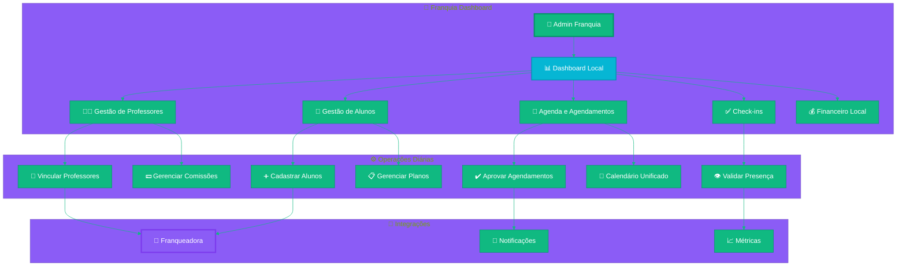

# Documentação Técnica - Franquia (Academia)

## Visão Geral

A interface da franquia é o painel operacional de cada unidade (academia), projetado para administradores locais gerenciarem as operações diárias: professores, alunos, agendamentos, check-ins e finanças. Cada franquia opera de forma semi-autônoma, com visibilidade limitada aos seus próprios dados.

## Arquitetura e Fluxo Operacional


```mermaid
%%{init: {'theme':'base', 'themeVariables': { 'primaryColor':'#10b981','primaryTextColor':'#fff','primaryBorderColor':'#059669','lineColor':'#10b981','secondaryColor':'#06b6d4','tertiaryColor':'#8b5cf6'}}}%%
graph TB
    subgraph Dashboard["🏪 Franquia Dashboard"]
        A["👤 Admin Franquia"]
        B["📊 Dashboard Local"]
        C["👨‍🏫 Gestão de Professores"]
        D["👥 Gestão de Alunos"]
        E["📅 Agenda e Agendamentos"]
        F["✅ Check-ins"]
        G["💰 Financeiro Local"]
        
        A --> B
        B --> C
        B --> D
        B --> E
        B --> F
        B --> G
    end
    
    subgraph Operations["⚙️ Operações Diárias"]
        H["🔗 Vincular Professores"]
        I["💵 Gerenciar Comissões"]
        J["➕ Cadastrar Alunos"]
        K["📋 Gerenciar Planos"]
        L["✔️ Aprovar Agendamentos"]
        M["📆 Calendário Unificado"]
        N["👁️ Validar Presença"]
        
        C --> H
        C --> I
        D --> J
        D --> K
        E --> L
        E --> M
        F --> N
    end
    
    subgraph Integration["🔌 Integrações"]
        O["🏢 Franqueadora"]
        P["🔔 Notificações"]
        Q["📈 Métricas"]
        
        H --> O
        J --> O
        L --> P
        N --> Q
    end
    
    style A fill:#10b981,stroke:#059669,stroke-width:3px,color:#fff
    style B fill:#06b6d4,stroke:#0891b2,stroke-width:2px,color:#fff
    style O fill:#8b5cf6,stroke:#7c3aed,stroke-width:3px,color:#fff
```

## Funcionalidades Principais

### 1. Dashboard da Franquia
**Rota:** `/franquia/dashboard`

#### 1.1 Métricas em Tempo Real
```json
{
  "today": {
    "scheduled_classes": 25,
    "completed_classes": 18,
    "active_students": 12,
    "checkins_today": 20
  },
  "week": {
    "total_classes": 150,
    "completion_rate": 92.5,
    "new_students": 5,
    "revenue": 8500.00
  },
  "month": {
    "total_classes": 600,
    "total_students": 180,
    "total_teachers": 15,
    "monthly_revenue": 35000.00
  }
}
```

#### 1.2 Alertas e Notificações
**Endpoint:** `GET /api/notifications?academy_id=:id`

Tipos de notificações:
- `NEW_BOOKING`: Novo agendamento pendente
- `BOOKING_CANCELLED`: Cancelamento de aula
- `NEW_STUDENT`: Novo aluno cadastrado
- `LOW_CREDITS`: Aluno com créditos baixos
- `TEACHER_UNAVAILABLE`: Professor indisponível
- `CHECKIN_MISSED`: Check-in não realizado

```json
{
  "id": "uuid",
  "type": "NEW_BOOKING",
  "title": "Novo Agendamento",
  "message": "João Silva agendou aula com Maria Santos",
  "data": {
    "booking_id": "uuid",
    "student_name": "João Silva",
    "teacher_name": "Maria Santos",
    "date": "2024-01-15T10:00:00Z"
  },
  "is_read": false,
  "created_at": "2024-01-14T15:30:00Z"
}
```

### 2. Gestão de Professores

#### 2.1 Listar Professores da Franquia
**Endpoint:** `GET /api/teachers/by-academy?academy_id=:id`

**Resposta Enriquecida:**
```json
{
  "teachers": [
    {
      "id": "uuid",
      "name": "Maria Santos",
      "email": "maria@email.com",
      "phone": "(11) 99999-9999",
      "avatar_url": "https://...",
      "is_active": true,
      "specialties": ["Musculação", "Funcional", "HIIT"],
      "status": "active",
      "teacher_profiles": [{
        "bio": "Personal trainer com 10 anos de experiência",
        "hourly_rate": 80.00,
        "rating_avg": 4.8,
        "rating_count": 45,
        "total_sessions": 320
      }],
      "academy_teachers": [{
        "academy_id": "uuid",
        "status": "active",
        "commission_rate": 0.70,
        "created_at": "2024-01-01T00:00:00Z"
      }],
      "teacher_subscriptions": [{
        "status": "active",
        "plan_name": "Plano Pro",
        "hours_remaining": 50
      }]
    }
  ]
}
```

#### 2.2 Vincular/Desvincular Professor
**Endpoint:** `PUT /api/teachers/:id/academy-link`

```json
{
  "academy_id": "uuid",
  "status": "active",
  "commission_rate": 0.70
}
```

**Status Possíveis:**
- `active`: Professor ativo na academia
- `inactive`: Professor desvinculado
- `suspended`: Professor temporariamente suspenso

#### 2.3 Visualizar Agenda do Professor
**Endpoint:** `GET /api/bookings?teacher_id=:id&unit_id=:academy_id`

Retorna todos os agendamentos do professor na academia:
- Horários disponíveis (AVAILABLE)
- Horários reservados (RESERVED)
- Aulas confirmadas (PAID)
- Aulas concluídas (DONE)
- Horários bloqueados (BLOCKED)
- Cancelamentos (CANCELED)

### 3. Gestão de Alunos

#### 3.1 Listar Alunos da Franquia
**Endpoint:** `GET /api/students?academy_id=:id`

**Filtros Disponíveis:**
- Status (ativo/inativo)
- Plano atual
- Créditos disponíveis
- Data de cadastro
- Última atividade

**Resposta:**
```json
{
  "students": [
    {
      "id": "uuid",
      "name": "João Silva",
      "email": "joao@email.com",
      "phone": "(11) 98888-8888",
      "avatar_url": "https://...",
      "credits": 10,
      "is_active": true,
      "academy_students": [{
        "academy_id": "uuid",
        "status": "active",
        "join_date": "2024-01-01T00:00:00Z",
        "last_activity": "2024-01-14T10:00:00Z",
        "plan_id": "uuid"
      }],
      "student_subscriptions": [{
        "status": "active",
        "credits_remaining": 10,
        "start_date": "2024-01-01",
        "end_date": "2024-02-01",
        "student_plans": {
          "name": "Plano Mensal",
          "price": 199.90,
          "credits_included": 12
        }
      }]
    }
  ]
}
```

#### 3.2 Cadastrar Novo Aluno
**Endpoint:** `POST /api/students`

```json
{
  "name": "João Silva",
  "email": "joao@email.com",
  "phone": "(11) 98888-8888",
  "academy_id": "uuid",
  "plan_id": "uuid",
  "credits": 12
}
```

**Fluxo de Cadastro:**
1. Validação de email único
2. Criação do usuário com role STUDENT
3. Vínculo com a academia (academy_students)
4. Atribuição de créditos iniciais
5. Envio de email de boas-vindas

#### 3.3 Detalhes do Aluno
**Endpoint:** `GET /api/students/:id`

Informações completas:
- Dados pessoais
- Plano atual e histórico
- Créditos disponíveis
- Histórico de agendamentos
- Histórico de transações
- Check-ins realizados
- Avaliações deixadas

### 4. Agenda e Agendamentos

#### 4.1 Calendário Unificado
**Endpoint:** `GET /api/bookings?unit_id=:academy_id&from=:date&to=:date`

Visualização consolidada de todos os agendamentos da academia:


```mermaid
gantt
    title Agenda da Academia - 15/01/2024
    dateFormat HH:mm
    section Prof. Maria
    Aluno João     :done, 08:00, 09:00
    Aluno Pedro    :active, 09:00, 10:00
    Disponível     :crit, 10:00, 11:00
    section Prof. Carlos
    Aluno Ana      :done, 08:00, 09:00
    Bloqueado      :milestone, 09:00, 10:00
    Aluno Lucas    :active, 10:00, 11:00
```

**Filtros:**
- Por professor
- Por status (PENDING, CONFIRMED, COMPLETED, CANCELLED)
- Por período (dia, semana, mês)
- Por aluno

#### 4.2 Gerenciar Agendamentos
**Endpoint:** `PATCH /api/bookings/:id`

Ações disponíveis:
- Confirmar agendamento pendente
- Cancelar agendamento
- Reagendar (cancelar + criar novo)
- Marcar como concluído

```json
{
  "status": "PAID",
  "notes": "Confirmado pelo admin"
}
```

#### 4.3 Regras de Agendamento
Configuráveis por academia:

```json
{
  "min_advance_hours": 4,
  "max_advance_days": 30,
  "cancellation_deadline_hours": 4,
  "allow_overlapping": false,
  "require_admin_approval": false
}
```

### 5. Check-ins

#### 5.1 Sistema de Check-in
**Endpoint:** `POST /api/checkins`

**Métodos de Check-in:**
1. **QR Code:** Aluno apresenta QR code, professor escaneia
2. **Manual:** Admin registra presença manualmente
3. **Automático:** Check-in automático no horário da aula

```json
{
  "booking_id": "uuid",
  "method": "QRCODE",
  "status": "SUCCESS",
  "checked_in_at": "2024-01-15T10:05:00Z"
}
```

#### 5.2 Monitoramento em Tempo Real
**Endpoint:** `GET /api/franchises/:id/checkins?date=:date`

Dashboard de check-ins do dia:
```json
{
  "date": "2024-01-15",
  "total_scheduled": 25,
  "checked_in": 20,
  "pending": 3,
  "missed": 2,
  "checkins": [
    {
      "id": "uuid",
      "student_name": "João Silva",
      "teacher_name": "Maria Santos",
      "scheduled_time": "10:00",
      "checkin_time": "10:05",
      "status": "SUCCESS",
      "method": "QRCODE"
    }
  ]
}
```

#### 5.3 Tolerância de Check-in
Configurável por academia (padrão: 15 minutos):
- Antes do horário: Permitido
- Até 15min após: Permitido
- Após 15min: Requer aprovação do admin
- Após 30min: Check-in negado (aula perdida)

### 6. Configurações da Academia

#### 6.1 Informações Básicas
**Endpoint:** `GET /api/franchises/:id/settings`

```json
{
  "id": "uuid",
  "name": "Academia Exemplo",
  "email": "contato@academia.com",
  "phone": "(11) 99999-9999",
  "address": "Rua Exemplo, 123",
  "city": "São Paulo",
  "state": "SP",
  "zip_code": "01234-567",
  "opening_time": "06:00:00",
  "closing_time": "22:00:00",
  "checkin_tolerance": 15
}
```

#### 6.2 Horários de Funcionamento
**Campo:** `schedule` (JSONB)

Permite horários especiais por dia da semana:
```json
{
  "monday": { "open": "06:00", "close": "22:00" },
  "tuesday": { "open": "06:00", "close": "22:00" },
  "wednesday": { "open": "06:00", "close": "22:00" },
  "thursday": { "open": "06:00", "close": "22:00" },
  "friday": { "open": "06:00", "close": "22:00" },
  "saturday": { "open": "08:00", "close": "18:00" },
  "sunday": { "closed": true }
}
```

#### 6.3 Gestão de Espaços
**Tabela:** `academy_spaces` (futuro)

Gerenciamento de salas/espaços para aulas:
- Sala de Musculação
- Sala de Funcional
- Sala de Spinning
- Área Externa

### 7. Financeiro da Franquia

#### 7.1 Relatório de Receita
**Endpoint:** `GET /api/franchises/:id/financials`

```json
{
  "period": "2024-01",
  "revenue": {
    "total": 35000.00,
    "from_subscriptions": 25000.00,
    "from_credits": 10000.00
  },
  "expenses": {
    "teacher_commissions": 15000.00,
    "platform_fee": 3500.00
  },
  "net_revenue": 16500.00,
  "transactions_count": 450,
  "active_students": 180,
  "average_ticket": 194.44
}
```

#### 7.2 Histórico de Transações
**Endpoint:** `GET /api/transactions?academy_id=:id`

Tipos de transações:
- `SUBSCRIPTION_PAYMENT`: Pagamento de plano
- `CREDIT_PURCHASE`: Compra de créditos
- `BOOKING_PAYMENT`: Pagamento de aula avulsa
- `REFUND`: Reembolso de cancelamento
- `COMMISSION_PAYOUT`: Pagamento de comissão

```json
{
  "transactions": [
    {
      "id": "uuid",
      "type": "SUBSCRIPTION_PAYMENT",
      "amount": 199.90,
      "user_name": "João Silva",
      "description": "Plano Mensal - Janeiro/2024",
      "status": "COMPLETED",
      "created_at": "2024-01-01T10:00:00Z"
    }
  ]
}
```

## Fluxo de Agendamento Completo

```mermaid
%%{init: {'theme':'base', 'themeVariables': { 'primaryColor':'#10b981','actorBkg':'#06b6d4','actorBorder':'#0891b2','actorTextColor':'#fff','actorLineColor':'#10b981','signalColor':'#10b981','signalTextColor':'#1f2937','labelBoxBkgColor':'#f3f4f6','labelBoxBorderColor':'#10b981','labelTextColor':'#1f2937','loopTextColor':'#1f2937','noteBorderColor':'#10b981','noteBkgColor':'#d1fae5','noteTextColor':'#1f2937','activationBorderColor':'#059669','activationBkgColor':'#a7f3d0','sequenceNumberColor':'#fff'}}}%%
sequenceDiagram
    participant A as 👤 Aluno
    participant S as 🖥️ Sistema
    participant F as 🏪 Franquia
    participant P as 👨‍🏫 Professor
    participant N as 📧 Notificações
    
    A->>S: 📝 Solicita agendamento
    activate S
    S->>S: 💳 Valida créditos
    S->>S: 🔍 Verifica disponibilidade
    
    alt 🔐 Requer Aprovação
        S->>F: 🔔 Notifica novo agendamento
        deactivate S
        activate F
        F->>S: ✅ Aprova agendamento
        deactivate F
        activate S
        S->>S: 💰 Debita créditos
        S->>N: 📤 Notifica aluno e professor
        deactivate S
    else ⚡ Aprovação Automática
        S->>S: ✔️ Confirma e debita créditos
        S->>N: 📤 Notifica aluno e professor
        deactivate S
    end
    
    Note over A,P: 📅 Dia da Aula
    
    A->>P: 📱 Apresenta QR Code
    activate P
    P->>S: 📷 Escaneia QR Code
    deactivate P
    activate S
    S->>S: ✅ Valida check-in
    S->>S: ✔️ Marca aula como concluída
    S->>N: ⭐ Solicita avaliação
    deactivate S
```

## Modelo de Dados

### Academy (Franquia)
```sql
CREATE TABLE academies (
  id UUID PRIMARY KEY DEFAULT uuid_generate_v4(),
  franqueadora_id UUID REFERENCES franqueadora(id),
  name VARCHAR(255) NOT NULL,
  email VARCHAR(255) NOT NULL,
  phone VARCHAR(20),
  address TEXT,
  city VARCHAR(100),
  state VARCHAR(2),
  zip_code VARCHAR(10),
  is_active BOOLEAN DEFAULT true,
  opening_time TIME DEFAULT '06:00:00',
  closing_time TIME DEFAULT '22:00:00',
  checkin_tolerance INTEGER DEFAULT 15,
  schedule JSONB DEFAULT '[]',
  monthly_revenue DECIMAL(10,2) DEFAULT 0,
  created_at TIMESTAMP DEFAULT NOW(),
  updated_at TIMESTAMP DEFAULT NOW()
);

CREATE INDEX idx_academies_franqueadora ON academies(franqueadora_id);
CREATE INDEX idx_academies_city_state ON academies(city, state);
```

### AcademyTeacher (Vínculo Professor-Academia)
```sql
CREATE TABLE academy_teachers (
  id UUID PRIMARY KEY DEFAULT uuid_generate_v4(),
  academy_id UUID REFERENCES academies(id),
  teacher_id UUID REFERENCES users(id),
  status VARCHAR(20) DEFAULT 'active',
  commission_rate DECIMAL(3,2) DEFAULT 0.70,
  created_at TIMESTAMP DEFAULT NOW(),
  updated_at TIMESTAMP DEFAULT NOW(),
  
  UNIQUE(academy_id, teacher_id)
);

CREATE INDEX idx_academy_teachers_academy ON academy_teachers(academy_id);
CREATE INDEX idx_academy_teachers_teacher ON academy_teachers(teacher_id);
CREATE INDEX idx_academy_teachers_status ON academy_teachers(status);
```

### AcademyStudent (Vínculo Aluno-Academia)
```sql
CREATE TABLE academy_students (
  id UUID PRIMARY KEY DEFAULT uuid_generate_v4(),
  academy_id UUID REFERENCES academies(id),
  student_id UUID REFERENCES users(id),
  plan_id UUID REFERENCES academy_plans(id),
  status VARCHAR(20) DEFAULT 'active',
  join_date TIMESTAMP DEFAULT NOW(),
  last_activity TIMESTAMP DEFAULT NOW(),
  created_at TIMESTAMP DEFAULT NOW(),
  updated_at TIMESTAMP DEFAULT NOW(),
  
  UNIQUE(academy_id, student_id)
);

CREATE INDEX idx_academy_students_academy ON academy_students(academy_id);
CREATE INDEX idx_academy_students_student ON academy_students(student_id);
CREATE INDEX idx_academy_students_status ON academy_students(status);
```

### AcademyPlan (Planos da Academia)
```sql
CREATE TABLE academy_plans (
  id UUID PRIMARY KEY DEFAULT uuid_generate_v4(),
  academy_id UUID REFERENCES academies(id),
  name VARCHAR(100) NOT NULL,
  description TEXT,
  price DECIMAL(10,2) NOT NULL,
  credits_included INTEGER NOT NULL,
  duration_days INTEGER NOT NULL,
  features JSONB,
  is_active BOOLEAN DEFAULT true,
  created_at TIMESTAMP DEFAULT NOW(),
  updated_at TIMESTAMP DEFAULT NOW()
);

CREATE INDEX idx_academy_plans_academy ON academy_plans(academy_id);
CREATE INDEX idx_academy_plans_active ON academy_plans(is_active);
```

### Checkin
```sql
CREATE TABLE checkins (
  id UUID PRIMARY KEY DEFAULT uuid_generate_v4(),
  academy_id UUID REFERENCES academies(id),
  booking_id UUID REFERENCES bookings(id),
  teacher_id UUID REFERENCES users(id),
  status VARCHAR(20) NOT NULL,
  method VARCHAR(20) DEFAULT 'QRCODE',
  reason TEXT,
  created_at TIMESTAMP DEFAULT NOW()
);

CREATE INDEX idx_checkins_academy ON checkins(academy_id);
CREATE INDEX idx_checkins_booking ON checkins(booking_id);
CREATE INDEX idx_checkins_date ON checkins(created_at);
```

### Notification
```sql
CREATE TABLE notifications (
  id UUID PRIMARY KEY DEFAULT uuid_generate_v4(),
  academy_id UUID REFERENCES academies(id),
  type VARCHAR(50) NOT NULL,
  title VARCHAR(255) NOT NULL,
  message TEXT NOT NULL,
  data JSONB,
  is_read BOOLEAN DEFAULT false,
  created_at TIMESTAMP DEFAULT NOW(),
  updated_at TIMESTAMP DEFAULT NOW()
);

CREATE INDEX idx_notifications_academy ON notifications(academy_id);
CREATE INDEX idx_notifications_read ON notifications(is_read);
CREATE INDEX idx_notifications_created ON notifications(created_at DESC);
```

## Endpoints da API

### Dashboard e Estatísticas
```
GET  /api/franchises/:id/dashboard
GET  /api/franchises/:id/stats
```

### Gestão de Professores
```
GET  /api/teachers/by-academy?academy_id=:id
PUT  /api/teachers/:id/academy-link
GET  /api/teachers/:id/stats
```

### Gestão de Alunos
```
GET  /api/students?academy_id=:id
POST /api/students
GET  /api/students/:id
PUT  /api/students/:id
DELETE /api/students/:id
GET  /api/students/:id/stats
```

### Agendamentos
```
GET    /api/bookings?unit_id=:academy_id
POST   /api/bookings
GET    /api/bookings/:id
PATCH  /api/bookings/:id
DELETE /api/bookings/:id
```

### Check-ins
```
GET  /api/franchises/:id/checkins
POST /api/checkins
GET  /api/checkins/:id
```

### Configurações
```
GET  /api/franchises/:id/settings
PUT  /api/franchises/:id/settings
```

### Financeiro
```
GET  /api/franchises/:id/financials
GET  /api/transactions?academy_id=:id
```

### Notificações
```
GET   /api/notifications?academy_id=:id
PATCH /api/notifications/:id/read
```

## Permissões e Controle de Acesso

### FRANCHISE_ADMIN
- Acesso total à sua franquia
- Não pode acessar dados de outras franquias
- Pode gerenciar professores e alunos locais
- Pode aprovar agendamentos (se configurado)
- Acesso a relatórios financeiros locais

### Validação de Acesso
```typescript
// Middleware de validação
async function validateFranchiseAccess(req, res, next) {
  const { academy_id } = req.params
  const user = req.user
  
  if (user.role === 'FRANCHISE_ADMIN') {
    const { data } = await supabase
      .from('franchise_admins')
      .select('academy_id')
      .eq('user_id', user.id)
      .eq('academy_id', academy_id)
      .single()
    
    if (!data) {
      return res.status(403).json({ error: 'Acesso negado' })
    }
  }
  
  next()
}
```

## Otimizações e Performance

### 1. Cache de Estatísticas
```typescript
const cacheKey = `academy_stats_${academyId}`
const cached = await redis.get(cacheKey)
if (cached) return JSON.parse(cached)

// Buscar dados...
await redis.setex(cacheKey, 300, JSON.stringify(stats))
```

### 2. Consultas Otimizadas
- Uso de índices compostos
- Eager loading de relacionamentos
- Paginação eficiente
- Agregações no banco de dados

### 3. Real-time Updates
WebSocket para atualizações em tempo real:
- Novos agendamentos
- Check-ins realizados
- Cancelamentos
- Notificações

## Boas Práticas

1. **Sempre validar** se o usuário tem acesso à franquia
2. **Cachear dados** que não mudam frequentemente
3. **Usar transações** para operações críticas
4. **Notificar usuários** sobre mudanças importantes
5. **Auditar operações** sensíveis
6. **Validar horários** de funcionamento antes de criar agendamentos
7. **Implementar rate limiting** em endpoints públicos
