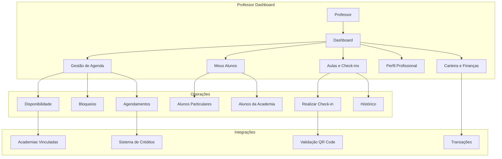
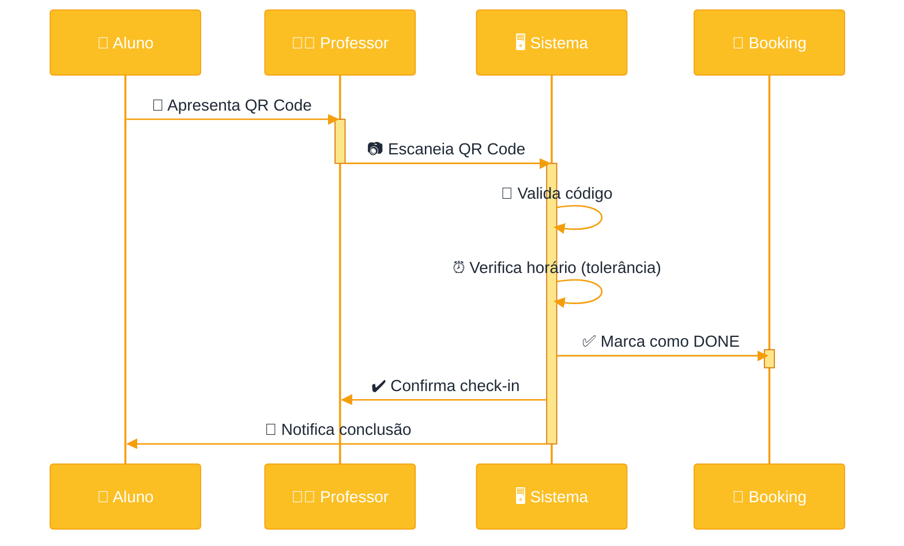

# Documentação Técnica - Professor

## Visão Geral

A interface do professor é o hub central para personal trainers gerenciarem sua carreira profissional na plataforma. Oferece ferramentas completas para gestão de agenda, alunos particulares, aulas em academias, finanças e desenvolvimento profissional.

## Arquitetura e Fluxo de Trabalho



## Funcionalidades Principais

### 1. Dashboard do Professor
**Rota:** `/professor/dashboard`

#### 1.1 Visão Geral
```json
{
  "today": {
    "scheduled_classes": 8,
    "completed_classes": 5,
    "pending_classes": 3,
    "earnings_today": 400.00
  },
  "week": {
    "total_classes": 35,
    "completion_rate": 94.3,
    "total_earnings": 2800.00,
    "hours_worked": 35
  },
  "month": {
    "total_classes": 150,
    "total_students": 25,
    "total_earnings": 12000.00,
    "average_rating": 4.8
  }
}
```

#### 1.2 Próximas Aulas
**Endpoint:** `GET /api/bookings?teacher_id=:id&status=RESERVED,PAID`

Lista das próximas aulas agendadas:
```json
{
  "bookings": [
    {
      "id": "uuid",
      "studentId": "uuid",
      "studentName": "João Silva",
      "franchiseId": "uuid",
      "franchiseName": "Academia Centro",
      "date": "2024-01-15T10:00:00Z",
      "duration": 60,
      "status": "PAID",
      "source": "ALUNO",
      "hourlyRate": 80.00
    }
  ]
}
```

#### 1.3 Resumo Financeiro
**Endpoint:** `GET /api/teachers/:id/stats`

```json
{
  "total_revenue": 12000.00,
  "total_credits_used": 150,
  "hourly_rate": 80.00,
  "hours_earned": 150,
  "monthly_earnings": {
    "current_month": 3500.00
  },
  "current_subscription": {
    "status": "active",
    "plan_name": "Plano Pro",
    "hours_remaining": 50
  }
}
```

### 2. Gestão da Agenda

#### 2.1 Configurar Disponibilidade
**Endpoint:** `PUT /api/teachers/:id/availability`

O professor define seus horários de trabalho por dia da semana e academia:

```json
{
  "availability": {
    "monday": {
      "academies": {
        "academy_uuid_1": {
          "slots": [
            { "start": "08:00", "end": "12:00" },
            { "start": "14:00", "end": "18:00" }
          ]
        }
      }
    },
    "tuesday": {
      "academies": {
        "academy_uuid_1": {
          "slots": [
            { "start": "08:00", "end": "12:00" }
          ]
        }
      }
    }
  },
  "is_available": true
}
```

#### 2.2 Bloqueios de Agenda

##### Bloquear Slot Específico
**Endpoint:** `POST /api/teachers/:id/blocks/slot`

```json
{
  "academy_id": "uuid",
  "date": "2024-01-15",
  "time": "10:00",
  "notes": "Compromisso pessoal"
}
```

##### Bloquear Múltiplos Horários
**Endpoint:** `POST /api/teachers/:id/blocks/custom`

```json
{
  "academy_id": "uuid",
  "date": "2024-01-15",
  "hours": ["10:00", "11:00", "12:00"]
}
```

**Validações:**
- Não permite bloquear horários com reservas confirmadas
- Retorna lista de horários bloqueados com sucesso
- Ignora horários já ocupados por alunos

##### Bloquear Dia Inteiro (DEPRECATED)
**Endpoint:** `POST /api/teachers/:id/blocks/day`

Bloqueia todos os horários de 06:00 às 22:00

##### Listar Bloqueios
**Endpoint:** `GET /api/teachers/:id/blocks?academy_id=:id&date=:date`

```json
{
  "blocks": [
    {
      "id": "uuid",
      "date": "2024-01-15T10:00:00Z",
      "duration": 60,
      "status": "BLOCKED",
      "notes": "Compromisso pessoal",
      "franchise_id": "uuid"
    }
  ]
}
```

##### Remover Bloqueio
**Endpoint:** `DELETE /api/teachers/:id/blocks/:bookingId`

Remove um bloqueio específico (DELETE real do banco)

##### Limpar Todos os Bloqueios de uma Data
**Endpoint:** `DELETE /api/teachers/:id/blocks/all/:date`

Remove todos os bloqueios de um dia específico

#### 2.3 Calendário de Aulas
**Endpoint:** `GET /api/bookings?teacher_id=:id&from=:date&to=:date`

Visualização completa da agenda com todos os tipos de slots:

```mermaid
gantt
    title Agenda do Professor - 15/01/2024
    dateFormat HH:mm
    section Academia Centro
    Aluno João (PAID)      :done, 08:00, 09:00
    Aluno Maria (PAID)     :done, 09:00, 10:00
    Bloqueado              :milestone, 10:00, 11:00
    Disponível             :crit, 11:00, 12:00
    section Academia Sul
    Aluno Pedro (RESERVED) :active, 14:00, 15:00
    Disponível             :crit, 15:00, 16:00
```



**Status dos Slots:**
- `AVAILABLE`: Horário disponível para agendamento
- `RESERVED`: Reservado mas não pago
- `PAID`: Confirmado e pago
- `DONE`: Aula concluída
- `BLOCKED`: Bloqueado pelo professor
- `CANCELED`: Cancelado

### 3. Gestão de Alunos

#### 3.1 Alunos Particulares
**Tabela:** `teacher_students`

O professor mantém uma lista de alunos particulares (fora do sistema de academias):

**Endpoint:** `GET /api/teacher-students?teacher_id=:id`

```json
{
  "students": [
    {
      "id": "uuid",
      "name": "João Silva",
      "email": "joao@email.com",
      "phone": "(11) 98888-8888",
      "hourly_rate": 100.00,
      "notes": "Foco em hipertrofia",
      "created_at": "2024-01-01T00:00:00Z"
    }
  ]
}
```

**Criar Aluno Particular:**
**Endpoint:** `POST /api/teacher-students`

```json
{
  "teacher_id": "uuid",
  "name": "João Silva",
  "email": "joao@email.com",
  "phone": "(11) 98888-8888",
  "hourly_rate": 100.00,
  "notes": "Foco em hipertrofia"
}
```

**Características:**
- Alunos particulares têm `hourly_rate` personalizado
- Não consomem créditos da academia
- Professor agenda diretamente para eles
- Pagamento gerenciado fora da plataforma

#### 3.2 Alunos da Academia
Alunos que agendam aulas através do sistema da academia:

**Endpoint:** `GET /api/bookings?teacher_id=:id&source=ALUNO`

Lista de alunos que já agendaram com o professor através das academias

#### 3.3 Histórico de Aulas por Aluno
**Endpoint:** `GET /api/bookings?teacher_id=:id&student_id=:student_id`

Histórico completo de aulas com um aluno específico

### 4. Aulas e Check-in

#### 4.1 Realizar Check-in
**Endpoint:** `POST /api/checkins`

O professor escaneia o QR code do aluno para confirmar presença:

```json
{
  "booking_id": "uuid",
  "method": "QRCODE",
  "qr_code_data": "encrypted_student_data"
}
```

**Fluxo de Check-in:**


**Validações:**
- Verifica se o booking existe
- Valida se está dentro do horário (com tolerância)
- Confirma que o professor é o correto
- Marca aula como concluída (DONE)
- Registra horário exato do check-in

#### 4.2 Check-in Manual
Para casos onde o QR code não funciona:

```json
{
  "booking_id": "uuid",
  "method": "MANUAL",
  "reason": "QR code não funcionou"
}
```

#### 4.3 Histórico de Check-ins
**Endpoint:** `GET /api/checkins?teacher_id=:id`

```json
{
  "checkins": [
    {
      "id": "uuid",
      "booking_id": "uuid",
      "student_name": "João Silva",
      "academy_name": "Academia Centro",
      "scheduled_time": "2024-01-15T10:00:00Z",
      "checkin_time": "2024-01-15T10:05:00Z",
      "method": "QRCODE",
      "status": "SUCCESS"
    }
  ]
}
```

### 5. Perfil Profissional

#### 5.1 Visualizar Perfil
**Endpoint:** `GET /api/teachers/:id`

```json
{
  "id": "uuid",
  "name": "Maria Santos",
  "email": "maria@email.com",
  "phone": "(11) 99999-9999",
  "avatar_url": "https://...",
  "cref": "123456-G/SP",
  "cref_card_url": "https://...",
  "role": "TEACHER",
  "approval_status": "APPROVED",
  "teacher_profiles": [{
    "id": "uuid",
    "bio": "Personal trainer com 10 anos de experiência...",
    "specialties": ["Musculação", "Funcional", "HIIT"],
    "hourly_rate": 80.00,
    "rating_avg": 4.8,
    "rating_count": 45,
    "total_sessions": 320,
    "is_available": true
  }]
}
```

#### 5.2 Atualizar Perfil
**Endpoint:** `PUT /api/teachers/:id`

```json
{
  "name": "Maria Santos",
  "email": "maria@email.com",
  "phone": "(11) 99999-9999",
  "bio": "Personal trainer especializada em emagrecimento...",
  "specialties": ["Musculação", "Funcional", "HIIT", "Crossfit"],
  "hourly_rate": 90.00,
  "is_available": true
}
```

**Campos Editáveis:**
- Dados pessoais (nome, email, telefone)
- Biografia profissional
- Especialidades (array de strings)
- Valor da hora/aula
- Disponibilidade geral
- Avatar
- CREF e URL do cartão CREF

#### 5.3 Avaliações Recebidas
**Endpoint:** `GET /api/teachers/:id/ratings?limit=10&offset=0`

```json
{
  "ratings": [
    {
      "id": "uuid",
      "rating": 5,
      "comment": "Excelente profissional! Muito atencioso.",
      "created_at": "2024-01-14T15:00:00Z",
      "student": {
        "id": "uuid",
        "name": "João Silva",
        "avatar_url": "https://..."
      }
    }
  ]
}
```

**Cálculo de Média:**
- Média armazenada em cache em `teacher_profiles.rating_avg`
- Atualizada automaticamente quando nova avaliação é criada
- Contagem total em `teacher_profiles.rating_count`

### 6. Carteira e Finanças

#### 6.1 Saldo de Horas
**Endpoint:** `GET /api/teachers/:id/hours`

Sistema de créditos de horas para professores:

```json
{
  "available_hours": 50.5
}
```

**Cálculo:**
- Soma de `available_hours` de todas as unidades
- Subtrai `locked_hours` (horas reservadas em agendamentos)
- Resultado: horas disponíveis para novos agendamentos

#### 6.2 Transações de Horas
**Endpoint:** `GET /api/teachers/:id/transactions`

```json
{
  "transactions": [
    {
      "id": "uuid",
      "type": "PURCHASE",
      "hours": 50,
      "created_at": "2024-01-01T10:00:00Z",
      "meta_json": {
        "package_name": "Pacote 50 horas",
        "price": 2000.00
      }
    },
    {
      "id": "uuid",
      "type": "CONSUME",
      "hours": -1,
      "created_at": "2024-01-15T10:00:00Z",
      "meta_json": {
        "booking_id": "uuid",
        "student_name": "João Silva"
      }
    }
  ]
}
```

**Tipos de Transação:**
- `PURCHASE`: Compra de pacote de horas
- `CONSUME`: Consumo de hora (aula realizada)
- `REFUND`: Reembolso de hora (cancelamento)
- `ADJUSTMENT`: Ajuste manual (admin)

#### 6.3 Estatísticas Financeiras
**Endpoint:** `GET /api/teachers/:id/stats`

```json
{
  "total_bookings": 320,
  "completed_bookings": 305,
  "pending_bookings": 10,
  "cancelled_bookings": 5,
  "total_students": 45,
  "total_revenue": 24400.00,
  "total_credits_used": 305,
  "hourly_rate": 80.00,
  "hours_earned": 305,
  "monthly_earnings": {
    "current_month": 3500.00
  },
  "last_booking_date": "2024-01-14T18:00:00Z",
  "join_date": "2023-06-01T00:00:00Z"
}
```

**Cálculo de Faturamento:**
1. **Horas ganhas da academia:** Transações CONSUME × hourly_rate do professor
2. **Aulas particulares:** Agendamentos COMPLETED com aluno × hourly_rate do aluno
3. **Total:** Soma dos dois valores acima

#### 6.4 Academias Vinculadas
**Endpoint:** `GET /api/teachers/:id/academies`

```json
{
  "academies": [
    {
      "id": "uuid",
      "name": "Academia Centro",
      "city": "São Paulo",
      "state": "SP"
    },
    {
      "id": "uuid",
      "name": "Academia Sul",
      "city": "São Paulo",
      "state": "SP"
    }
  ]
}
```

### 7. Agendamentos

#### 7.1 Criar Agendamento (Professor-led)
**Endpoint:** `POST /api/bookings`

Professor agenda aula para um aluno particular:

```json
{
  "source": "PROFESSOR",
  "studentId": "uuid",
  "professorId": "uuid",
  "unitId": "uuid",
  "startAt": "2024-01-15T10:00:00Z",
  "endAt": "2024-01-15T11:00:00Z",
  "professorNotes": "Treino de pernas"
}
```

**Características:**
- Não consome créditos do aluno
- Usa `hourly_rate` do aluno (da tabela `teacher_students`)
- Professor pode agendar sem aprovação
- Aluno recebe notificação

#### 7.2 Listar Agendamentos
**Endpoint:** `GET /api/bookings?teacher_id=:id`

Todos os agendamentos do professor (academia + particulares)

#### 7.3 Cancelar Agendamento
**Endpoint:** `DELETE /api/bookings/:id`

**Regras de Cancelamento:**
- Disponibilidade sem aluno (AVAILABLE, BLOCKED): DELETE real
- Agendamento com aluno: Cancela e reembolsa créditos
- Respeita prazo de cancelamento (padrão: 4h antes)

## Fluxo de Aprovação de Professor

```mermaid
%%{init: {'theme':'base', 'themeVariables': { 'primaryColor':'#f59e0b','actorBkg':'#fbbf24','actorBorder':'#f59e0b','actorTextColor':'#fff','actorLineColor':'#f59e0b','signalColor':'#f59e0b','signalTextColor':'#1f2937','labelBoxBkgColor':'#fef3c7','labelBoxBorderColor':'#f59e0b','labelTextColor':'#1f2937','noteBorderColor':'#f59e0b','noteBkgColor':'#fef3c7','noteTextColor':'#1f2937','activationBorderColor':'#d97706','activationBkgColor':'#fde68a','sequenceNumberColor':'#fff'}}}%%
sequenceDiagram
    participant P as 👨‍🏫 Professor
    participant S as 🖥️ Sistema
    participant F as 🏢 Franqueadora
    participant A as 🏪 Academia
    
    P->>S: 📝 Cadastro com CREF
    activate S
    S->>S: 🆕 Cria usuário (PENDING)
    S->>F: 🔔 Notifica novo cadastro
    deactivate S
    
    activate F
    F->>S: 🔍 Revisa perfil
    F->>S: ✅ Valida CREF
    
    alt ✔️ Aprovado
        F->>S: ✅ Aprova professor
        deactivate F
        activate S
        S->>S: 🔄 Status = APPROVED
        S->>P: ✉️ Email de aprovação
        deactivate S
        activate P
        P->>A: 🔗 Vincula-se a academias
        deactivate P
        activate A
        A->>S: ✔️ Confirma vínculo
        deactivate A
        activate P
        P->>S: ⚙️ Configura disponibilidade
        deactivate P
    else ❌ Rejeitado
        F->>S: ❌ Rejeita com motivo
        deactivate F
        activate S
        S->>S: 🔄 Status = REJECTED
        S->>P: ✉️ Email de rejeição
        deactivate S
    end
```

## Modelo de Dados

### User (Professor)
```sql
CREATE TABLE users (
  id UUID PRIMARY KEY,
  email VARCHAR(255) UNIQUE NOT NULL,
  name VARCHAR(255) NOT NULL,
  phone VARCHAR(20),
  cref VARCHAR(50),
  cref_card_url TEXT,
  role VARCHAR(20) DEFAULT 'TEACHER',
  avatar_url TEXT,
  approval_status VARCHAR(20) DEFAULT 'PENDING',
  approved_at TIMESTAMP,
  approved_by UUID REFERENCES users(id),
  is_active BOOLEAN DEFAULT true,
  created_at TIMESTAMP DEFAULT NOW(),
  updated_at TIMESTAMP DEFAULT NOW()
);

CREATE INDEX idx_users_role ON users(role);
CREATE INDEX idx_users_approval_status ON users(approval_status);
CREATE INDEX idx_users_email ON users(email);
```

### TeacherProfile
```sql
CREATE TABLE teacher_profiles (
  id UUID PRIMARY KEY,
  user_id UUID UNIQUE REFERENCES users(id),
  bio TEXT,
  specialization TEXT[] DEFAULT '{}',
  hourly_rate DECIMAL(10,2) DEFAULT 0,
  availability JSONB DEFAULT '{}',
  is_available BOOLEAN DEFAULT true,
  rating_avg DECIMAL(3,2),
  rating_count INTEGER DEFAULT 0,
  total_sessions INTEGER DEFAULT 0,
  created_at TIMESTAMP DEFAULT NOW(),
  updated_at TIMESTAMP DEFAULT NOW()
);

CREATE INDEX idx_teacher_profiles_user ON teacher_profiles(user_id);
CREATE INDEX idx_teacher_profiles_available ON teacher_profiles(is_available);
```

### TeacherStudent (Alunos Particulares)
```sql
CREATE TABLE teacher_students (
  id UUID PRIMARY KEY,
  teacher_id UUID REFERENCES teacher_profiles(id),
  name VARCHAR(255) NOT NULL,
  email VARCHAR(255) NOT NULL,
  phone VARCHAR(20),
  hourly_rate DECIMAL(10,2),
  notes TEXT,
  created_at TIMESTAMP DEFAULT NOW(),
  updated_at TIMESTAMP DEFAULT NOW()
);

CREATE INDEX idx_teacher_students_teacher ON teacher_students(teacher_id);
CREATE INDEX idx_teacher_students_email ON teacher_students(email);
```

### AcademyTeacher (Vínculo com Academias)
```sql
CREATE TABLE academy_teachers (
  id UUID PRIMARY KEY,
  academy_id UUID REFERENCES academies(id),
  teacher_id UUID REFERENCES users(id),
  status VARCHAR(20) DEFAULT 'active',
  commission_rate DECIMAL(3,2) DEFAULT 0.70,
  created_at TIMESTAMP DEFAULT NOW(),
  updated_at TIMESTAMP DEFAULT NOW(),
  
  UNIQUE(academy_id, teacher_id)
);

CREATE INDEX idx_academy_teachers_academy ON academy_teachers(academy_id);
CREATE INDEX idx_academy_teachers_teacher ON academy_teachers(teacher_id);
```

### TeacherRatings (Avaliações)
```sql
CREATE TABLE teacher_ratings (
  id UUID PRIMARY KEY,
  teacher_id UUID REFERENCES users(id),
  student_id UUID REFERENCES users(id),
  booking_id UUID UNIQUE REFERENCES bookings(id),
  rating INTEGER CHECK (rating >= 1 AND rating <= 5),
  comment TEXT,
  created_at TIMESTAMP DEFAULT NOW(),
  updated_at TIMESTAMP DEFAULT NOW()
);

CREATE INDEX idx_teacher_ratings_teacher ON teacher_ratings(teacher_id);
CREATE INDEX idx_teacher_ratings_booking ON teacher_ratings(booking_id);
```

### HourTransactions (Transações de Horas)
```sql
CREATE TABLE hour_transactions (
  id UUID PRIMARY KEY,
  professor_id UUID REFERENCES users(id),
  unit_id UUID REFERENCES units(id),
  type VARCHAR(20) NOT NULL,
  hours DECIMAL(10,2) NOT NULL,
  meta_json JSONB,
  created_at TIMESTAMP DEFAULT NOW()
);

CREATE INDEX idx_hour_transactions_professor ON hour_transactions(professor_id);
CREATE INDEX idx_hour_transactions_type ON hour_transactions(type);
CREATE INDEX idx_hour_transactions_created ON hour_transactions(created_at DESC);
```

## Endpoints da API

### Perfil e Dados Básicos
```
GET    /api/teachers
GET    /api/teachers/:id
PUT    /api/teachers/:id
POST   /api/teachers
DELETE /api/teachers/:id
```

### Disponibilidade
```
GET  /api/teachers/:id/availability
PUT  /api/teachers/:id/availability
```

### Bloqueios de Agenda
```
POST   /api/teachers/:id/blocks/slot
POST   /api/teachers/:id/blocks/custom
POST   /api/teachers/:id/blocks/day
GET    /api/teachers/:id/blocks
DELETE /api/teachers/:id/blocks/:bookingId
DELETE /api/teachers/:id/blocks/all/:date
```

### Agendamentos
```
GET    /api/bookings?teacher_id=:id
POST   /api/bookings
PATCH  /api/bookings/:id
DELETE /api/bookings/:id
```

### Alunos Particulares
```
GET  /api/teacher-students?teacher_id=:id
POST /api/teacher-students
PUT  /api/teacher-students/:id
DELETE /api/teacher-students/:id
```

### Estatísticas e Finanças
```
GET  /api/teachers/:id/stats
GET  /api/teachers/:id/hours
GET  /api/teachers/:id/transactions
```

### Avaliações
```
GET  /api/teachers/:id/ratings
```

### Academias
```
GET  /api/teachers/:id/academies
GET  /api/teachers/by-academy?academy_id=:id
PUT  /api/teachers/:id/academy-link
```

## Permissões e Controle de Acesso

### Acesso Próprio (Teacher)
Professor pode acessar e modificar apenas seus próprios dados:
- Perfil
- Disponibilidade
- Bloqueios
- Agendamentos
- Alunos particulares
- Estatísticas

### Acesso Admin
Admins de franquia e franqueadora podem:
- Visualizar todos os professores
- Criar/editar professores
- Vincular/desvincular de academias
- Aprovar/rejeitar cadastros
- Visualizar estatísticas

### Middleware de Validação
```typescript
const ensureTeacherScope = (req, res, teacherId) => {
  const user = req.user
  const isAdmin = ['FRANCHISE_ADMIN', 'FRANQUEADORA', 'SUPER_ADMIN'].includes(user.role)
  const isSelf = user.userId === teacherId && user.role === 'TEACHER'
  
  if (!isAdmin && !isSelf) {
    return res.status(403).json({ error: 'Forbidden' })
  }
  return true
}
```

## Otimizações e Performance

### 1. Cache de Avaliações
Média e contagem armazenadas em `teacher_profiles`:
```typescript
// Atualização automática após nova avaliação
const { data: ratings } = await supabase
  .from('teacher_ratings')
  .select('rating')
  .eq('teacher_id', teacherId)

const avg = ratings.reduce((sum, r) => sum + r.rating, 0) / ratings.length
const count = ratings.length

await supabase
  .from('teacher_profiles')
  .update({ rating_avg: avg, rating_count: count })
  .eq('user_id', teacherId)
```

### 2. Consultas Otimizadas
- Eager loading de relacionamentos
- Índices em campos frequentemente consultados
- Paginação em listas grandes
- Agregações no banco de dados

### 3. Validações Eficientes
- Validação de disponibilidade antes de criar agendamento
- Verificação de conflitos de horário
- Validação de saldo de horas

## Regras de Negócio

### 1. Aprovação de Cadastro
- Professor se cadastra com CREF obrigatório
- Status inicial: PENDING
- Franqueadora revisa e aprova/rejeita
- Apenas professores APPROVED podem receber agendamentos

### 2. Disponibilidade
- Professor define horários por dia da semana e academia
- Pode ter horários diferentes em cada academia
- Sistema gera slots de 1 hora automaticamente
- Slots podem ser bloqueados individualmente

### 3. Agendamentos
- **Professor-led:** Professor agenda para aluno particular
  - Usa hourly_rate do aluno
  - Não consome créditos
- **Aluno-led:** Aluno agenda com professor
  - Usa hourly_rate do professor
  - Consome créditos do aluno

### 4. Check-in
- Tolerância configurável (padrão: 15 minutos)
- Após check-in, aula marcada como DONE
- Hora é consumida do saldo do professor
- Aluno pode avaliar após conclusão

### 5. Cancelamento
- Disponibilidade sem aluno: DELETE real
- Agendamento com aluno: Cancela e reembolsa
- Prazo mínimo: 4 horas antes (configurável)
- Após prazo: Não reembolsa créditos

## Boas Práticas

1. **Sempre validar** permissões antes de operações
2. **Manter cache** de avaliações atualizado
3. **Validar CREF** antes de aprovar cadastro
4. **Notificar alunos** sobre mudanças na agenda
5. **Registrar transações** de horas corretamente
6. **Implementar soft delete** para manter histórico
7. **Auditar operações** sensíveis
8. **Validar conflitos** de horário antes de agendar